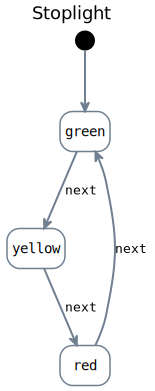
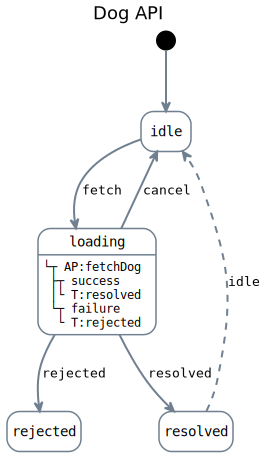
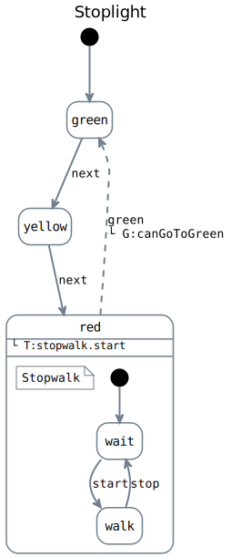
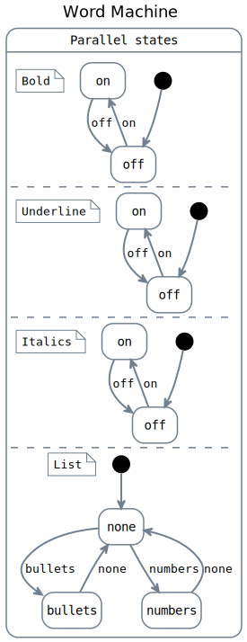

## X-Robot

X-Robot is a finite state machine library for nodejs and for the web.
Intended to be used for high complex state machines with an easy to use API.
Not only for user interfaces but also for server side applications.

## Installation

`x-robot` is published as an npm module: https://www.npmjs.com/package/x-robot

### npm

```bash
npm install x-robot
```

### bun

```bash
bun add x-robot
```

## What is a Pulse?

A pulse is the execution unit in x-robot for state updates and side effects.
It receives `context` plus an optional payload, can be sync or async, and can
mutate `context` directly.

In frozen mode (enabled by default), pulses receive a cloned context, so you do
not need to clone state manually before updating it.

```javascript
pulse(fn) // pulse with no transitions
pulse(fn, 'success') // transition on success
pulse(fn, 'success', 'failure') // transitions on success or failure
```

### Concepts comparison

| Concept | Can run async | Manual state clone | Must return new state | Event/type discrimination | Async update needs two functions | Boilerplate complexity |
| --- | --- | --- | --- | --- | --- | --- |
| Reducer | No | Yes | Yes | Yes | Yes | High |
| Mutation | No | Yes | Yes | No | Yes | Medium |
| Producer | No | No | No | No | Yes | Low |
| Action + Mutation | Yes | Yes | Yes | No | Yes | High |
| Action + Producer | Yes | No | No | No | Yes | Medium |
| Pulse | Yes | No | No | No | No | Minimal |

### Reducer example (discriminates by event type)

```javascript
function titleReducer(state, action) {
  if (action.type === 'TITLE/SET') {
    return { ...state, title: action.payload };
  }

  if (action.type === 'TITLE/CLEAR') {
    return { ...state, title: '' };
  }

  return state;
}
```

### Action + Mutation example

```javascript
async function fetchTitleAction(state) {
  const response = await fetch('/api/title');
  const data = await response.json();
  return setTitleMutation(state, data.title);
}

function setTitleMutation(state, title) {
  return { ...state, title };
}
```

### Action + Producer example

```javascript
async function fetchTitleAction(context) {
  const response = await fetch('/api/title');
  const data = await response.json();
  setTitleProducer(context, data.title);
}

function setTitleProducer(context, title) {
  context.title = title;
}
```

### Pulse example (single function)

```javascript
async function fetchTitle(context) {
  const response = await fetch('/api/title');
  const data = await response.json();
  context.title = data.title;
}

state('loading', pulse(fetchTitle, 'resolved', 'rejected'));
```

### Throw after mutating context

```javascript
function validateAndFail(context) {
  context.lastAttempt = Date.now();
  throw new Error('Validation failed');
}

state('saving', pulse(validateAndFail, undefined, 'error'));
```

In frozen mode (default), the pulse writes to a cloned context, so mutating
then throwing is safe and does not attempt to mutate the original frozen object.

## Use cases

### Simple example



```javascript 
import {machine, states, state, initial, transition, invoke} from 'x-robot';

const stoplight = machine(
  'Stoplight',
  states(
    state('green', transition('next', 'yellow')),
    state('yellow', transition('next', 'red')),
    state('red', transition('next', 'green'))
  ),
  initial('green')
);

// stoplight.current === 'green' because is the initial state
invoke(stoplight, 'next'); // stoplight.current === 'yellow'
invoke(stoplight, 'next'); // stoplight.current === 'red'
invoke(stoplight, 'next'); // stoplight.current === 'green' 
```

### Async example



```javascript
import {machine, states, state, initial, transition, immediate, invoke, context, pulse} from 'x-robot';

// Pulse
async function fetchDog(context) {
  let response = await fetch('https://dog.ceo/api/breeds/image/random');
  let json = await response.json();
  context.dog = json.data;
}

// Error pulse
function assignError(context, error) {
  context.error = error;
}

// Machine definition
const fetchMachine = machine(
  'Dog API',
  initial('idle'),
  context({
    dog: null,
    error: null
  }),
  states(
    state('idle', transition('fetch', 'loading')),
    state(
      'loading',
      pulse(fetchDog, 'resolved', 'rejected'),
      transition('cancel', 'idle')
    ),
    state('resolved', immediate('idle')),
    state('rejected', pulse(assignError))
  )
);

// fetchMachine.current === 'idle' because is the initial state
await invoke(fetchMachine, 'fetch');
// fetchMachine.current === 'idle' if the pulse succeeds (resolved -> idle)
// fetchMachine.current === 'rejected' if the pulse fails
```

### Nested machines



```javascript
import {machine, states, state, initial, transition, invoke, nested, guard} from 'x-robot';

const stopwalk = machine(
  'Stopwalk',
  states(
    state('wait', transition('start', 'walk')), 
    state('walk', transition('stop', 'wait'))
  ),
  initial('wait')
);

// Guard to prevent the machine to transition to 'green' if the stopwalk machine is in 'walk' state
const canGoToGreen = () => {
  return stopwalk.current === 'wait';
};

const stoplight = machine(
  'Stoplight',
  states(
    state('green', transition('next', 'yellow')),
    state('yellow', transition('next', 'red')),
    state(
      'red', 
      nested(stopwalk, 'start'), 
      immediate('green', guard(canGoToGreen))
    )
  ),
  initial('green')
);

// stopwalk.current === 'wait' because is the initial state
// stoplight.current === 'green' because is the initial state

invoke(stoplight, 'next');
// stopwalk.current === 'wait'
// stoplight.current === 'yellow' because the transition was invoked

invoke(stoplight, 'next');
// stopwalk.current === 'walk' because the stoplight transition invoked the stopwalk transition `start`
// stoplight.current === 'red' because the transition was invoked

invoke(stoplight, 'red.stop'); // Invoke the stopwalk transition stop from the stoplight machine
// stopwalk.current === 'wait' because the stop transition was invoked
// stoplight.current === 'green' because the immediate transition was invoked and the guard was true
```

### Parallel states



```javascript
import {machine, states, state, initial, transition, invoke, parallel, getState} from 'x-robot';

const boldMachine = machine('Bold', states(state('on', transition('off', 'off')), state('off', transition('on', 'on'))), initial('off'));
const underlineMachine = machine('Underline', states(state('on', transition('off', 'off')), state('off', transition('on', 'on'))), initial('off'));
const italicsMachine = machine('Italics', states(state('on', transition('off', 'off')), state('off', transition('on', 'on'))), initial('off'));
const listMachine = machine(
  'List',
  states(
    state('none', transition('bullets', 'bullets'), transition('numbers', 'numbers')),
    state('bullets', transition('none', 'none')),
    state('numbers', transition('none', 'none'))
  ),
  initial('none')
);

const wordMachine = machine(
  'Word Machine',
  parallel(
    boldMachine,
    underlineMachine,
    italicsMachine,
    listMachine
  )
);

invoke(wordMachine, 'bold/on'); // boldMachine.current === 'on'
invoke(wordMachine, 'underline/on'); // underlineMachine.current === 'on'
invoke(wordMachine, 'italics/on'); // italicsMachine.current === 'on'
invoke(wordMachine, 'list/bullets'); // listMachine.current === 'bullets'

getState(wordMachine); // { bold: 'on', underline: 'on', italics: 'on', list: 'bullets' }
```
