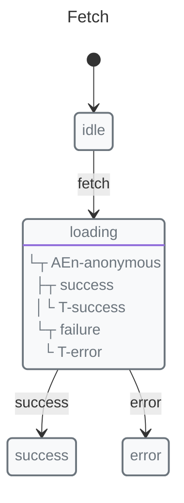

# Redux vs X-Robot

A comparison with the popular state management library.

## Quick Comparison

| Feature | X-Robot | Redux |
|---------|---------|-------|
| Paradigm | State machine | Flux/Redux |
| Bundle Size | 15.06KB | ~7KB core + middleware |
| Boilerplate | Low | High |
| Type Safety | Included | Manual |
| Built-in Async | ✅ | Via thunks/sagas |
| State Transitions | Explicit | Implicit |

## Concept Comparison

### Redux

*   Actions describe what happened
*   Reducers calculate new state
*   Store holds single source of truth

```javascript
// Redux: Multiple functions
const FETCH_REQUEST = "FETCH_REQUEST";
const FETCH_SUCCESS = "FETCH_SUCCESS";
const FETCH_ERROR = "FETCH_ERROR";

const fetchRequest = () => ({ type: FETCH_REQUEST });
const fetchSuccess = (data) => ({ type: FETCH_SUCCESS, payload: data });
const fetchError = (error) => ({ type: FETCH_ERROR, payload: error });

const fetchThunk = () => (dispatch) => {
  dispatch(fetchRequest());
  fetch("/api/data")
    .then(res => res.json())
    .then(data => dispatch(fetchSuccess(data)))
    .catch(err => dispatch(fetchError(err)));
};

function reducer(state, action) {
  switch (action.type) {
    case FETCH_REQUEST:
      return { ...state, loading: true };
    case FETCH_SUCCESS:
      return { ...state, loading: false, data: action.payload };
    case FETCH_ERROR:
      return { ...state, loading: false, error: action.payload };
    default:
      return state;
  }
}
```

### X-Robot

*   Machine defines valid states and transitions
*   Single function handles action + state update



```javascript
// X-Robot: Single function
import { machine, state, transition, entry, context, init, initial } from "x-robot";

const fetchMachine = machine(
  "Fetch",
  init(initial("idle"), context({ data: null, error: null })),
  state("idle", transition("fetch", "loading")),
  state("loading", entry(async (ctx) => {
    const res = await fetch("/api/data");
    ctx.data = await res.json();
  }, "success", "error")),
  state("success"),
  state("error")
);
```

## Advantages of X-Robot

1.  **Less boilerplate** — No action types, action creators, or separate reducers
2.  **Explicit transitions** — States and transitions are defined, not implied
3.  **Type support** — Includes TypeScript types and generated code helpers
4.  **No invalid states** — Machine prevents impossible states
5.  **Simpler async** — Pulse handles async without thunks/sagas

## When to Choose Redux

*   Existing Redux codebase
*   Large ecosystem of middleware
*   Team familiarity
*   Simple state (key-value only)

## When to Choose X-Robot

*   Complex state logic
*   Need for state machines
*   Better type safety wanted
*   Less boilerplate preferred

## Migration Path

Redux can coexist with X-Robot:


```javascript
import { machine, state, transition, entry, init, initial } from "x-robot";

const fetchMachine = machine(
  "Fetch",
  init(initial("idle")),
  state("idle", transition("fetch", "loading")),
  state("loading", entry(async (ctx) => {
    const res = await fetch("/api/data");
    ctx.data = await res.json();
  }, "success", "error")),
  state("success"),
  state("error")
);
```

```javascript
import { createStore } from "redux";

// Redux for global state
const store = createStore(rootReducer);

// Sync X-Robot to Redux
store.subscribe(() => {
  syncToRedux(fetchMachine);
});
```

## See Also

*   [Why Finite States Machines](../why.md) — FSM benefits
*   [Concepts: Pulse](../concepts/pulse.md) — Core innovation
