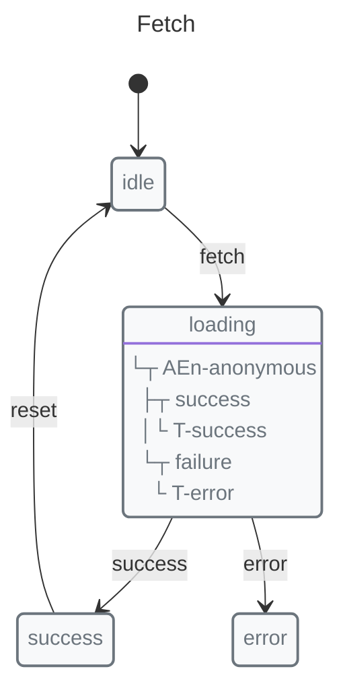
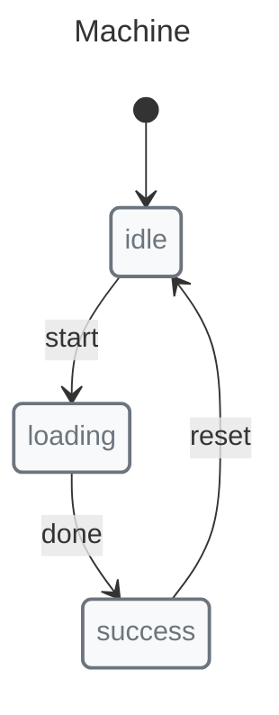

# Robot3 vs X-Robot

A comparison with the minimalist state machine library.

## Quick Comparison

| Feature | X-Robot Core | X-Robot + Modules | Robot3 |
|---------|--------------|-------------------|--------|
| Bundle Size | 15.06KB | 57.84KB | ~1KB |
| TypeScript | Included | Included | Basic |
| Nested States | ✅ | ✅ | ❌ |
| Parallel States | ✅ | ✅ | ❌ |
| Guards | ✅ | ✅ | Limited |
| Async Support | ✅ | ✅ | Via callbacks |
| Code Generation | ✅ | ✅ | ❌ |
| Serialization | ✅ | ✅ | ❌ |

## Philosophy

**Robot3** — Extreme minimalism. Core FSM only.

**X-Robot** — Balance of simplicity and capability.

## API Comparison

### Robot3

```javascript
import { createMachine } from "robot3";

const machine = createMachine({
  idle: "loading",
  loading: function(ctx) {
    return fetch("/api").then(() => "success");
  },
  success: "idle"
});
```

### X-Robot



```javascript
import { machine, state, transition, entry } from "x-robot";

const fetchMachine = machine(
  "Fetch",
  state("idle", transition("fetch", "loading")),
  state("loading", entry(async (ctx) => {
    await fetch("/api");
  }, "success", "error")),
  state("success", transition("reset", "idle")),
  state("error")
);
```

## When to Choose Robot3

*   Extreme bundle size constraints
*   Simple FSM only
*   No TypeScript needed
*   Maximum simplicity

## When to Choose X-Robot

*   Nested or parallel states needed
*   TypeScript support with generated code and machine helpers is useful
*   Guards needed
*   Code generation required
*   Serialization needed
*   More features but still small

## Feature Matrix

| Feature | Robot3 | X-Robot |
|---------|--------|---------|
| Simple transitions | ✅ | ✅ |
| Context | ✅ | ✅ |
| Nested states | ❌ | ✅ |
| Parallel states | ❌ | ✅ |
| Async guards | ❌ | ✅ |
| Exit actions | Limited | ✅ |
| History tracking | ❌ | ✅ |
| SCXML | ❌ | ✅ |
| Code generation | ❌ | ✅ |
| Validation | ❌ | ✅ |

## Migration from Robot3

Robot3 machines can be converted to X-Robot:

```javascript
// Robot3
import { createMachine } from "robot3";

const robotMachine = createMachine({
  idle: "loading",
  loading: "success",
  success: "idle"
});
```



```javascript
import { machine, state, transition } from "x-robot";

const xRobotMachine = machine(
  "Machine",
  state("idle", transition("start", "loading")),
  state("loading", transition("done", "success")),
  state("success", transition("reset", "idle"))
);
```
