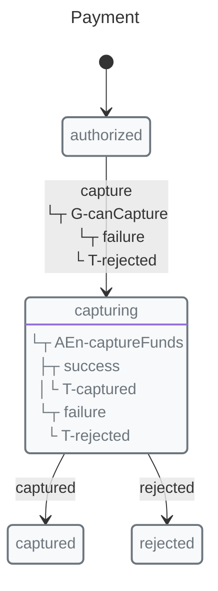
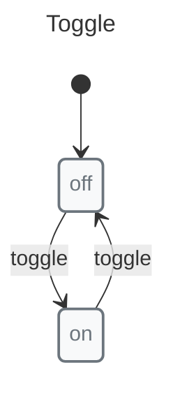

# XState vs X-Robot

X-Robot offers native async guards, frozen state by default, validation, and generated documentation through a smaller surface area for teams that want machine behavior, tooling, and adoption docs from one model.

## Read this after the X-Robot overview

Start with the [X-Robot Overview](../overview.md) and [Getting Started](../guides/getting-started.md) to see the core mental model before comparing it with XState. Then use this page to evaluate async guards, frozen context, validation, generated documentation, and bundle shape side by side.

## Quick Comparison

| Feature | X-Robot Core | X-Robot + Modules | XState Interpreter | XState Web | XState Full | XState Full + Stately Studio |
|---------|--------------|-------------------|-------------------|------------|-------------|-------------------------------|
| Bundle Size / Tooling Size | 16.55KB | 79.93KB | 30.09KB | 46.64KB | 58.80KB | 58.80KB + external web app |
| Installable / external | npm package | npm packages | npm package | npm package | npm packages | npm packages + external web app |
| Nested States | ✅ | ✅ | ❌ | ✅ | ✅ | ✅ |
| Parallel States | ✅ | ✅ | ❌ | ✅ | ✅ | ✅ |
| Guards | ✅ | ✅ | ✅ | ✅ | ✅ | ✅ |
| Async Guards | ✅ | ✅ | ❌ | ❌ | ❌ | ❌ |
| Frozen State | Default | Default | ❌ | ❌ | Optional | Optional |
| Code Generation | ✅ | ✅ | ❌ | ❌ | ❌ | ✅ |
| Mermaid visual docs | ❌ | ✅ | ❌ | ❌ | ❌ | ❌ |
| PlantUML visual docs | ❌ | ✅ | ❌ | ❌ | ❌ | ❌ |
| SVG image exports | ❌ | ✅ | ❌ | ❌ | ❌ | ❌ |
| PNG image exports | ❌ | ✅ | ❌ | ❌ | ❌ | ❌ |
| SCXML | ✅ | ✅ | ❌ | ❌ | ✅ | ✅ |
| Machine Validation | ❌ | ✅ | ❌ | ❌ | ❌ | ❌ |
| Actor Model | ❌ | ❌ | ❌ | ❌ | ✅ | ✅ |

## Async Guards

X-Robot supports native async guards:

```javascript
// X-Robot
import { transition, guard } from "x-robot";

state("idle", transition("check", "granted", guard(async (ctx) => {
  const res = await fetch("/api/permission");
  return (await res.json()).allowed;
})));
```

XState requires workarounds\*:

```javascript
// XState: needs invoke
{
  idle: { on: { check: "checking" }},
  checking: {
    invoke: {
      src: async () => await checkPermission(),
      onDone: { target: "granted" },
      onError: { target: "denied" }
    }
  }
}
```

*   In XState, async checks are modeled as invoked actors/operational states. See [Mental model switch](#mental-model-switch-async-preconditions-vs-async-lifecycle) below.

## Mental model switch: async preconditions vs async lifecycle

> Skip to the last part if you only want to compare both code shapes.

Before choosing a machine shape, separate the business rule from the library API.

### Business logic first

For a payment lifecycle, events such as `authorize`, `capture`, `void`, and `refund` are attempts. Each attempt has async preconditions:

*   `authorize`: the payment method exists and can be authorized.
*   `capture`: the authorization exists and is capturable.
*   `void`: the authorization exists and can still be voided.
*   `refund`: the payment was captured and is refundable.

If a precondition fails, the attempt should route to `rejected`. Effects such as reserving, capturing, voiding, or refunding funds should run only after the relevant preconditions pass.

### XState implementation shape

In XState, keep the async check inside the machine instead of running external checks before sending events. Because guards are synchronous, the machine usually models each async check as an invoked actor and an operational state such as `checkingCapture`.

```javascript
// XState: safe inside the machine, with explicit checking states
const paymentMachine = createMachine({
  initial: "authorized",
  states: {
    authorized: {
      on: { capture: "checkingCapture" }
    },
    checkingCapture: {
      invoke: {
        src: "canCapture",
        onDone: { target: "capturing" },
        onError: { target: "rejected" }
      }
    },
    capturing: {
      invoke: {
        src: "captureFunds",
        onDone: { target: "captured" },
        onError: { target: "rejected" }
      }
    },
    captured: {},
    rejected: {}
  }
});
```

This is explicit and safe, but it adds operational states for `checking` / `checked` lifecycle steps when the domain question is “may this transition happen?”

### X-Robot implementation shape

In X-Robot, async guards can sit at the transition boundary. Effects then run as entry pulses after the transition has been allowed.


```javascript
// X-Robot: async precondition at the boundary, effect after entry
import { entry, guard, init, initial, machine, state, transition } from "x-robot";

async function canCapture() {
  return true;
}

async function captureFunds() {}

const payment = machine(
  "Payment",
  init(initial("authorized")),
  state("authorized", transition("capture", "capturing", guard(canCapture, "rejected"))),
  state("capturing", entry(captureFunds, "captured", "rejected")),
  state("captured"),
  state("rejected")
);
```

X-Robot can also model explicit lifecycle states such as `checkingCapture` when those states are meaningful to the product or UI. The difference is that async preconditions do not require those states just to be expressible.

## API Comparison

X-Robot's `documentate()` output is part of the developer workflow in these examples. The same machine definition can produce visual documentation by concept:

*   Mermaid: Markdown-friendly source diagrams and previews for state, sequence, and focused structural views.
*   PlantUML: richer source diagrams and the preferred visual style for state, sequence, and focused structural views.
*   SVG formats: explicit `svg-*` exports, such as `svg-guards` and `svg-sequence`, for sharing, embedding, and vector assets.
*   PNG formats: explicit `png-*` exports, such as `png-events` and `png-complexity`, for raster images in docs, tickets, and slides.

Focused structural views include guards, events, pulses, outcomes, immediate transitions, composition, and complexity. These outputs are useful for PR review, onboarding, conceptual debugging, and living project documentation.

### XState

```javascript
// XState
const toggleMachine = createMachine(
  "Toggle",
  {
    initial: "off",
    states: {
      off: { on: { toggle: "on" }},
      on: { on: { toggle: "off" }}
    }
  }
);
```

### X-Robot


```javascript
// X-Robot: simpler
const toggle = machine(
  "Toggle",
  state("off", transition("toggle", "on")),
  state("on", transition("toggle", "off"))
);
```

### Pulse vs Actions

XState requires separate action types:

```javascript
// XState: action + reducer
{
  loading: {
    invoke: {
      src: "fetchData",
      onDone: { target: "success", actions: "assignData" },
      onError: { target: "error", actions: "assignError" }
    }
  }
}
```

X-Robot: single function handles both:

```javascript
// X-Robot: single function
import { machine, state, transition, entry } from "x-robot";

state("loading", entry(async (ctx) => {
  ctx.data = await fetchData();
}, "success", "error"))
```

## When to Choose X-Robot

*   Bundle size is critical (16.55KB vs 30KB+)
*   Native async guards needed
*   Simpler API preferred
*   Code generation required
*   Generated visual documentation required:
    *   Mermaid source diagrams for Markdown-friendly previews
    *   PlantUML source diagrams for richer visual styling
    *   Focused views for guards, events, pulses, outcomes, immediate transitions, composition, and complexity
    *   Explicit `svg-*` exports for sharing, embedding, and vector assets
    *   Explicit `png-*` exports for raster docs, tickets, and slides
*   Machine validation needed

## When to Choose XState

*   Actor model required
*   Larger ecosystem needed
*   Enterprise support required
*   Visual editor required
*   More community resources

## Performance

See [Performance](../performance.md) for benchmarks.

## Migration

X-Robot can import SCXML from XState:

```javascript
import { documentate } from "x-robot/documentate";

// Convert XState machine to SCXML
const xstateScxml = convertToScxml(xstateMachine);

// Get serialized representation
const { serialized } = await documentate(xstateScxml, { format: "serialized" });
```
