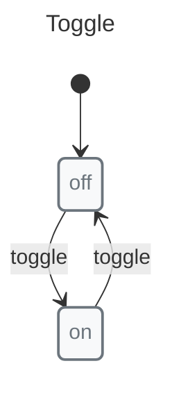

# XState vs X-Robot

A comparison of two state machine libraries.

## Quick Comparison

| Feature | X-Robot Core | X-Robot + Modules | XState Interpreter | XState Web | XState Full |
|---------|--------------|-------------------|-------------------|------------|-------------|
| Bundle Size | 15.06KB | 57.84KB | 30KB | 47KB | 59KB |
| Nested States | ✅ | ✅ | ❌ | ✅ | ✅ |
| Parallel States | ✅ | ✅ | ❌ | ✅ | ✅ |
| Guards | ✅ | ✅ | ✅ | ✅ | ✅ |
| Async Guards | ✅ | ✅ | ❌ | ❌ | ❌ |
| Frozen State | Default | Default | ❌ | ❌ | Optional |
| Code Generation | ✅ | ✅ | ❌ | ❌ | ❌ |
| SCXML | ✅ | ✅ | ❌ | ❌ | ✅ |
| Machine Validation | ❌ | ✅ | ❌ | ❌ | ❌ |
| Actor Model | ❌ | ❌ | ❌ | ❌ | ✅ |

## Async Guards

X-Robot supports native async guards:

```javascript
// X-Robot
import { transition, guard } from "x-robot";

state("idle", transition("check", "granted", guard(async (ctx) => {
  const res = await fetch("/api/permission");
  return (await res.json()).allowed;
})));
```

XState requires workarounds:

```javascript
// XState: needs invoke
{
  idle: { on: { check: "checking" }},
  checking: {
    invoke: {
      src: async () => await checkPermission(),
      onDone: { target: "granted" },
      onError: { target: "denied" }
    }
  }
}
```

## API Comparison

### XState

```javascript
// XState
const toggleMachine = createMachine(
  "Toggle",
  {
    initial: "off",
    states: {
      off: { on: { toggle: "on" }},
      on: { on: { toggle: "off" }}
    }
  }
);
```

### X-Robot



```javascript
// X-Robot: simpler
const toggle = machine(
  "Toggle",
  state("off", transition("toggle", "on")),
  state("on", transition("toggle", "off"))
);
```

### Pulse vs Actions

XState requires separate action types:

```javascript
// XState: action + reducer
{
  loading: {
    invoke: {
      src: "fetchData",
      onDone: { target: "success", actions: "assignData" },
      onError: { target: "error", actions: "assignError" }
    }
  }
}
```

X-Robot: single function handles both:

```javascript
// X-Robot: single function
import { machine, state, transition, entry } from "x-robot";

state("loading", entry(async (ctx) => {
  ctx.data = await fetchData();
}, "success", "error"))
```

## When to Choose X-Robot

*   Bundle size is critical (15.06KB vs 30KB+)
*   Native async guards needed
*   Simpler API preferred
*   Code generation required
*   Machine validation needed

## When to Choose XState

*   Actor model required
*   Larger ecosystem needed
*   Enterprise support required
*   Visual editor required
*   More community resources

## Performance

See [Performance](../performance.md) for benchmarks.

## Migration

X-Robot can import SCXML from XState:

```javascript
import { documentate } from "x-robot/documentate";

// Convert XState machine to SCXML
const xstateScxml = convertToScxml(xstateMachine);

// Get serialized representation
const { serialized } = await documentate(xstateScxml, { format: "serialized" });
```
