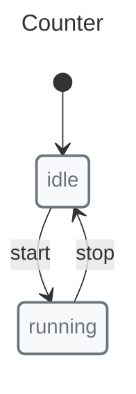
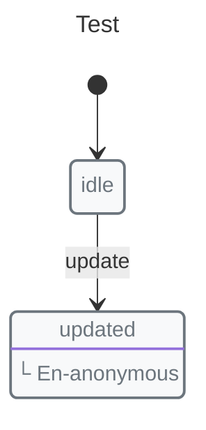
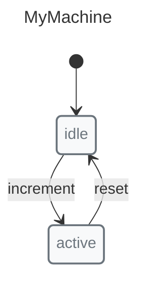

# Context

Context holds the machine's state data — analogous to Redux state or Vue/React component data.

## Defining Context



```javascript
import { context, init, initial, machine, state, transition } from "x-robot";

const counter = machine(
  "Counter",
  init(initial("idle"), context({ count: 0 })),
  state("idle", transition("start", "running")),
  state("running", transition("stop", "idle"))
);
```

## Accessing Context

```javascript
console.log(myMachine.context.user);  // null
console.log(myMachine.context.count); // 0
```

## Modifying Context

### With Pulse

```javascript
state("idle", entry((ctx) => {
  ctx.count++;
  ctx.items.push({ id: 1, name: "Item" });
}))
```

### With Entry/Exit Actions

```javascript
state("active", 
  entry((ctx) => {
    ctx.enteredAt = Date.now();
    ctx.active = true;
  }),
  exit((ctx) => {
    ctx.active = false;
  })
)
```

## Frozen Mode

By default, X-Robot uses frozen mode. Each pulse receives a deep-cloned copy of the context, and successful changes are committed back to the machine:



```javascript
const myMachine = machine(
  "Test",
  init(initial("idle"), context({ value: 1 })),
  state("idle", transition("update", "updated")),
  state("updated", entry((ctx) => {
    ctx.value = 2;
  }))
);

const originalContext = myMachine.context;
invoke(myMachine, "update");
console.log(myMachine.context.value); // 2
console.log(myMachine.context === originalContext); // false
```

This prevents accidental mutations and makes state changes explicit.

### Disabling Frozen Mode


```javascript
import { shouldFreeze } from "x-robot";

const myMachine = machine(
  "Test",
  init(initial("idle"), context({ value: 1 }), shouldFreeze(false)),
  state("idle", transition("update", "updated")),
  state("updated", entry((ctx) => {
    ctx.value = 2;
  }))
);

const originalContext = myMachine.context;
invoke(myMachine, "update");
console.log(myMachine.context.value); // 2
console.log(myMachine.context === originalContext); // true
```

## Context with Nested Machines

When machines are nested, parent and child machines keep separate contexts. Pass shared data explicitly when needed:

```mermaid
---
title: Parent
---

stateDiagram-v2
direction TB

classDef danger fill:#f8d7da,stroke:#721c24,stroke-width:2px,text-align:left,color:#721c24
classDef warning fill:#fff3cd,stroke:#856404,stroke-width:2px,text-align:left,color:#856404
classDef success fill:#d4edda,stroke:#155724,stroke-width:2px,text-align:left,color:#155724
classDef primary fill:#cce5ff,stroke:#004085,stroke-width:2px,text-align:left,color:#004085
classDef info fill:#d1ecf1,stroke:#0c5460,stroke-width:2px,text-align:left,color:#0c5460
classDef def fill:#f8f9fa,stroke:#6c757d,stroke-width:2px,text-align:left,color:#6c757d

state "start" as start
class start def


[*] --> start
```



```javascript
const childMachine = machine(
  "Child",
  init(initial("idle")),
  state("idle", transition("update", "updated"))
);

const parentMachine = machine(
  "Parent",
  init(initial("start"), context({ shared: "data" })),
  state("start", nested(childMachine))
);
```

## Serialization

Save and restore context with `snapshot()` and `start()`:



```javascript
import { context, init, initial, machine, snapshot, start, state, transition } from "x-robot";

const myMachine = machine(
  "MyMachine",
  init(initial("idle"), context({ count: 1 })),
  state("idle", transition("increment", "active")),
  state("active", transition("reset", "idle"))
);

const saved = snapshot(myMachine);

const newMachine = machine(
  "MyMachine",
  init(initial("idle"), context({ count: 1 })),
  state("idle", transition("increment", "active")),
  state("active", transition("reset", "idle"))
);

start(newMachine, saved);
```

## Best Practices

1.  **Keep context minimal** — Store only what's needed for state transitions
2.  **Use frozen mode** — Default behavior prevents bugs
3.  **Immutable patterns** — When disabled, use spread operator for new objects
4.  **Serialize for persistence** — Use `snapshot()` and `start()` for save/restore

## Comparison

| Approach | Mutates Original | Manual Clone | X-Robot Support |
|----------|------------------|--------------|-----------------|
| Frozen (default) | No | No | ✅ (default) |
| Mutable | Yes | No | ✅ shouldFreeze(false) |
| Immutable | No | Yes | Manual |

## Next Steps

*   [Pulse](./pulse.md) — Context modification
*   [Guards](./guards.md) — Context in conditions
*   [Saving and Restoring](../guides/saving-and-restoring.md) — Persist runtime state
