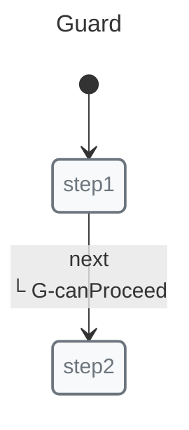

# Guards

Guards determine whether a transition should occur. They receive context and optional payload, and must return `true` to allow the transition.

## Synchronous Guards



```javascript
import { guard, init, initial, machine, state, transition } from "x-robot";

function canProceed(ctx, payload) {
  return payload?.value > 0;
}

const guardedFlow = machine(
  "Guard",
  init(initial("step1")),
  state("step1", transition("next", "step2", guard(canProceed))),
  state("step2")
);
```

## Async Guards

X-Robot supports native async guards — no workarounds required:

```javascript
const checkPermission = async (ctx) => {
  const res = await fetch("/api/permission");
  const data = await res.json();
  return data.allowed;
};

state("idle", transition("proceed", "active", guard(checkPermission)));
```

When the guard is async, the transition waits for resolution:

```javascript
await invoke(machine, "proceed");
// If checkPermission returns true: transitions to "active"
// If checkPermission returns false: stays in "idle"
```

## Guard with Failure Transition

You can specify a failure transition for when the guard does not return `true`:

```javascript
state("idle", transition("submit", "success", guard(validateInput, "error")));
// success: if guard returns true
// error: if guard returns anything other than true
```

## Multiple Guards

Combine guards with logical operations:

```javascript
const allPass = (ctx) => guards.every(g => g(ctx));

state("idle", transition("next", "step2", guard(allPass)));
```

## Guards vs Entry Pulses

Guards run before the transition. Entry pulses run after entering the state where they are defined:

```javascript
const notify = (ctx) => {
  console.log("Approved! Notifying:", ctx.user);
};

state("review", 
  transition("approve", "approved", guard(canApprove)),
  entry(notify),  // runs after entering "review"
  transition("reject", "rejected")
);
```

## Common Patterns

### Form Validation

```javascript
const isValidEmail = (ctx, email) => /@/.test(email);
const isValidPassword = (ctx, pw) => pw.length >= 8;

state("idle", transition("submit", "valid", guard((ctx, payload) => 
  isValidEmail(ctx, payload.email) && isValidPassword(ctx, payload.password)
, "invalid"))),
```

### Role-Based Access

```javascript
const isAdmin = (ctx) => ctx.user?.role === "admin";

state("settings", transition("delete", "confirm", guard(isAdmin)));
```

### Conditional History

```javascript
const shouldSaveHistory = (ctx) => ctx.preferences.saveHistory;

state("editing", transition("save", "saved", guard(shouldSaveHistory)));
```

## Comparison with XState

XState requires workarounds for async guards:

```javascript
// XState: uses invoke workaround
{
  idle: {
    on: { check: "checking" }
  },
  checking: {
    invoke: {
      src: async () => await checkPermission(),
      onDone: { target: "active" },
      onError: { target: "idle" }
    }
  }
}
```

X-Robot:

```javascript
// X-Robot: native async guard
state("idle", transition("check", "active", guard(asyncCheckPermission)));
```

For developer-facing documentation, X-Robot includes `documentate()` views that make guarded flow easier to review without describing internals:

*   Mermaid: Markdown-friendly source diagrams and previews for state, sequence, and focused structural views.
*   PlantUML: richer source diagrams and the preferred visual style for state, sequence, and focused structural views.
*   SVG formats: explicit `svg-*` exports, such as `svg-guards` and `svg-sequence`, for sharing, embedding, and vector assets.
*   PNG formats: explicit `png-*` exports, such as `png-guards` and `png-events`, for raster images in docs, tickets, and slides.

Focused structural views include guards, events, pulses, outcomes, immediate transitions, composition, and complexity. These outputs are useful for PR review, onboarding, conceptual debugging, and living project documentation.

## Next Steps

*   [Pulse](./pulse.md) — Combined with guards
*   [Context](./context.md) — Accessing state in guards
*   [Guides: Using Guards](../guides/guards.md) — Practical examples
*   [Guides: Immediate Transitions](../guides/immediate-transitions.md) — Guards with auto-transition
