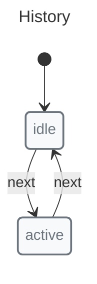

# History Tracking

X-Robot provides built-in history tracking, storing states, transitions, guards, pulses, and async pulses.

## Enabling History



```javascript
import { history, init, initial, machine, state, transition } from "x-robot";

const historyMachine = machine(
  "History",
  init(initial("idle"), history(10)),
  state("idle", transition("next", "active")),
  state("active", transition("next", "idle"))
);
```

## Accessing History

```javascript
invoke(myMachine, "next"); // idle -> active
invoke(myMachine, "next"); // active -> idle

console.log(myMachine.history);
// [
//   "State: idle",
//   "Transition: next",
//   "State: active",
//   "Transition: next",
//   "State: idle"
// ]
```

## History Entry Structure

History entries are strings with the following formats:

```javascript
// State entry
"State: idle"

// Transition entry
"Transition: next"

// With specific types (from pulses, guards, etc.)
"Pulse: fetchData"
"Async Pulse: fetchData"
"Guard: canSubmit"
```

## History Limit

By default, history keeps the last 10 entries. You can customize:

```javascript
// Keep only last 5 entries
init(initial("idle"), history(5))

// Keep 50 entries
init(initial("idle"), history(50))
```

## Disable History

```javascript
// Disable history tracking
init(initial("idle"), history(0))
```

## Use Cases

### Undo/Redo

```javascript
const canUndo = () => myMachine.history.length > 1;

state("active", 
  transition("undo", "idle", guard(canUndo)),
  // Implement undo by restoring previous state
);
```

### Debugging

```javascript
// Log all transitions
console.log(myMachine.history);
```

### Analytics

```javascript
// Track user journey - filter state entries only
const journey = myMachine.history
  .filter(entry => entry.startsWith("State: "))
  .map(entry => entry.replace("State: ", ""));
console.log(journey); // ["idle", "loading", "success", "idle", "loading", "error"]
```

### Audit Trail

```javascript
// Record state changes for compliance
const auditLog = myMachine.history.map(entry => ({
  type: entry.split(": ")[0].toLowerCase(),
  value: entry.split(": ")[1],
  time: new Date().toISOString()
}));
```

## Comparison with XState

XState does not have built-in history tracking. You would need to implement it manually:

```javascript
// XState: manual implementation
{
  initial: "idle",
  states: {
    idle: {
      on: { next: "active" }
    },
    active: {
      on: { next: "idle" }
    }
  },
  // Custom: track manually with actions
}
```

X-Robot:

```javascript
// X-Robot: built-in, enabled by default with limit of 10
init(initial("idle"))
// or explicitly:
init(initial("idle"), history(10))
```

For developer-facing documentation, X-Robot also includes `documentate()` so the same machine can produce living visual docs by concept:

*   Mermaid: Markdown-friendly source diagrams and previews for state, sequence, and focused structural views.
*   PlantUML: richer source diagrams and the preferred visual style for state, sequence, and focused structural views.
*   SVG formats: explicit `svg-*` exports, such as `svg-sequence` and `svg-events`, for sharing, embedding, and vector assets.
*   PNG formats: explicit `png-*` exports, such as `png-guards` and `png-complexity`, for raster images in docs, tickets, and slides.

Focused structural views include guards, events, pulses, outcomes, immediate transitions, composition, and complexity. These outputs are useful for PR review, onboarding, and conceptual debugging.

## API Reference

| Option | Type | Default | Description |
|--------|------|---------|-------------|
| `history` | `number` | `10` | Maximum number of history entries to keep. Set to 0 to disable. |

## Next Steps

*   [Guides: Getting Started](../guides/getting-started.md) — Combine with other features
*   [Recipes: Form Validation](../recipes/form-validation.md) — Real-world usage
