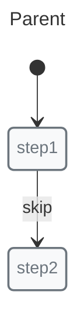
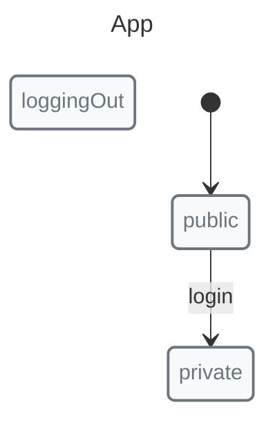

# Nested State Machines

Nested machines allow hierarchical state organization. A machine can contain other machines as states.

## Basic Nesting



```javascript
import { init, initial, machine, nested, state, transition } from "x-robot";

const orderMachine = machine(
  "Order",
  init(initial("pending")),
  state("pending", transition("confirm", "confirmed")),
  state("confirmed")
);

const parent = machine(
  "Parent",
  init(initial("step1")),
  state("step1", nested(orderMachine, "confirm"), transition("skip", "step2")),
  state("step2")
);
```

## Invoking Nested Transitions

```javascript
// Trigger a nested transition from the parent
invoke(parent, "step1.confirm");

// Access nested state
console.log(parent.current);        // "step1"
console.log(orderMachine.current);  // "confirmed"
```

## Nested with Initial State



```javascript
const auth = machine(
  "Auth",
  init(initial("unauthenticated")),
  state("unauthenticated", transition("login", "authenticating")),
  state("authenticating", entry(async (ctx, credentials) => {
    ctx.user = await authenticate(credentials);
  }, "authenticated", "failed")),
  state("authenticated", transition("logout", "unauthenticated")),
  state("failed", transition("retry", "authenticating"))
);

const app = machine(
  "App",
  init(initial("public")),
  state("public", transition("login", "private")),
  state("private", nested(auth, "logout")),
  state("loggingOut")
);
```

## Guards with Nested Machines

Use guards to control when nested machines can transition:

```javascript
const canLogout = () => auth.current === "authenticated";

state("private", 
  nested(auth),
  transition("logout", "loggingOut", guard(canLogout))
);
```

## Exit from Nested Machine

The parent can invoke child transitions using dot notation:

```javascript
state("private", nested(auth));

invoke(app, "private.logout");
```

## Use Cases

### Authentication Flow

    App
    ├── public
    │   └── Auth (nested)
    │       ├── unauthenticated
    │       ├── authenticating
    │       ├── authenticated
    │       └── failed
    └── private

### Form Wizard

    Wizard
    ├── step1
    │   └── Validation (nested)
    ├── step2
    │   └── Validation (nested)
    └── step3
        └── Validation (nested)

### Game States

    Game
    ├── menu
    ├── playing
    │   └── Player (nested)
    │       ├── idle
    │       ├── walking
    │       ├── running
    │       └── jumping
    ├── paused
    └── gameOver

## Limitations

*   Child machines cannot directly transition to parent states
*   Context sharing requires explicit parent-child relationship
*   Deep nesting (3+ levels) can become complex to visualize

## Next Steps

*   [Parallel States](./parallel.md) — Multiple independent states
*   [Guides: Nested Machines](../guides/nested-machines.md) — Practical examples
*   [Recipes: Wizard](../recipes/wizard.md) — Multi-step forms
