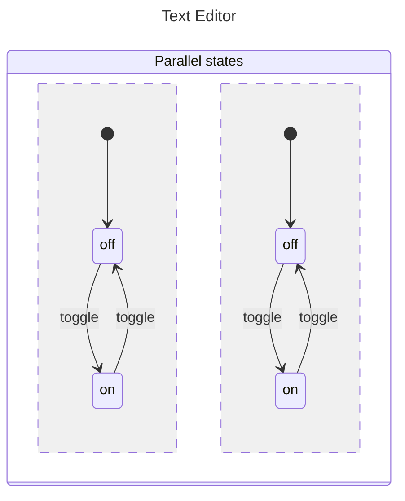
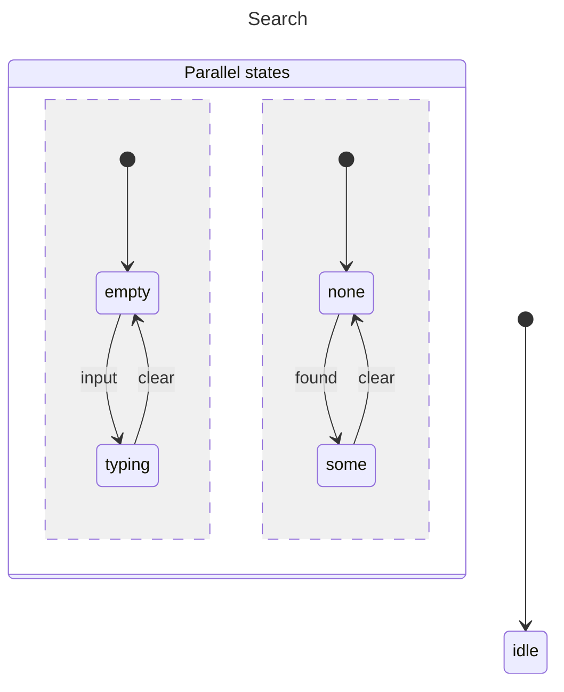

# Parallel State Machines

Parallel states allow multiple independent states to be active simultaneously. Each parallel region operates independently.

## Basic Parallel Machine



```javascript
import { init, initial, machine, parallel, state, transition } from "x-robot";

const bold = machine(
  "Bold",
  init(initial("off")),
  state("off", transition("toggle", "on")),
  state("on", transition("toggle", "off"))
);

const italic = machine(
  "Italic",
  init(initial("off")),
  state("off", transition("toggle", "on")),
  state("on", transition("toggle", "off"))
);

const textEditor = machine(
  "Text Editor",
  parallel(bold, italic)
);
```

## Accessing Parallel State

### Using getState()

<!-- x-robot:fragment -->

```javascript
const state = getState(myMachine);
// Returns object with all parallel region states
```

### Direct Access

```javascript
console.log(bold.current);  // "on"
console.log(italic.current); // "on"
```

## Invoking Transitions

Use slash notation to target specific regions:

<!-- x-robot:fragment -->

```javascript
invoke(textEditor, "bold/toggle");   // Only bold changes
invoke(textEditor, "italic/toggle"); // Only italic changes
```

## Parallel with Context



<!-- x-robot:fragment -->


<!-- x-robot:fragment -->


```javascript
const searchMachine = machine(
  "Search",
  init(initial("idle"), context({ query: "", results: [] })),
  parallel(
    machine("Query", init(initial("empty")),
      state("empty", transition("input", "typing")),
      state("typing", transition("clear", "empty"))
    ),
    machine("Results", init(initial("none")),
      state("none", transition("found", "some")),
      state("some", transition("clear", "none"))
    )
  )
);
```

## Use Cases

### Text Formatting

    TextFormat (parallel)
    ├── bold: on/off
    ├── italic: on/off
    ├── underline: on/off
    └── alignment: left/center/right

### Multi-Panel Layout

    Dashboard (parallel)
    ├── sidebar: collapsed/expanded
    ├── header: visible/hidden
    └── content: list/grid

### Search/Filter

    FilterPanel (parallel)
    ├── category: all/electronics/books/clothing
    ├── priceRange: any/under25/25to100/over100
    └── sortBy: relevance/price/name

### Connection Status

    NetworkMonitor (parallel)
    ├── server1: connected/disconnected/error
    ├── server2: connected/disconnected/error
    └── server3: connected/disconnected/error

## Guards with Parallel States

Guards can check any parallel region's state:

<!-- x-robot:fragment -->

```javascript
const canSave = () => form.current === "valid" && network.current === "connected";

state("editing", transition("save", "saving", guard(canSave)));
```

## Limitations

*   All parallel regions must complete their transitions
*   No cross-region guards (guard only sees its region's context)
*   Visual representation can be complex

## Next Steps

*   [Nested Machines](./nested.md) — Hierarchical states
*   [Guides: Parallel States](../guides/parallel-states.md) — Practical examples
*   [Recipes: Modal Dialog](../recipes/modal-dialog.md) — UI state
