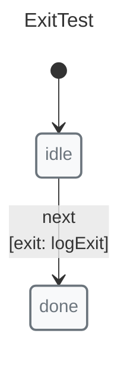
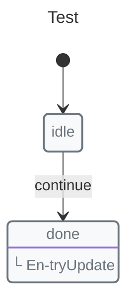
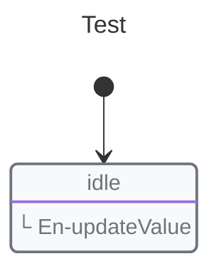

# Pulse

The Pulse is X-Robot's core concept — a unified execution unit for state updates and side effects. Entry and exit are pulses: entry pulses run when entering a state, exit pulses run when leaving a state.

```javascript
import { machine, state, transition, entry, exit, initial, init, context, shouldFreeze } from "x-robot";
```

## What is a Pulse?

A pulse is a function that:

1.  Receives the machine's context
2.  Can be synchronous or asynchronous
3.  Can mutate the context directly
4.  Can trigger state transitions on success or failure

Entry pulses are defined with `entry()`, exit pulses with `exit()`:

```javascript
// Synchronous entry pulse
function updateCounter(ctx) {
  ctx.count++;
}

// Asynchronous entry pulse
async function fetchData(ctx) {
  const res = await fetch("/api/data");
  ctx.data = await res.json();
}
```

## Entry Pulse

Entry pulses run when entering a state:

```javascript
function markStarted(ctx) {
  ctx.startedAt = Date.now();
}

state("active", entry(markStarted))
```

With transitions (success/failure):

```javascript
async function fetchData(ctx) {
  const res = await fetch("/api/data");
  ctx.data = await res.json();
}

state("loading", entry(fetchData, "success", "error"))
```

## Exit Pulse


```javascript
import { exit, init, initial, machine, state, transition } from "x-robot";

function logExit() {
  return "exited";
}

const exitMachine = machine(
  "ExitTest",
  init(initial("idle")),
  state("idle", transition("next", "done", exit(logExit))),
  state("done")
);
```

## Why Not Reducers?

Reducers require returning new state and manual cloning:

```javascript
// Reducer approach
function reducer(state, action) {
  switch (action.type) {
    case "FETCH":
      return { ...state, loading: true };
    case "FETCH_SUCCESS":
      return { ...state, loading: false, data: action.payload };
    case "FETCH_ERROR":
      return { ...state, loading: false, error: action.error };
    default:
      return state;
  }
}
```

X-Robot entry pulse approach — single function handles everything:

```javascript
async function fetchData(ctx) {
  const res = await fetch("/api/data");
  ctx.data = await res.json();
}

// X-Robot entry pulse
state("idle", transition("fetch", "loading"));
state("loading", entry(fetchData, "success", "error"));
```

## Basic Usage

### Entry Pulse with Transitions

```javascript
state("loading", entry(asyncAction, "success", "failure"));
```

*   First argument: The pulse function
*   Second argument: State to transition on success (resolve)
*   Third argument: State to transition on failure (reject)

### Entry Pulse Without Transitions

```javascript
state("active", entry(updateContext));
```

The pulse runs but no transition occurs.

### Pulse with Throw

You can throw to trigger the failure transition:

```javascript
function validateAndSave(ctx) {
  ctx.timestamp = Date.now();
  if (!ctx.data) {
    throw new Error("No data to save");
  }
}

state("saving", entry(validateAndSave, "saved", "error"));
```

## Frozen Mode

By default, X-Robot runs in frozen mode. Each pulse receives a deep-cloned copy of the context:


```javascript
function tryUpdate(ctx) {
  ctx.value = 42;
  throw new Error("Oops");
}

const myMachine = machine(
  "Test",
  init(initial("idle"), context({ value: 0 })),
  state("idle", transition("continue", "done")),
  state("done", entry(tryUpdate))
);

try {
  invoke(myMachine, "continue");
} catch (error) {
  // Original context.value is still 0 because the pulse failed
}
```

This prevents accidental mutations and makes error handling safer.

## Disabling Frozen Mode


```javascript
function updateValue(ctx) {
  ctx.value = 42; // modifies original
}

const myMachine = machine(
  "Test",
  init(initial("idle"), context({ value: 0 }), shouldFreeze(false)),
  state("idle", entry(updateValue))
);
```

## Comparison with Other Approaches

### The Problem: Too Many Concepts

Traditional state management separates concerns into multiple functions:

*   **Reducers**: Handle sync state updates
*   **Mutations**: Handle sync updates without action type discrimination
*   **Producers**: Handle updates with cloned state
*   **Actions**: Handle async operations
*   **Signals**: Handle reactive updates

Each concept requires different patterns, increasing cognitive load.

### Reducers

Reducers require returning new state and manual cloning:

```javascript
// Reducer approach
function reducer(state, action) {
  switch (action.type) {
    case "FETCH":
      return { ...state, loading: true };
    case "FETCH_SUCCESS":
      return { ...state, loading: false, data: action.payload };
    case "FETCH_ERROR":
      return { ...state, loading: false, error: action.error };
    default:
      return state;
  }
}
```

Problems:

*   Must discriminate by action type
*   Must clone state manually
*   Must return new state
*   Async requires additional functions

### Mutations

Mutations still require returning new state:

```javascript
// Mutation approach
function fetchDataMutation(state) {
  return { ...state, loading: true };
}
```

### Actions + Mutations

The classic async pattern combines action + mutation:

```javascript
// Action (async)
async function fetchDataAction(context) {
  const response = await fetch("/api/data");
  const data = await response.json();
  return { data }; // returns value for mutation
}

// Mutation (sync)
function fetchDataMutation(state, payload) {
  return { ...state, loading: false, data: payload };
}
```

Problems:

*   Two functions per operation
*   Must handle data flow between action and mutation
*   Still need action types for discrimination

### Producers

Producers receive cloned state (no manual clone needed):

```javascript
function updateProducer(state) {
  state.count++;
  // No return needed
}
```

Problems:

*   Only sync operations
*   No async support

### Actions + Producers

The async version combines action + producer:

```javascript
async function fetchDataAction(context) {
  const response = await fetch("/api/data");
  const data = await response.json();
  updateProducer(context, data);
}

function updateProducer(context, data) {
  context.data = data;
}
```

Problems:

*   Two functions per operation
*   Complex data flow
*   Verbose

### Pulse: The Unified Solution

X-Robot's Pulse unifies all these concepts into one:

```javascript
async function fetchData(ctx) {
  const res = await fetch("/api/data");
  ctx.data = await res.json();
}

// Single function handles everything
state("loading", entry(fetchData, "success", "error"));
```

| Concept | Async Support | Manual Clone | Returns New State | Functions Needed |
|---------|--------------|--------------|-------------------|------------------|
| Reducer | No | Yes | Yes | 1-2 |
| Mutation | No | Yes | Yes | 2 |
| Producer | No | No | No | 1 |
| Action + Mutation | Yes | Yes | Yes | 2 |
| Action + Producer | Yes | No | No | 2 |
| **Pulse (entry/exit)** | **Yes** | **No** | **No** | **1** |

### When to Use Each

*   **Reducer**: When you need time-travel debugging or Immutable.js
*   **Mutation**: Rarely — similar limitations to reducer
*   **Producer**: Simple sync updates only
*   **Action + Mutation/Producer**: When migrating from Redux
*   **Pulse**: For new X-Robot code — simpler and more powerful

## Next Steps

*   [Guards](./guards.md) — Conditional transitions
*   [Context](./context.md) — State management
*   [Getting Started](../guides/getting-started.md) — Practical examples
