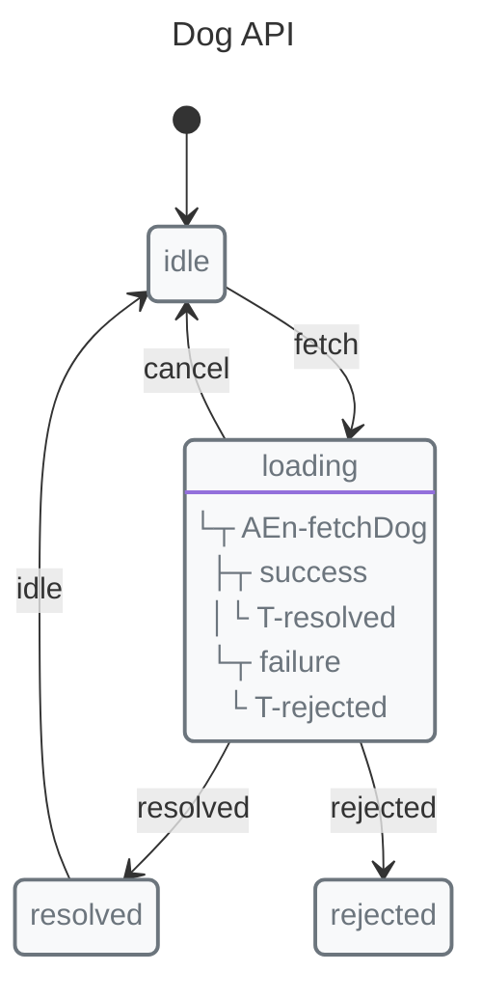
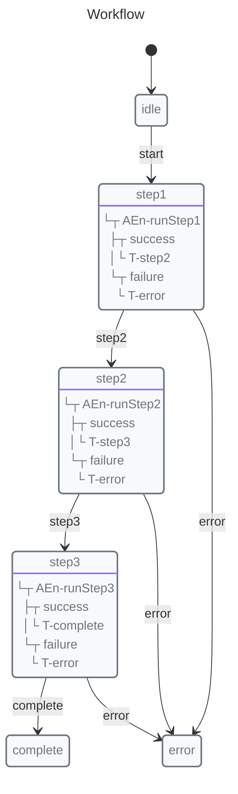
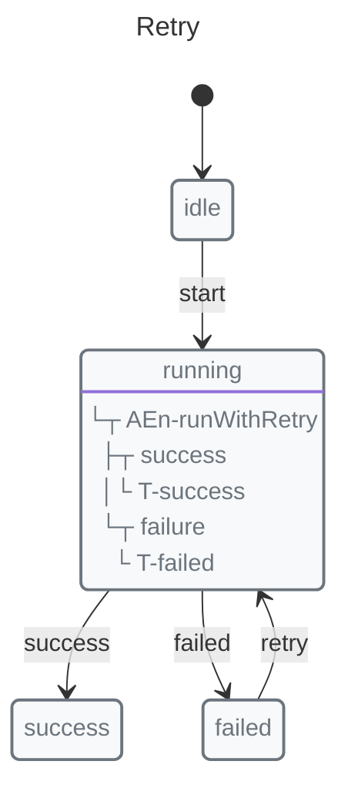
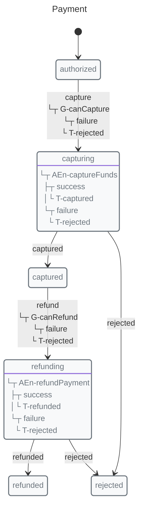

# Async Operations

X-Robot's Pulse concept makes async state management simple. One function handles the async operation and state transition.

## Basic Async with Pulse


```javascript
import { context, entry, immediate, init, initial, invoke, machine, state, transition } from "x-robot";

async function fetchDog(ctx) {
  ctx.dog = "https://images.example/dog.jpg";
}

const fetchMachine = machine(
  "Dog API",
  init(initial("idle"), context({ dog: null, error: null })),
  state("idle", transition("fetch", "loading")),
  state("loading", entry(fetchDog, "resolved", "rejected"), transition("cancel", "idle")),
  state("resolved", immediate("idle")),
  state("rejected")
);
```

## Using invoke()

<!-- x-robot:fragment -->

```javascript
invoke(fetchMachine, "fetch");

// Machine is now in "loading"
// When resolved: transitions to "resolved" or "rejected"
```

For async operations, use await:

<!-- x-robot:fragment -->

```javascript
await invoke(fetchMachine, "fetch");
console.log(fetchMachine.current); // "resolved" or "rejected"
```

### Runtime ordering and cancellation

`invoke()` calls are serialized per machine runtime: if an invocation is already
running, the next invocation waits in that machine's queue instead of running at
the same time. When a queued invocation starts, X-Robot revalidates it against
the machine's current state, so stale queued work will not run against a state
that no longer accepts that event.

`cancel(machine)` invalidates in-flight async work and clears queued invocations
for that machine. When called on a parent machine, it also cancels active nested
and parallel child runtimes recursively.

`cancel(machine)` only controls X-Robot's runtime bookkeeping. It does not abort
external I/O such as `fetch()` requests, timers, or database calls, and it does
not undo side effects that have already happened.

## Error Handling

### Automatic Error Transitions

<!-- x-robot:fragment -->

```javascript
async function fetchWithErrorCheck(ctx) {
  const res = await fetch("/api/data");
  if (!res.ok) {
    throw new Error("HTTP " + res.status);
  }
  ctx.data = await res.json();
}

state("loading", entry(fetchWithErrorCheck, "success", "error"))
```

### Manual Error Handling

<!-- x-robot:fragment -->

```javascript
async function fetchWithTryCatch(ctx) {
  try {
    const res = await fetch("/api/data");
    ctx.data = await res.json();
  } catch (e) {
    ctx.error = e.message;
    throw e; // Trigger failure transition
  }
}

state("loading", entry(fetchWithTryCatch, "success", "error"))
```

## Multiple Async Operations



<!-- x-robot:fragment -->


<!-- x-robot:fragment -->


```javascript
import { context, entry, init, initial, machine, state, transition } from "x-robot";

async function step1(ctx) {
  ctx.steps = [...(ctx.steps ?? []), "step1"];
}

async function step2(ctx) {
  ctx.steps = [...(ctx.steps ?? []), "step2"];
}

async function step3(ctx) {
  ctx.steps = [...(ctx.steps ?? []), "step3"];
}

async function runStep1(ctx) {
  await step1(ctx);
}

async function runStep2(ctx) {
  await step2(ctx);
}

async function runStep3(ctx) {
  await step3(ctx);
}

const workflow = machine(
  "Workflow",
  init(initial("idle"), context({ steps: [] })),
  state("idle", transition("start", "step1")),
  state("step1", entry(runStep1, "step2", "error")),
  state("step2", entry(runStep2, "step3", "error")),
  state("step3", entry(runStep3, "complete", "error")),
  state("complete"),
  state("error")
);
```

## Retrying Failed Operations



<!-- x-robot:fragment -->


<!-- x-robot:fragment -->


```javascript
import { entry, init, initial, machine, state, transition } from "x-robot";

async function riskyOperation() {
  return { ok: true };
}

function delay(ms) {
  return new Promise((resolve) => setTimeout(resolve, ms));
}

async function runWithRetry(ctx) {
  let attempts = 0;
  while (attempts < 3) {
    try {
      await riskyOperation();
      return;
    } catch (e) {
      attempts++;
      if (attempts >= 3) throw e;
      await delay(1000 * attempts);
    }
  }
}

const withRetry = machine(
  "Retry",
  init(initial("idle")),
  state("idle", transition("start", "running")),
  state("running", entry(runWithRetry, "success", "failed")),
  state("success"),
  state("failed", transition("retry", "running"))
);
```

## Async Guards

Combine async operations with guards:

<!-- x-robot:fragment -->

```javascript
async function checkUserPermission(ctx) {
  const permission = await checkPermission(ctx.userId);
  return permission.granted;
}

state("idle", transition("proceed", "active", guard(checkUserPermission)))
```

## Choosing guards, entry, exit, and immediate

Use the machine primitive that matches the question you are asking:

*   **Guards:** “May this transition happen?” Use guards for sync or async preconditions that must pass before a transition occurs. If the guard returns `false`, or routes through a guard failure transition, the effect state is not entered.
*   **Entry:** “What should happen after entering this state?” Use entry pulses for sync or async effects that belong to the destination state, such as fetching data, capturing payment, or updating context. Async entry pulses can route to success and failure targets.
*   **Exit:** “What cleanup or release should happen before leaving this state?” Use exit pulses for sync or async cleanup, release, audit, or side effects tied to leaving a state. Keep exit work focused so the transition remains understandable.
*   **Immediate:** “Where should this state automatically route next?” Use immediate transitions for automatic routing after a state is entered or evaluated. Prefer immediate transitions for simple, deterministic routing; they can also use guards where guarded immediate routing is supported. If that guard is async, treat it as a precondition and keep it free of effects.

Payment flow summary:


```javascript
import { entry, guard, init, initial, machine, state, transition } from "x-robot";

async function canCapture() {
  return true;
}

async function canRefund() {
  return true;
}

async function captureFunds() {}

async function refundPayment() {}

const payment = machine(
  "Payment",
  init(initial("authorized")),
  state(
    "authorized",
    transition("capture", "capturing", guard(canCapture, "rejected"))
  ),
  state("capturing", entry(captureFunds, "captured", "rejected")),
  state("captured", transition("refund", "refunding", guard(canRefund, "rejected"))),
  state("refunding", entry(refundPayment, "refunded", "rejected")),
  state("refunded"),
  state("rejected")
);
```

In that shape:

*   `canCapture` and `canRefund` are guards because they answer whether the requested transition may happen. They may be sync checks against context or async checks against an external payment system.
*   `captureFunds` and `refundPayment` are entry pulses because they are effects that should run only after the preconditions pass.
*   An exit pulse would fit cleanup such as releasing a local reservation or writing a final audit event before leaving a state.
*   An immediate transition would fit automatic routing, such as sending a computed `review` state to `approved` or `rejected` after its data has been evaluated.

## Comparison: X-Robot vs Redux

Redux requires multiple functions:

<!-- x-robot:fragment -->

```javascript
// Redux: Action + Thunk + Reducer
function fetchRequest() {
  return { type: "FETCH_REQUEST" };
}

function fetchSuccess(data) {
  return { type: "FETCH_SUCCESS", payload: data };
}

function fetchFailure(error) {
  return { type: "FETCH_FAILURE", payload: error };
}

function fetchThunk() {
  return async function(dispatch) {
    dispatch(fetchRequest());
    try {
      const data = await api.fetch();
      dispatch(fetchSuccess(data));
    } catch (error) {
      dispatch(fetchFailure(error));
    }
  };
}

function reducer(state, action) {
  // Handle each action type
}
```

X-Robot: Single function:

<!-- x-robot:fragment -->

```javascript
// X-Robot: One pulse
async function loadData(ctx) {
  ctx.data = await api.fetch();
}

state("loading", entry(loadData, "success", "error"))
```

## Best Practices

1.  **Keep pulses focused** — One async operation per pulse
2.  **Handle errors explicitly** — Use try/catch with throw
3.  **Update context in pulse** — Don't rely on external state
4.  **Use guards for validation** — Before transitioning to async states

## Next Steps

*   [Guards Guide](./guards.md) — Conditional transitions
*   [Concepts: Pulse](../concepts/pulse.md) — Core concept
