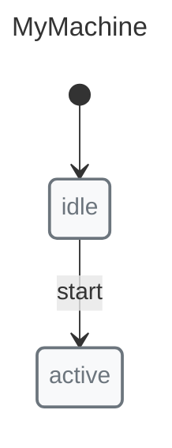
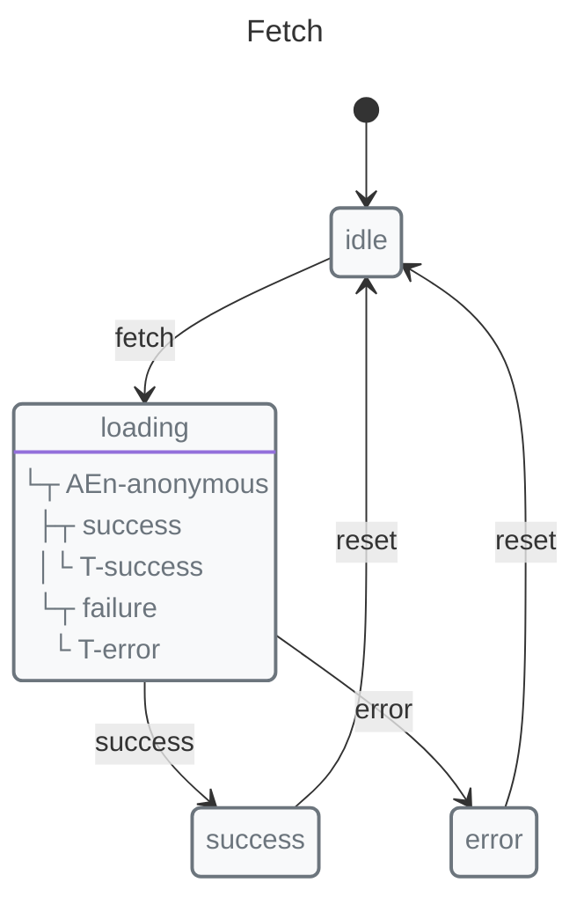

# Code Generation

Generate TypeScript, ESM, or CJS code from your machines using `documentate()`.

## Generate TypeScript


```javascript
import { machine, state, transition, initial, init, context } from "x-robot";
import { documentate } from "x-robot/documentate";

const myMachine = machine(
  "MyMachine",
  init(initial("idle"), context({ count: 0 })),
  state("idle", transition("start", "active")),
  state("active")
);

const { ts } = await documentate(myMachine, { format: "ts" });

console.log(ts);
// Exports:
// - MyMachine type
// - States type
// - Context type
// - All event types
```

## Generate ES Modules

```javascript
const { mjs } = await documentate(myMachine, { format: "mjs" });

console.log(mjs);
// import { machine, state, transition } from "x-robot";
// ...
```

## Generate CommonJS

```javascript
const { cjs } = await documentate(myMachine, { format: "cjs" });

console.log(cjs);
// const { machine, state, transition } = require("x-robot");
// ...
```

## Generate All Formats

```javascript
const { ts, mjs, cjs, json, scxml, plantuml, mermaid, svg, png } = 
  await documentate(myMachine, { format: "all" });
```

## Full Example


```javascript
import { machine, state, transition, initial, init, context, entry } from "x-robot";
import { documentate } from "x-robot/documentate";

const fetchMachine = machine(
  "Fetch",
  init(initial("idle"), context({ data: null, error: null })),
  state("idle", transition("fetch", "loading")),
  state("loading", entry(async (ctx) => {
    const res = await fetch("/api/data");
    ctx.data = await res.json();
  }, "success", "error")),
  state("success", transition("reset", "idle")),
  state("error", transition("reset", "idle"))
);

// Generate TypeScript
const { ts } = await documentate(fetchMachine, { format: "ts" });
```

Output TypeScript includes:

```typescript
// Generated types
export type States = "idle" | "loading" | "success" | "error";
export type Context = { data: unknown; error: unknown };
export type Events = "fetch" | "reset";

// Machine definition
export const fetchMachine = /* ... */;
```

## Use Cases

### Type-Safe Applications

Generate types for use in your application:

```typescript
// types.ts (generated)
export type FetchStates = "idle" | "loading" | "success" | "error";
export interface FetchContext {
  data: unknown;
  error: unknown;
}

// Use in your code
function handleState(machine: { current: FetchStates }) {
  switch (machine.current) {
    case "idle": /* ... */ break;
    case "loading": /* ... */ break;
    // TypeScript ensures all cases handled
  }
}
```

### Sharing Machine Definitions

Generate shareable code:

```javascript
// Share as ESM
const { mjs } = await documentate(machine, { format: "mjs" });
await writeFile("machine.mjs", mjs);

// Or as CJS
const { cjs } = await documentate(machine, { format: "cjs" });
await writeFile("machine.cjs", cjs);
```

### Documentation

Generate code as documentation:

```javascript
// Include in docs
const { ts } = await documentate(exampleMachine, { format: "ts" });
```

## Format Options

| Format | Description | Output |
|--------|-------------|--------|
| `ts` | TypeScript | `.ts` file with types |
| `mjs` | ES Modules | ESM JavaScript |
| `cjs` | CommonJS | CJS JavaScript |
| `json` | JSON | Machine definition |
| `scxml` | SCXML | XML format |
| `plantuml` | PlantUML | UML diagram code |
| `svg` | SVG | Vector diagram |
| `png` | PNG | Raster diagram |
| `all` | All | All formats |

## Next Steps

*   [SCXML Import/Export](./scxml.md) — XML format
*   [Serialization](./serialization.md) — Machine definition format
*   [Saving and Restoring](./saving-and-restoring.md) — Persist runtime state
*   [Visualization](./visualization.md) — Generate SVG/PNG diagrams
*   [API: documentate()](../api/modules/x_robot_documentate.md) — Full reference
