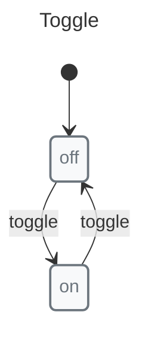
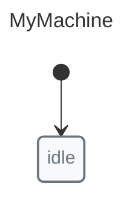
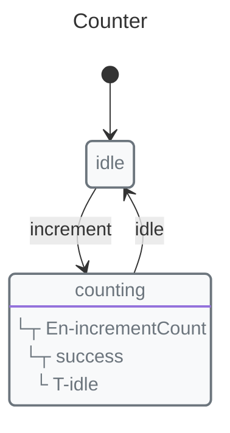
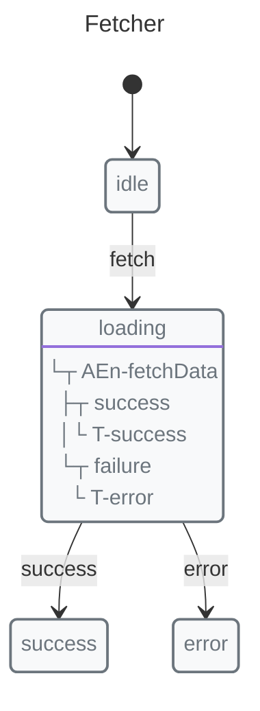
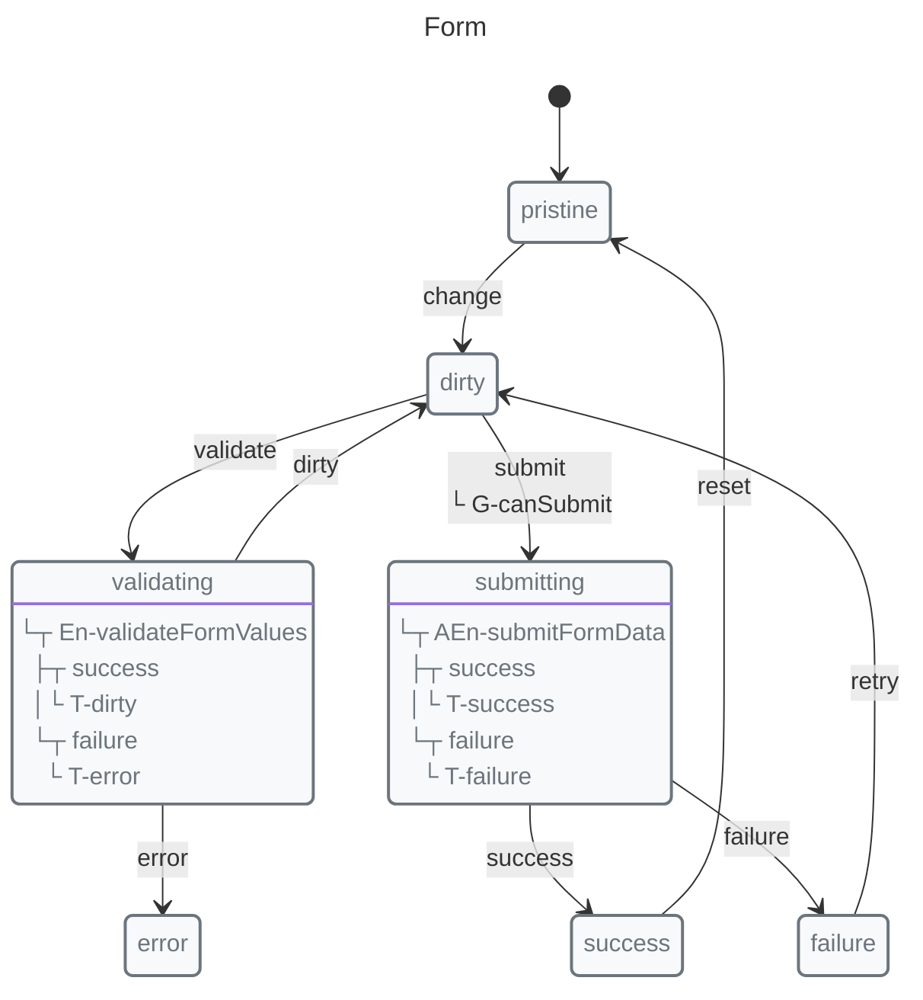

# Getting Started

Start with the [X-Robot Overview](../overview.md) for the product mental model, then use this guide to create your first state machine with the core `x-robot` runtime.

## Installation

```bash
npm install x-robot
# or
bun add x-robot
```

## Optional Modules

The core package is enough to define and run machines. As your project grows, you can opt into these modules:

*   `x-robot/devtools` - connect wrapped machine operations to Redux DevTools during development
*   `x-robot/documentate` - generate diagrams, serialization, and code output from machines
*   `x-robot/validate` - [validate machine structure](./validation.md) before shipping or generating artifacts
*   `@x-robot/react` and `@x-robot/vue` - [adapt machines to React and Vue](./framework-adapters.md)

You do not need all of them on day one. A common path is: start with the core runtime, add a framework adapter when UI state must update from machine transitions, add `validate` when your machines become more complex, add `documentate` when you want generated diagrams or exports, and use `devtools` only in development.

For stable import paths and SemVer expectations, read [Public API and Stability](./public-api.md).

## Your First Machine

This example models one product decision: the toggle can be `off` or `on`. The `toggle` event moves the machine between those two valid states.



```javascript
import { machine, state, transition } from "x-robot";

const toggle = machine(
  "Toggle",
  state("off", transition("toggle", "on")),
  state("on", transition("toggle", "off"))
);
```

## Understanding the Parts

### machine(name, ...states)

Creates a new state machine.



```javascript
import { machine, state } from "x-robot";

const myMachine = machine("MyMachine", state("idle"));
```

### state(name, ...handlers)

Defines a state. Handlers include transitions, pulses, guards, etc.

```javascript
import { state, transition } from "x-robot";

state("idle", transition("start", "running"))
```

### transition(event, target, ...options)

Defines how the machine responds to events.

```javascript
import { guard, transition } from "x-robot";

transition("toggle", "on")           // Simple
transition("submit", "saving", guard(canSubmit))  // With guard
```

### invoke(machine, event, payload?)

Triggers a transition.

```javascript
import { invoke } from "x-robot";

invoke(myMachine, "submit", { data: "value" });
```

## Adding Context

Context stores data associated with the machine:



```javascript
import { context, entry, initial, init, invoke, machine, state, transition } from "x-robot";

function incrementCount(ctx) {
  ctx.count += 1;
}

const counter = machine(
  "Counter",
  init(
    initial("idle"),
    context({ count: 0 })
  ),
  state("idle", transition("increment", "counting")),
  state("counting", entry(incrementCount, "idle"))
);

invoke(counter, "increment");
console.log(counter.context.count); // 1
```

## Working with Async

The Pulse concept handles async operations:



```javascript
import { context, entry, initial, init, invoke, machine, state, transition } from "x-robot";

async function fetchData(ctx) {
  const res = await fetch("/api/data");
  ctx.data = await res.json();
}

const fetcher = machine(
  "Fetcher",
  init(initial("idle"), context({ data: null })),
  state("idle", transition("fetch", "loading")),
  state("loading", entry(fetchData, "success", "error")),
  state("success"),
  state("error")
);

await invoke(fetcher, "fetch");
console.log(fetcher.current); // "success" or "error"
```

## Complete Example

Here's a form submission machine with validation:



```javascript
import { machine, state, transition, invoke, initial, init, context, entry, guard } from "x-robot";

function validateFormValues(ctx) {
  ctx.errors = validateForm(ctx.values);
}

async function submitFormData(ctx) {
  await submitForm(ctx.values);
}

function canSubmit(ctx) {
  return Object.keys(ctx.errors).length === 0;
}

const formMachine = machine(
  "Form",
  init(
    initial("pristine"),
    context({ values: {}, errors: {} })
  ),
  state("pristine", transition("change", "dirty")),
  state("dirty", 
    transition("validate", "validating"),
    transition("submit", "submitting", guard(canSubmit))
  ),
  state("validating", entry(validateFormValues, "dirty", "error")),
  state("submitting", entry(submitFormData, "success", "failure")),
  state("success", transition("reset", "pristine")),
  state("failure", transition("retry", "dirty")),
  state("error")
);
```

## Next Steps

*   [Async Guide](./async.md) — Deep dive into Pulse
*   [Guards Guide](./guards.md) — Conditional transitions
*   [Public API and Stability](./public-api.md) — Stable imports, optional modules, and SemVer expectations
*   [Validation](./validation.md) — Check machine structure before shipping
*   [Immediate Transitions](./immediate-transitions.md) — Auto-transitioning states
*   [Devtools Guide](./devtools.md) — Inspect wrapped transitions in Redux DevTools
*   [Visualization](./visualization.md) — Generate diagrams
*   [Concepts: Pulse](../concepts/pulse.md) — Understand the core concept
*   [Recipes](../recipes/) — Common patterns
