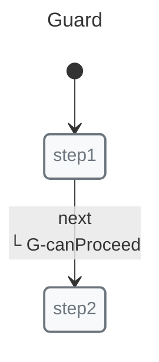
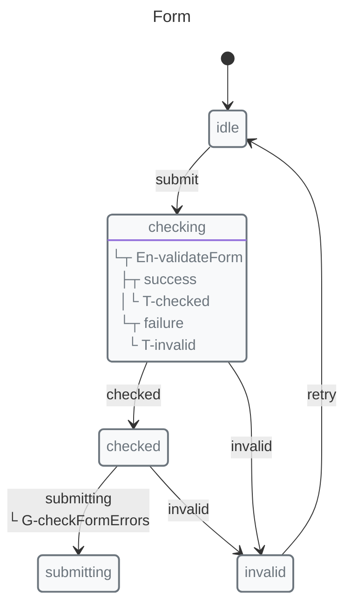
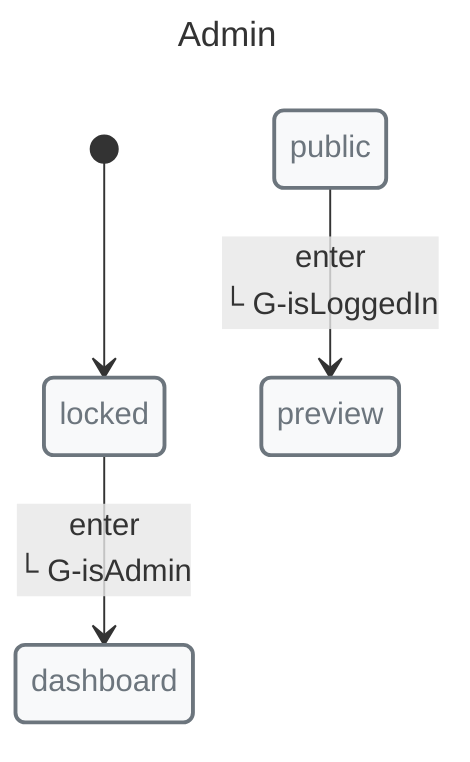

# Using Guards

Guards determine whether a transition can occur. They receive context and optional payload, and must return `true` to allow the transition.

## Basic Guard



```javascript
import { guard, init, initial, machine, state, transition } from "x-robot";

function canProceed(ctx, payload) {
  return payload?.value > 0;
}

const guardedFlow = machine(
  "Guard",
  init(initial("step1")),
  state("step1", transition("next", "step2", guard(canProceed))),
  state("step2")
);
```

## Guard with Failure Transition

Specify what happens when the guard does not return `true`:

```javascript
state("input", transition("submit", "valid", guard(isValid, "invalid")));
```

*   First argument: The guard function
*   Second argument: Failure transition to invoke when the guard does not return `true`

## Common Use Cases

### Form Validation



```javascript
function validateEmail(ctx, email) {
  return /^[^\s@]+@[^\s@]+\.[^\s@]+$/.test(email);
}

function validatePassword(ctx, pw) {
  return pw.length >= 8;
}

function checkFormErrors(ctx) {
  return !ctx.errors?.email && !ctx.errors?.password;
}

function validateForm(ctx) {
  ctx.errors = {
    email: validateEmail(ctx, ctx.email) ? null : "Invalid email",
    password: validatePassword(ctx, ctx.password) ? null : "Too short"
  };
}

const formMachine = machine(
  "Form",
  init(initial("idle")),
  state("idle", transition("submit", "checking")),
  state("checking", entry(validateForm, "checked", "invalid")),
  state(
    "checked",
    immediate("submitting", guard(checkFormErrors)),
    immediate("invalid")
  ),
  state("invalid", transition("retry", "idle")),
  state("submitting")
);
```

### Role-Based Access



```javascript
function isAdmin(ctx) {
  return ctx.user?.role === "admin";
}

function isLoggedIn(ctx) {
  return !!ctx.user;
}

const adminSection = machine(
  "Admin",
  init(initial("locked")),
  state("locked", transition("enter", "dashboard", guard(isAdmin))),
  state("dashboard"),
  state("public", transition("enter", "preview", guard(isLoggedIn))),
  state("preview")
);
```

### Conditional History

```javascript
function shouldSave(ctx) {
  return ctx.preferences.autoSave;
}

state("editing", transition("save", "saved", guard(shouldSave, "discarded")));
```

## Async Guards

X-Robot supports native async guards:

```javascript
async function checkPermission(ctx) {
  const res = await fetch("/api/permission");
  const data = await res.json();
  return data.allowed;
}

state("idle", transition("check", "granted", guard(checkPermission)));
```

## Multiple Guards

Chain guards directly - they run in order:

```javascript
function guard1(ctx) {
  return ctx.value > 0;
}

function guard2(ctx) {
  return ctx.isValid;
}

// All guards must pass for transition
state("step1", transition("next", "step2", guard(guard1), guard(guard2)));
```

With async guards:

```javascript
async function asyncGuard1(ctx) {
  // ... async logic
}

async function asyncGuard2(ctx) {
  // ... async logic
}

state("idle", transition("start", "loading", guard(asyncGuard1), guard(asyncGuard2)));
```

## Guards vs Entry Pulses

*   **Guards** run before the transition decision
*   **Pulse** runs after entering the state where it is defined

```javascript
function canApprove(ctx) {
  return ctx.user?.canApprove;
}

function notify(ctx) {
  console.log("Notifying:", ctx.message);
}

state("review", 
  transition("approve", "approved", guard(canApprove)),  // Runs first
  entry(notify),                                        // Runs after entering "review"
  transition("reject", "rejected")
)
```

## Best Practices

1.  **Keep guards pure** — Don't modify context in guards
2.  **Use meaningful names** — `canSubmit` better than `validate`
3.  **Handle async carefully** — Consider timeout scenarios
4.  **Provide feedback** — Use failure transitions to show why blocked

## Next Steps

*   [Async Guide](./async.md) — Guards with async operations
*   [Concepts: Guards](../concepts/guards.md) — Deep dive
*   [Recipes: Form Validation](../recipes/form-validation.md) — Complete example
