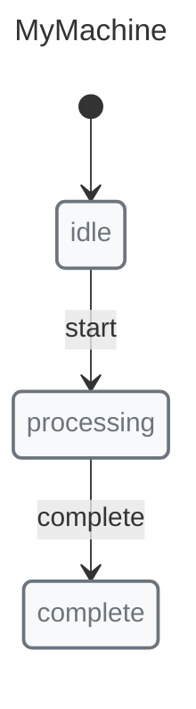
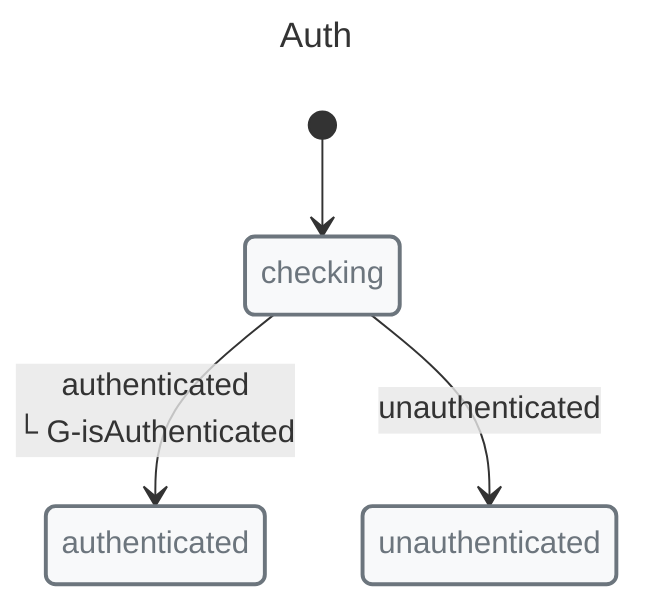
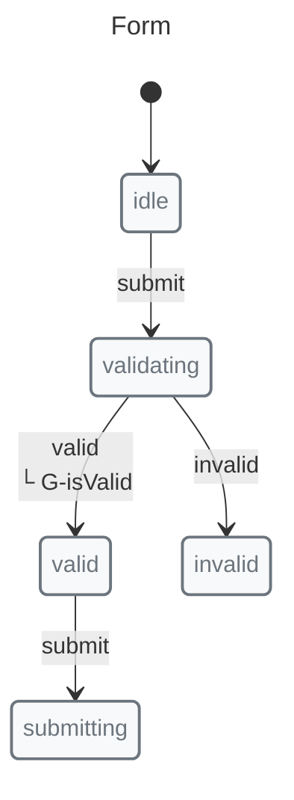
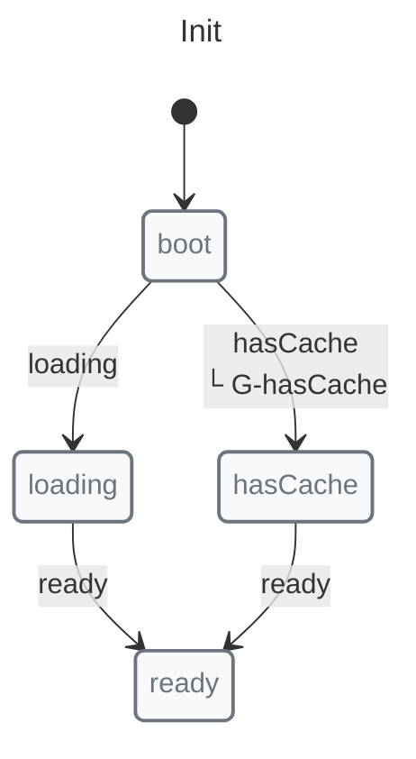
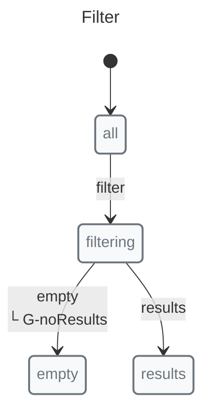
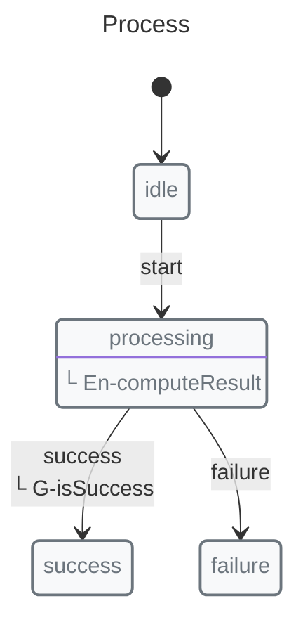

# Immediate Transitions

Immediate transitions allow a state to automatically transition to another state without waiting for an event. They're useful for validation, computed states, and redirecting based on conditions.

## Basic Usage



```javascript
import { immediate, init, initial, machine, state, transition } from "x-robot";

const myMachine = machine(
  "MyMachine",
  init(initial("idle")),
  state("idle", transition("start", "processing")),
  state("processing", immediate("complete")),
  state("complete")
);
```

## With Guards

Immediate transitions can use guards to conditionally redirect:



```javascript
function isAuthenticated(ctx) {
  return ctx.user !== null;
}

const authMachine = machine(
  "Auth",
  init(initial("checking")),
  state(
    "checking",
    immediate("authenticated", guard(isAuthenticated)),
    immediate("unauthenticated")
  ),
  state("authenticated"),
  state("unauthenticated")
);
```

## Use Cases

### Validation Redirect

Redirect based on validation results:



```javascript
function isValid(ctx) {
  return Object.keys(ctx.errors).length === 0;
}

const formMachine = machine(
  "Form",
  init(initial("idle")),
  state("idle", transition("submit", "validating")),
  state("validating", 
    immediate("valid", guard(isValid)),
    immediate("invalid")
  ),
  state("valid", transition("submit", "submitting")),
  state("invalid"),
  state("submitting")
);
```

### Initial State Logic

Process and redirect on initialization:



```javascript
function hasCache(ctx) {
  return !!ctx.cachedData;
}

const initMachine = machine(
  "Init",
  init(initial("boot")),
  state(
    "boot",
    immediate("hasCache", guard(hasCache)),
    immediate("loading")
  ),
  state("loading", immediate("ready")),
  state("hasCache", immediate("ready")),
  state("ready")
);
```

### Computed States

Create states that automatically compute and redirect:



```javascript
function noResults(ctx) {
  return ctx.items.length === 0;
}

const filterMachine = machine(
  "Filter",
  init(initial("all")),
  state("all", transition("filter", "filtering")),
  state("filtering", immediate("empty", guard(noResults)), immediate("results")),
  state("empty"),
  state("results")
);
```

## With Entry Pulses

Immediate transitions work with entry pulses:



```javascript
function computeResult(ctx) {
  ctx.result = compute(ctx.input);
}

function isSuccess(ctx) {
  return ctx.result !== null;
}

const processMachine = machine(
  "Process",
  init(initial("idle")),
  state("idle", transition("start", "processing")),
  state("processing", 
    entry(computeResult),
    immediate("success", guard(isSuccess)),
    immediate("failure")
  ),
  state("success"),
  state("failure")
);
```

The entry pulse runs first, then the immediate transition evaluates guards.

## Next Steps

*   [Guards Guide](./guards.md) — Conditional transitions
*   [Concepts: Guards](../concepts/guards.md) — Deep dive
