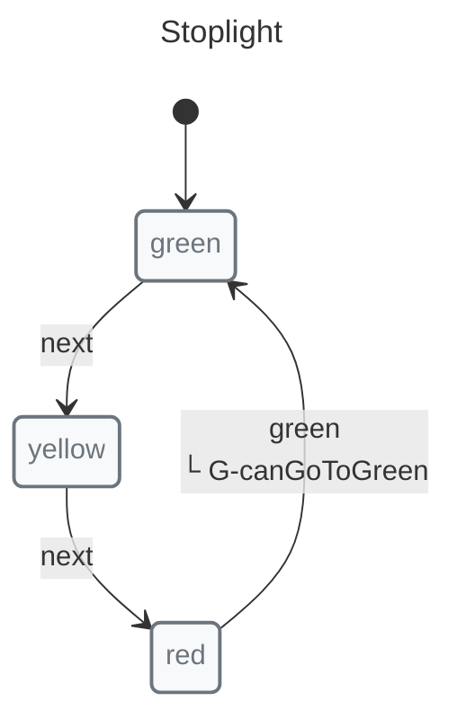
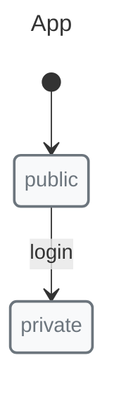
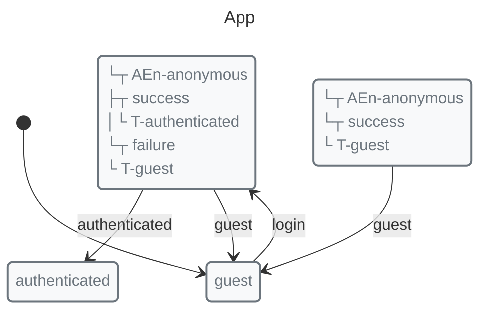
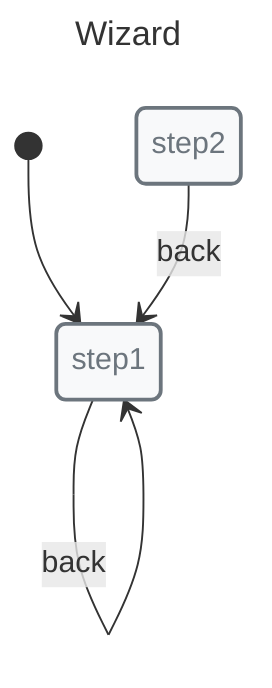

# Nested Machines

Nesting machines within other machines creates hierarchical state organizations.

## Basic Nesting



```javascript
import { guard, immediate, init, initial, machine, nested, state, transition } from "x-robot";

const stopwalk = machine(
  "Stopwalk",
  init(initial("wait")),
  state("wait", transition("start", "walk")),
  state("walk", transition("stop", "wait"))
);

function canGoToGreen() {
  return stopwalk.current === "wait";
}

const stoplight = machine(
  "Stoplight",
  init(initial("green")),
  state("green", transition("next", "yellow")),
  state("yellow", transition("next", "red")),
  state("red", nested(stopwalk, "start"), immediate("green", guard(canGoToGreen)))
);
```

## Invoking Nested Transitions

Use dot notation:

```javascript
invoke(stoplight, "next");        // green -> yellow
invoke(stoplight, "next");        // yellow -> red
invoke(stoplight, "red.start");   // stopwalk: wait -> walk
invoke(stoplight, "red.stop");    // stopwalk: walk -> wait
```

## Accessing Nested State

```javascript
console.log(stoplight.current);   // "red"
console.log(stopwalk.current);    // "wait" or "walk"
```

## Initial State in Nested Machines



```javascript
const auth = machine(
  "Auth",
  init(initial("unauthenticated")),
  state("unauthenticated", transition("login", "authenticating")),
  state("authenticating", transition("success", "authenticated")),
  state("authenticated", transition("logout", "unauthenticated"))
);

const app = machine(
  "App",
  init(initial("public")),
  state("public", transition("login", "private")),
  state("private", nested(auth)),  // Starts in "unauthenticated"
  state("loggingOut")
);
```

## Guards with Nested Machines

```javascript
const isAuthenticated = () => auth.current === "authenticated";

state("private", 
  nested(auth),
  transition("logout", "loggingOut", guard(isAuthenticated))
);
```

## Exit Handling

Invoke child transitions from the parent using dot notation:

```javascript
state("private", nested(auth));

invoke(app, "private.logout");
```

## Use Cases

### Authentication



```javascript
const auth = machine(
  "Auth",
  init(initial("authenticated")),
  state("authenticated", transition("logout", "loggedOut")),
  state("loggedOut")
);

const app = machine(
  "App",
  init(initial("guest")),
  state("guest", transition("login", "loggingIn")),
  state("loggingIn", entry(async (ctx, credentials) => {
    ctx.user = await authenticate(credentials);
  }, "authenticated", "guest")),
  state("authenticated", nested(auth, "logout")),
  state("loggingOut", entry(async (ctx) => {
    await logout();
    ctx.user = null;
  }, "guest"))
);
```

### Form Wizards



```javascript
const step1 = machine("Step1", init(initial("pending")),
  state("pending", transition("next", "completed")),
  state("completed")
);

const step2 = machine("Step2", init(initial("pending")),
  state("pending", transition("next", "completed")),
  state("completed")
);

const wizard = machine(
  "Wizard",
  init(initial("step1")),
  state("step1", nested(step1, "next"), transition("back", "step1")),
  state("step2", nested(step2, "next"), transition("back", "step1")),
  state("complete")
);
```

## Best Practices

1.  **Limit nesting depth** — 2-3 levels maximum
2.  **Use clear names** — `auth.logout` clearer than `auth.logout`
3.  **Pass data explicitly** — Parent and child machines keep separate contexts
4.  **Consider parallel** — If regions are independent, use parallel states

## Next Steps

*   [Parallel States](./parallel-states.md) — Independent regions
*   [Concepts: Nested](../concepts/nested.md) — Deep dive
*   [Recipes: Wizard](../recipes/wizard.md) — Multi-step forms
