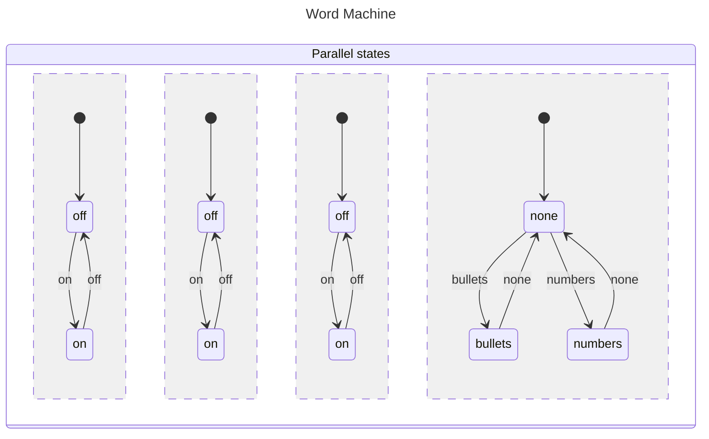
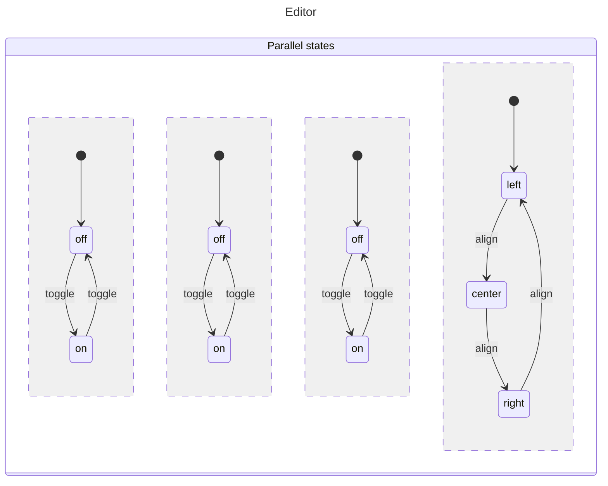
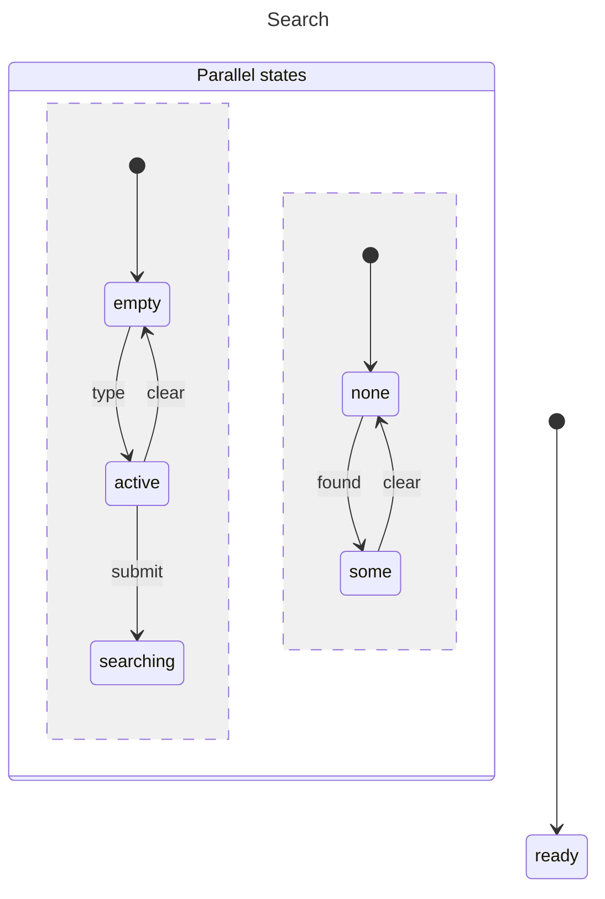
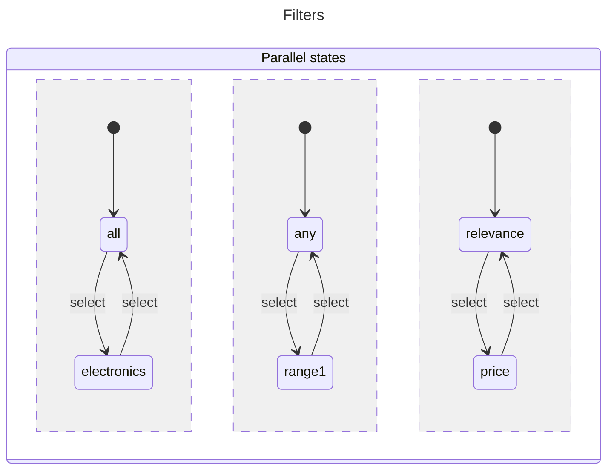
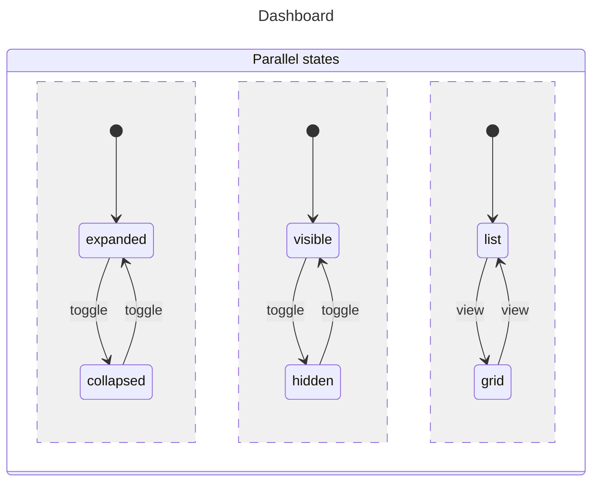

# Parallel States

Parallel states allow multiple independent states to be active simultaneously.

## Basic Parallel Machine


```javascript
import { getState, init, initial, invoke, machine, parallel, state, transition } from "x-robot";

const boldMachine = machine(
  "Bold",
  init(initial("off")),
  state("off", transition("on", "on")),
  state("on", transition("off", "off"))
);

const underlineMachine = machine(
  "Underline",
  init(initial("off")),
  state("off", transition("on", "on")),
  state("on", transition("off", "off"))
);

const italicsMachine = machine(
  "Italics",
  init(initial("off")),
  state("off", transition("on", "on")),
  state("on", transition("off", "off"))
);

const listMachine = machine(
  "List",
  init(initial("none")),
  state("none", transition("bullets", "bullets"), transition("numbers", "numbers")),
  state("bullets", transition("none", "none")),
  state("numbers", transition("none", "none"))
);

const wordMachine = machine(
  "Word Machine",
  parallel(boldMachine, underlineMachine, italicsMachine, listMachine)
);
```

## Accessing State

### getState()

```javascript
const state = getState(wordMachine);
// { bold: "off", underline: "off", italics: "off", list: "none" }
```

### Direct Access

```javascript
console.log(boldMachine.current);    // "off"
console.log(italicsMachine.current); // "off"
```

## Invoking Transitions

Target specific regions with slash notation:

```javascript
invoke(wordMachine, "bold/on");      // bold: off -> on
invoke(wordMachine, "italics/on");   // italics: off -> on
```

## Complete Example: Text Editor


```javascript
const bold = machine("Bold", init(initial("off")),
  state("off", transition("toggle", "on")),
  state("on", transition("toggle", "off"))
);

const italic = machine("Italic", init(initial("off")),
  state("off", transition("toggle", "on")),
  state("on", transition("toggle", "off"))
);

const underline = machine("Underline", init(initial("off")),
  state("off", transition("toggle", "on")),
  state("on", transition("toggle", "off"))
);

const alignment = machine("Alignment", init(initial("left")),
  state("left", transition("align", "center")),
  state("center", transition("align", "right")),
  state("right", transition("align", "left"))
);

const editor = machine(
  "Editor",
  parallel(bold, italic, underline, alignment)
);
```

## Parallel with Context


```javascript
const search = machine(
  "Search",
  init(initial("ready"), context({ query: "", results: [] })),
  parallel(
    machine("Query", init(initial("empty")),
      state("empty", transition("type", "active")),
      state("active", transition("clear", "empty"), transition("submit", "searching"))
    ),
    machine("Results", init(initial("none")),
      state("none", transition("found", "some")),
      state("some", transition("clear", "none"))
    )
  )
);
```

## Use Cases

### Multi-Filter Panel


```javascript
const category = machine("Category", init(initial("all")),
  state("all", transition("select", "electronics")),
  state("electronics", transition("select", "all"))
);

const priceRange = machine("PriceRange", init(initial("any")),
  state("any", transition("select", "range1")),
  state("range1", transition("select", "any"))
);

const sortBy = machine("SortBy", init(initial("relevance")),
  state("relevance", transition("select", "price")),
  state("price", transition("select", "relevance"))
);

const filters = machine("Filters", parallel(category, priceRange, sortBy));
```

### Dashboard Panels


```javascript
const sidebar = machine("Sidebar", init(initial("expanded")),
  state("expanded", transition("toggle", "collapsed")),
  state("collapsed", transition("toggle", "expanded"))
);

const header = machine("Header", init(initial("visible")),
  state("visible", transition("toggle", "hidden")),
  state("hidden", transition("toggle", "visible"))
);

const content = machine("Content", init(initial("list")),
  state("list", transition("view", "grid")),
  state("grid", transition("view", "list"))
);

const dashboard = machine("Dashboard", parallel(sidebar, header, content));
```

## Best Practices

1.  **Keep regions independent** — No cross-region dependencies
2.  **Use meaningful names** — Easy to identify regions
3.  **Consider performance** — Many parallel regions may slow transitions

## Next Steps

*   [Nested Machines](./nested-machines.md) — Hierarchical states
*   [Concepts: Parallel](../concepts/parallel.md) — Deep dive
*   [Recipes: Modal Dialog](../recipes/modal-dialog.md) — UI state
