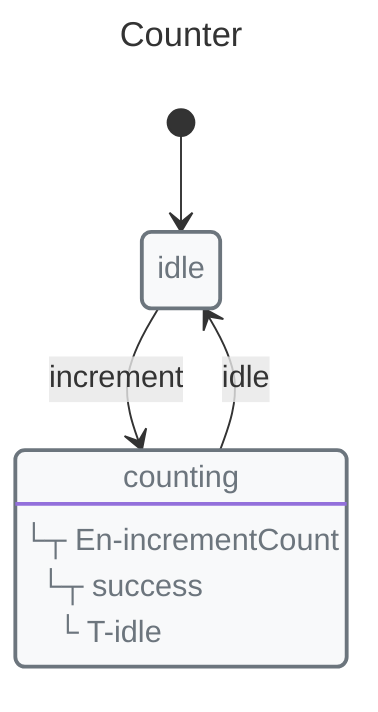

# Saving and Restoring State

Save and restore the runtime state of your machines using `snapshot()` and `start()`. This is useful for persisting machine state across page reloads, server restarts, or user sessions.

## Basic Usage

### Get a Snapshot

```javascript
import { snapshot } from "x-robot";

const state = snapshot(myMachine);

console.log(state);
// {
//   current: "loading",
//   context: { data: [...] },
//   history: ["State: idle", "Transition: fetch", "State: loading"],
//   parallel: { ... },    // if parallel machines exist
//   nested: { ... }      // if nested machines exist
// }
```

### Restore from Snapshot

```javascript
import { start } from "x-robot";

// Later, restore the state
start(myMachine, savedSnapshot);

console.log(myMachine.current); // "loading"
console.log(myMachine.context.data); // [...]
```

## Complete Example


```javascript
import { machine, state, transition, initial, init, context, invoke, snapshot, start } from "x-robot";

function incrementCount(ctx) {
  ctx.count += 1;
}

const counter = machine(
  "Counter",
  init(initial("idle"), context({ count: 0 })),
  state("idle", transition("increment", "counting")),
  state("counting", entry(incrementCount, "idle"))
);

// Simulate state changes
invoke(counter, "increment");
invoke(counter, "increment");

// Save snapshot
const savedSnapshot = snapshot(counter);
console.log(savedSnapshot.context.count); // 2

// Later, restore
const restoredMachine = machine(
  "Counter",
  init(initial("idle"), context({ count: 0 })),
  state("idle", transition("increment", "counting")),
  state("counting", entry(incrementCount, "idle"))
);
start(restoredMachine, savedSnapshot);

console.log(restoredMachine.context.count); // 2
```

## Use Cases

### Local Storage (Browser)

```javascript
// Save to localStorage
function saveState() {
  const state = snapshot(myMachine);
  localStorage.setItem("machineState", JSON.stringify(state));
}

// Load from localStorage
function loadState() {
  const saved = localStorage.getItem("machineState");
  if (saved) {
    start(myMachine, JSON.parse(saved));
  }
}
```

### Server-Side Database

```javascript
// Express route: Save state
app.post("/api/machine/save", (req, res) => {
  const state = snapshot(machineInstance);
  db.machines.update(req.session.id, { state });
  res.json({ success: true });
});

// Express route: Load state
app.get("/api/machine/load", async (req, res) => {
  const saved = await db.machines.find(req.session.id);
  if (saved) {
    start(machineInstance, saved.state);
  }
  res.json({ machine: machineInstance });
});
```

### Session Persistence

```javascript
// Express session with store
app.use(session({
  store: new SessionStore({
    serialize: (session) => snapshot(session.machine),
    deserialize: (data) => {
      const machine = createMachine();
      start(machine, data);
      return machine;
    }
  })
}));
```

## Snapshot Structure

```javascript
{
  current: string,        // Current state name
  context: object,       // Machine context (cloned)
  history: string[],      // Transition history array
  parallel?: object,      // Parallel machines state
  nested?: object        // Nested machines state
}
```

## Important Notes

1.  **You need the machine definition** - To restore, you must have the original machine definition. The snapshot only contains the runtime state (current state, context, history), not the machine structure.

2.  **Parallel and nested machines** - `snapshot()` automatically includes state from parallel and nested machines. `start()` restores them automatically.

3.  **Frozen context** - The snapshot contains a deep clone of the context, so it's safe to modify after snapshotting.

## Next Steps

*   [Serialization](./serialization.md) — Generate machine definitions for code/diagrams
*   [API: snapshot()](../api/interfaces/x_robot.MachineSnapshot.md) — Full reference
*   [API: start()](../api/modules/x_robot.md#start) — Full reference
