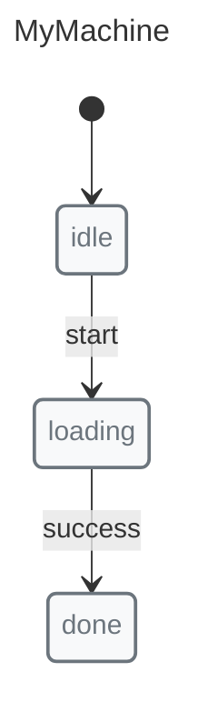

# SCXML Import/Export

SCXML (State Chart XML) is a W3C standard for state machines. X-Robot supports importing and exporting in SCXML format.

## Export to SCXML

<!-- x-robot:fragment -->

```javascript
import { documentate } from "x-robot/documentate";

const { scxml } = await documentate(myMachine, { format: "scxml" });

console.log(scxml);
// <?xml version="1.0" encoding="UTF-8"?>
// <scxml ...>
//   <state id="idle">...</state>
//   ...
// </scxml>
```

## Import from SCXML

<!-- x-robot:fragment -->

```javascript
const scxmlString = `<?xml version="1.0"?>
<scxml xmlns="http://www.w3.org/2005/07/scxml" version="1.0" initial="idle">
  <state id="idle">
    <transition event="start" target="loading"/>
  </state>
  <state id="loading">
    <transition event="success" target="success"/>
    <transition event="error" target="error"/>
  </state>
  <state id="success"/>
  <state id="error"/>
</scxml>`;

const { serialized } = await documentate(scxmlString, { format: "serialized" });
// serialized can be used with documentate() to generate code/diagrams
```

## Complete Import/Export Cycle


```javascript
import { machine, state, transition, initial, init } from "x-robot";
import { documentate } from "x-robot/documentate";

// Create machine
const myMachine = machine(
  "MyMachine",
  init(initial("idle")),
  state("idle", transition("start", "loading")),
  state("loading", transition("success", "done")),
  state("done")
);

// Export
const { scxml } = await documentate(myMachine, { format: "scxml" });

// Import - get serialized representation
const { serialized } = await documentate(scxml, { format: "serialized" });

console.log(serialized.initial); // "idle" (same as original)
```

## Features Supported

### States

```xml
<state id="idle"/>
<state id="loading"/>
<state id="success"/>
```

### Transitions

```xml
<state id="idle">
  <transition event="start" target="loading"/>
</state>
```

### Guards (Conditions)

```xml
<state id="idle">
  <transition event="submit" target="valid" cond="isValid"/>
</state>
```

### Entry/Exit Actions

```xml
<state id="loading">
  <onentry>
    <script>console.log('entering loading');</script>
  </onentry>
  <onexit>
    <script>console.log('exiting loading');</script>
  </onexit>
</state>
```

### Parallel States

```xml
<parallel id="editor">
  <state id="bold" initial="off">
    <state id="off"><transition event="toggle" target="on"/></state>
    <state id="on"><transition event="toggle" target="off"/></state>
  </state>
  <state id="italic" initial="off">
    <state id="off"><transition event="toggle" target="on"/></state>
    <state id="on"><transition event="toggle" target="off"/></state>
  </state>
</parallel>
```

## Use Cases

### Interoperability

Export to SCXML for tools that understand the standard:

*   SCXML validators
*   Visualization tools
*   Model checkers

### Migration

Import existing SCXML machines:

<!-- x-robot:fragment -->

```javascript
const legacyScxml = await fetchLegacyMachine();
const { serialized } = await documentate(legacyScxml, { format: "serialized" });
// serialized contains the machine definition
```

### Standards Compliance

SCXML export demonstrates X-Robot follows industry standards.

## Limitations

*   Some SCXML features not supported (invoke, send, cancel)
*   History tracking is an X-Robot feature and not part of SCXML standard

## Next Steps

*   [Code Generation](./code-generation.md) — Generate TypeScript/JS
*   [Serialization](./serialization.md) — Machine definition format
*   [Saving and Restoring](./saving-and-restoring.md) — Persist runtime state
*   [API: documentate()](../api/modules/x_robot_documentate.md) — Full reference
