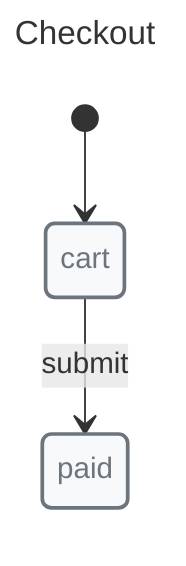
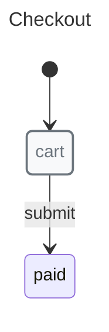

# Validation

Use `x-robot/validate` to check a machine before you ship it, run generated docs, or accept a complex workflow into a codebase.

## When to use validation

Validation is most useful when a machine has enough states, transitions, nested machines, parallel machines, guards, or pulses that structural mistakes are easy to miss in review.

Use it before release checks, documentation generation, or before accepting a large machine definition into the codebase.

## Basic validation

Import `validate()` from `x-robot/validate` and call it with a machine. The function completes without returning a value when the machine is structurally valid. It throws an error when it finds the first structural problem.

## Example: valid machine


```javascript
import { initial, init, machine, state, transition } from "x-robot";
import { validate } from "x-robot/validate";

const checkout = machine(
  "Checkout",
  init(initial("cart")),
  state("cart", transition("submit", "paid")),
  state("paid")
);

validate(checkout);
console.log("Machine is valid");
```

`validate(checkout)` completes without throwing because the machine has a title, its initial state exists, and the transition target exists.

## Example: invalid transition target


```javascript
import { initial, init, machine, state, transition } from "x-robot";
import { validate } from "x-robot/validate";

const checkout = machine(
  "Checkout",
  init(initial("cart")),
  state("cart", transition("submit", "paid"))
);

try {
  validate(checkout);
} catch (error) {
  console.error(error.message);
  // The transition 'submit' of the state 'cart' has a target state 'paid' that does not exists.
}
```

This catches a common docs and runtime mistake: the transition points to a state name that is not declared in the machine.

## What validate() checks

`validate()` currently checks the machine structure that X-Robot can inspect directly:

*   The machine has a valid `title`.
*   `initial` exists when required and points to an existing state.
*   Each non-initial, non-`fatal` state has a transition or entry pulse target that can reach it.
*   Normal transitions have string targets and point to existing states.
*   Immediate transitions point to states, nested machines, or parallel machines that can handle the transition.
*   Entry pulses use a function, appear before transitions, and have existing success/failure targets when those targets are declared.
*   Guards are used inside transitions, use a function, and have a valid failure transition when one is declared.
*   Nested machines and parallel machines are validated recursively.
*   Exit pulses with a declared failure target point to an existing state.

Validation does not prove that your business rules are correct. Keep domain expectations in unit tests near the machine.

## Practical adoption pattern

1.  Start by validating machines in unit tests.
2.  Add validation before documentation generation for machines that feed diagrams or serialized output.
3.  Keep validation near the machine definition when the workflow is business-critical.

## Next steps

*   [Getting Started](./getting-started.md) — Build a first machine before adding validation.
*   [Order Processing Flow](../recipes/order-flow.md) — Review a larger workflow where validation is useful.
*   [API: validate()](../api/modules/x_robot_validate.md#validate) — Read the generated API reference.
