# Visualization

Generate visual diagrams from your machines using `documentate()`. X-Robot can generate Mermaid and PlantUML state diagrams, Mermaid and PlantUML sequence diagrams, additional structural maps, plus SVG and PNG files.

`svg` and `png` keep their existing meaning: they render the current PlantUML state-diagram output. Use explicit image formats such as `svg-guards`, `png-guards`, `svg-complexity`, or `png-complexity` when you want an image for one of the PlantUML structural maps. PlantUML image generation requires a Node.js environment with Java available.

Use the format that matches the question you want to answer:

*   `mermaid` and `plantuml`: state diagrams that show states and transitions.
*   `mermaid-sequence` and `plantuml-sequence`: sequence diagrams that show structural interactions between the root machine, nested machines, and parallel machines. Use `svg-sequence` or `png-sequence` for PlantUML sequence image files.
*   Additional structural maps: pulse, event, outcome, immediate, guard, composition, and complexity diagrams.

## Basic Usage

<!-- x-robot:fragment -->

```javascript
import { documentate } from "x-robot/documentate";

// Generate Mermaid state diagram code
const { mermaid } = await documentate(myMachine, { format: "mermaid" });

// Generate PlantUML state diagram code
const { plantuml } = await documentate(myMachine, { format: "plantuml" });

// Generate SVG file path
const { svg } = await documentate(myMachine, { format: "svg" });

// Generate PNG file path
const { png } = await documentate(myMachine, { format: "png" });
```

## With Options

Customize the output with `level` and, for PlantUML-based output, `skinparam`:

```javascript
// High detail diagram
const { svg } = await documentate(myMachine, {
  format: "svg",
  level: "high"
});

// With custom PlantUML styling
const { svg } = await documentate(myMachine, {
  format: "svg",
  level: "high",
  skinparam: "skinparam backgroundColor white\nskinparam arrowColor #333"
});
```

## Options

### level

*   `"low"`: Basic state diagram
*   `"high"` (default): Detailed diagram with all transitions, guards, and actions

### skinparam

Customize PlantUML styling for `plantuml` and `svg` output. Common options:

<!-- x-robot:fragment -->

```javascript
skinparam: `
  skinparam backgroundColor white
  skinparam state {
    BackgroundColor white
    BorderColor black
    ArrowColor black
  }
  skinparam note {
    BackgroundColor #ffffcc
  }
`;
```

## From Different Inputs

You can generate diagrams from various input types:

```javascript
// From a Machine
const { svg } = await documentate(myMachine, { format: "svg" });

// From SerializedMachine
const { svg } = await documentate(serialized, { format: "svg" });

// From SCXML
const { svg } = await documentate(scxmlString, { format: "svg" });

// From PlantUML (to convert to image)
const { svg } = await documentate(plantUmlCode, { format: "svg" });
```

## Use Cases

### Documentation

Generate diagrams automatically for documentation:

```javascript
// In your build process
const { svg } = await documentate(myMachine, { format: "svg" });
console.log(svg); // absolute/relative path to generated SVG file
```

### Debugging

Visualize machine state during development:

<!-- x-robot:fragment -->

```javascript
async function debugDiagram(machine) {
  const { svg } = await documentate(machine, { format: "svg" });
  // Open in browser or save to file
  console.log(svg);
}
```

### Export

Save diagrams for external use:

```javascript
// Export as PNG
const { png } = await documentate(myMachine, { format: "png" });
console.log(png); // generated PNG file path
```

## PlantUML Generation

For more control, generate PlantUML code first:

```javascript
import { documentate } from "x-robot/documentate";

const { plantuml } = await documentate(myMachine, { format: "plantuml" });

// Customize
const { svg } = await documentate(myMachine, {
  format: "svg",
  skinparam: "skinparam stateFontSize 14"
});
```

## Sequence Diagram Generation

Use sequence diagrams when your machine includes nested or parallel machines and you want to see how those machine boundaries relate to each other.

Sequence diagrams are structural diagrams. They help explain the shape of a machine and its submachines; they are not runtime traces of a specific invocation.

### Mermaid Sequence Diagrams

```javascript
import { documentate } from "x-robot/documentate";

const result = await documentate(orderMachine, {
  format: "mermaid-sequence"
});

console.log(result.mermaid); // starts with sequenceDiagram
```

The result uses the same `mermaid` field as the regular Mermaid state-diagram format. Choose the format explicitly:

*   `format: "mermaid"` returns a Mermaid state diagram.
*   `format: "mermaid-sequence"` returns a Mermaid sequence diagram.

### PlantUML Sequence Diagrams

```javascript
import { documentate } from "x-robot/documentate";

const result = await documentate(orderMachine, {
  format: "plantuml-sequence"
});

console.log(result.plantuml); // PlantUML sequence diagram code
```

The result uses the same `plantuml` field as the regular PlantUML state-diagram format. Choose the format explicitly:

*   `format: "plantuml"` returns a PlantUML state diagram.
*   `format: "plantuml-sequence"` returns a PlantUML sequence diagram.

### What gets included

Sequence diagrams include participants for:

*   the root machine,
*   nested machines,
*   parallel machines.

Participant labels use the machine `title` when available. If a machine has no title, X-Robot uses stable default labels so generated diagrams stay readable across runs.

Sequence diagrams do not add custom actor configuration. There are no `actors` options, manual aliases, or actors inferred from event names.

## Additional Structural Diagram Maps

Use the additional diagram families when you want focused documentation views for a specific review question. These diagrams are structural views of the machine you pass to `documentate()`; they are not runtime traces and do not include callback bodies, payloads, context values, or function source.

Each family has a Mermaid and PlantUML source format. Mermaid output is returned in `result.mermaid`; PlantUML output is returned in `result.plantuml`. Each PlantUML family also has explicit SVG/PNG image formats returned in `result.svg` or `result.png`.

| Question                                                       | Mermaid format        | PlantUML source        | SVG image         | PNG image         |
| -------------------------------------------------------------- | --------------------- | ---------------------- | ----------------- | ----------------- |
| Where are entry and exit pulses declared?                      | `mermaid-pulses`      | `plantuml-pulses`      | `svg-pulses`      | `png-pulses`      |
| Which events are accepted by which states?                     | `mermaid-events`      | `plantuml-events`      | `svg-events`      | `png-events`      |
| Which state types and declared outcomes exist?                 | `mermaid-outcomes`    | `plantuml-outcomes`    | `svg-outcomes`    | `png-outcomes`    |
| Which automatic/immediate transitions exist?                   | `mermaid-immediate`   | `plantuml-immediate`   | `svg-immediate`   | `png-immediate`   |
| Which guarded transitions branch to target or failure states?  | `mermaid-guards`      | `plantuml-guards`      | `svg-guards`      | `png-guards`      |
| How are root, nested, and parallel machines composed?          | `mermaid-composition` | `plantuml-composition` | `svg-composition` | `png-composition` |
| Which states have more structural transition/action load?      | `mermaid-complexity`  | `plantuml-complexity`  | `svg-complexity`  | `png-complexity`  |

```javascript
const { mermaid } = await documentate(orderMachine, {
  format: "mermaid-guards"
});

const { plantuml } = await documentate(orderMachine, {
  format: "plantuml-complexity"
});

const { svg } = await documentate(orderMachine, {
  format: "svg-guards"
});
```

These formats are requested explicitly. `format: "all"` keeps the existing state-diagram outputs and does not include the additional structural maps.

### One machine, multiple views

A single machine can answer different documentation questions depending on the diagram family you generate. The gallery below uses one `OrderWorkflow` machine that includes typed states, entry pulse success/failure branches, exit pulses, guards, immediate transitions, a nested `Payment` machine, a parallel `Fulfillment` machine, and repeated events such as `submit`, `cancel`, and `ship`.

The outputs are generated from this same machine with `documentate(orderWorkflow, { format })`. They are intentionally wrapped in `<details>` blocks so this guide stays scannable while keeping the real Mermaid and PlantUML source available.

<details>
<summary>Example machine used for the gallery</summary>

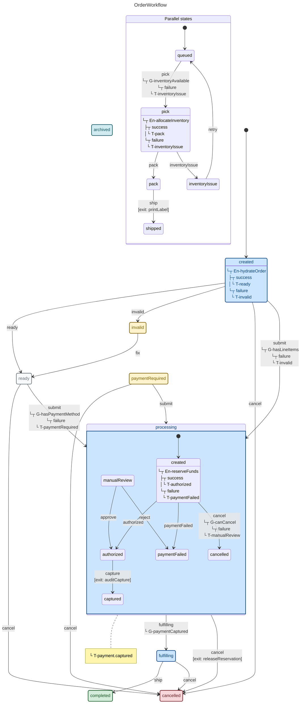

```javascript
import {
  dangerState,
  entry,
  exit,
  guard,
  immediate,
  infoState,
  init,
  initial,
  machine,
  nested,
  nestedGuard,
  parallel,
  primaryState,
  state,
  successState,
  transition,
  warningState
} from "x-robot";

function hydrateOrder() {}
function hasLineItems() {
  return true;
}
function hasPaymentMethod() {
  return true;
}
function releaseReservation() {}
function reserveFunds() {}
function canCancel() {
  return true;
}
function auditCapture() {}
function paymentCaptured() {
  return true;
}
function allocateInventory() {}
function printLabel() {}
function inventoryAvailable() {
  return true;
}

const payment = machine(
  "Payment",
  init(initial("created")),
  primaryState(
    "created",
    entry(reserveFunds, "authorized", "paymentFailed"),
    transition("cancel", "cancelled", guard(canCancel, "manualReview"))
  ),
  successState(
    "authorized",
    transition("capture", "captured", exit(auditCapture))
  ),
  successState("captured"),
  warningState(
    "manualReview",
    transition("approve", "authorized"),
    transition("reject", "paymentFailed")
  ),
  dangerState("paymentFailed"),
  dangerState("cancelled")
);

const fulfillment = machine(
  "Fulfillment",
  init(initial("queued")),
  state(
    "queued",
    immediate("pick", guard(inventoryAvailable, "inventoryIssue"))
  ),
  primaryState("pick", entry(allocateInventory, "pack", "inventoryIssue")),
  state("pack", transition("ship", "shipped", exit(printLabel))),
  successState("shipped"),
  warningState("inventoryIssue", transition("retry", "queued"))
);

const orderWorkflow = machine(
  "OrderWorkflow",
  init(initial("created")),
  primaryState(
    "created",
    entry(hydrateOrder, "ready", "invalid"),
    transition("submit", "processing", guard(hasLineItems, "invalid")),
    transition("cancel", "cancelled")
  ),
  state(
    "ready",
    transition(
      "submit",
      "processing",
      guard(hasPaymentMethod, "paymentRequired")
    ),
    transition("cancel", "cancelled")
  ),
  primaryState(
    "processing",
    nested(payment, "captured"),
    immediate("fulfilling", nestedGuard(payment, paymentCaptured)),
    transition("cancel", "cancelled", exit(releaseReservation, "cancelled"))
  ),
  primaryState(
    "fulfilling",
    transition("ship", "completed"),
    transition("cancel", "cancelled")
  ),
  warningState(
    "paymentRequired",
    transition("submit", "processing"),
    transition("cancel", "cancelled")
  ),
  warningState("invalid", transition("fix", "ready")),
  infoState("archived"),
  successState("completed"),
  dangerState("cancelled"),
  parallel(fulfillment)
);
```

</details>

#### State view

*   **Objective:** Review the complete state graph and the transitions that can move the workflow forward, sideways, or into failures.
*   **Shows:** Root states, typed state styling, nested `Payment` states inside `processing`, the parallel `Fulfillment` machine, guards, entry pulses, exit pulses, and automatic transitions.
*   **Useful developer detail:** Use it to spot unreachable-looking states, overloaded states, missing failure paths, and whether nested/parallel work is visible where reviewers expect it.

<details>
<summary>Mermaid output: <code>mermaid</code></summary>


</details>

<details>
<summary>PlantUML output: <code>plantuml</code></summary>

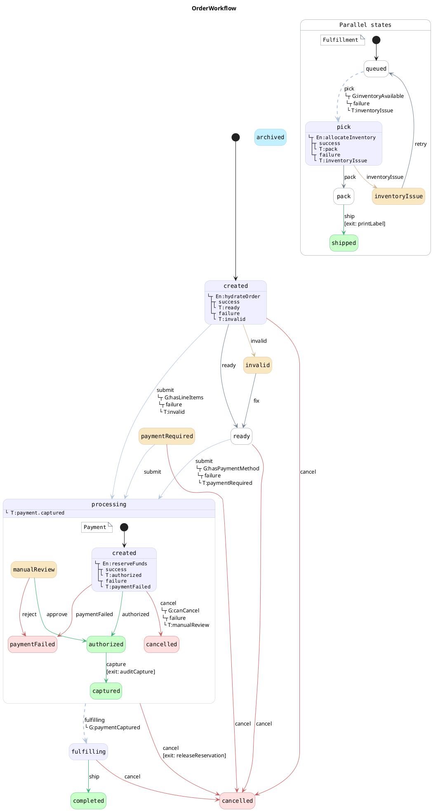

</details>

#### Sequence view

*   **Objective:** Explain how the root machine relates to child machines without reading every state box in the state diagram.
*   **Shows:** Participants for `OrderWorkflow`, nested `Payment`, and parallel `Fulfillment`, plus the transitions each participant owns.
*   **Useful developer detail:** Use it in design reviews when the important question is machine boundaries: which machine emits an outcome, which parent transition consumes it, and which work is parallel.

<details>
<summary>Mermaid output: <code>mermaid-sequence</code></summary>

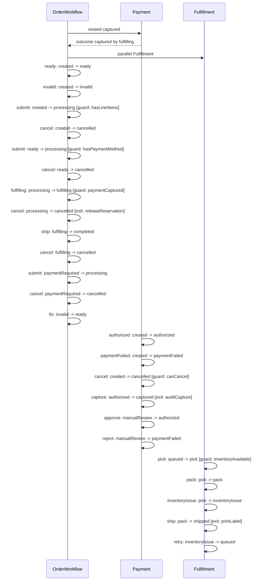

</details>

<details>
<summary>PlantUML output: <code>plantuml-sequence</code></summary>

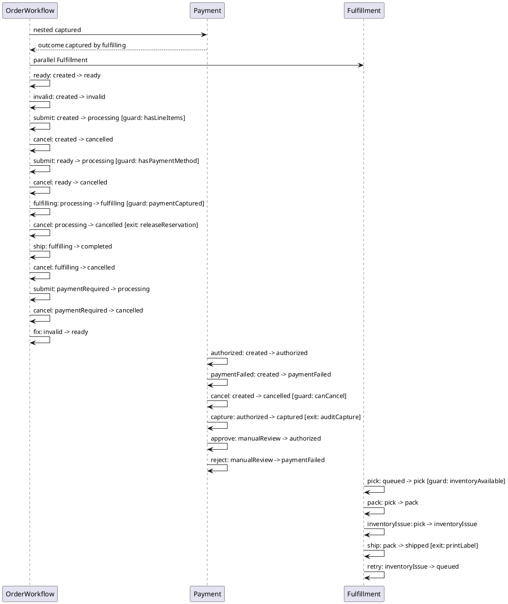

</details>

#### Pulses view

*   **Objective:** Audit side-effect hooks declared on entry and exit paths.
*   **Shows:** Entry pulse success and failure branches, plus exit pulses tied to the event that leaves a state.
*   **Useful developer detail:** Use it to confirm that success/failure outcomes are documented and that cleanup pulses such as cancellation or label printing are attached to the intended transition.

<details>
<summary>Mermaid output: <code>mermaid-pulses</code></summary>

```mermaid
flowchart TD
  root_created["created"]
  root_ready["ready"]
  root_processing["processing"]
  root_fulfilling["fulfilling"]
  root_paymentRequired["paymentRequired"]
  root_invalid["invalid"]
  root_archived["archived"]
  root_completed["completed"]
  root_cancelled["cancelled"]
  root_state_processing_nested_0_created["state.processing.nested.0.created"]
  root_state_processing_nested_0_authorized["state.processing.nested.0.authorized"]
  root_state_processing_nested_0_captured["state.processing.nested.0.captured"]
  root_state_processing_nested_0_manualReview["state.processing.nested.0.manualReview"]
  root_state_processing_nested_0_paymentFailed["state.processing.nested.0.paymentFailed"]
  root_state_processing_nested_0_cancelled["state.processing.nested.0.cancelled"]
  root_parallel_fulfillment_queued["parallel.fulfillment.queued"]
  root_parallel_fulfillment_pick["parallel.fulfillment.pick"]
  root_parallel_fulfillment_pack["parallel.fulfillment.pack"]
  root_parallel_fulfillment_shipped["parallel.fulfillment.shipped"]
  root_parallel_fulfillment_inventoryIssue["parallel.fulfillment.inventoryIssue"]
  root_created -->|"entry: hydrateOrder ✓"| root_ready
  root_created -->|"entry: hydrateOrder ✗"| root_invalid
  root_processing -->|"exit: releaseReservation on cancel"| root_cancelled
  root_state_processing_nested_0_created -->|"entry: reserveFunds ✓"| root_state_processing_nested_0_authorized
  root_state_processing_nested_0_created -->|"entry: reserveFunds ✗"| root_state_processing_nested_0_paymentFailed
  root_state_processing_nested_0_authorized -->|"exit: auditCapture on capture"| root_state_processing_nested_0_captured
  root_parallel_fulfillment_pick -->|"entry: allocateInventory ✓"| root_parallel_fulfillment_pack
  root_parallel_fulfillment_pick -->|"entry: allocateInventory ✗"| root_parallel_fulfillment_inventoryIssue
  root_parallel_fulfillment_pack -->|"exit: printLabel on ship"| root_parallel_fulfillment_shipped
  classDef pulse fill:#eef6ff,stroke:#2f6fed,color:#0b1b3a

```

</details>

<details>
<summary>PlantUML output: <code>plantuml-pulses</code></summary>

```plantuml
@startuml
skinparam rectangle {
  RoundCorner 12
  Shadowing false
}

rectangle "created" as root_created
rectangle "ready" as root_ready
rectangle "processing" as root_processing
rectangle "fulfilling" as root_fulfilling
rectangle "paymentRequired" as root_paymentRequired
rectangle "invalid" as root_invalid
rectangle "archived" as root_archived
rectangle "completed" as root_completed
rectangle "cancelled" as root_cancelled
rectangle "state.processing.nested.0.created" as root_state_processing_nested_0_created
rectangle "state.processing.nested.0.authorized" as root_state_processing_nested_0_authorized
rectangle "state.processing.nested.0.captured" as root_state_processing_nested_0_captured
rectangle "state.processing.nested.0.manualReview" as root_state_processing_nested_0_manualReview
rectangle "state.processing.nested.0.paymentFailed" as root_state_processing_nested_0_paymentFailed
rectangle "state.processing.nested.0.cancelled" as root_state_processing_nested_0_cancelled
rectangle "parallel.fulfillment.queued" as root_parallel_fulfillment_queued
rectangle "parallel.fulfillment.pick" as root_parallel_fulfillment_pick
rectangle "parallel.fulfillment.pack" as root_parallel_fulfillment_pack
rectangle "parallel.fulfillment.shipped" as root_parallel_fulfillment_shipped
rectangle "parallel.fulfillment.inventoryIssue" as root_parallel_fulfillment_inventoryIssue
root_created --> root_ready : entry: hydrateOrder ✓
root_created --> root_invalid : entry: hydrateOrder ✗
root_processing --> root_cancelled : exit: releaseReservation on cancel
root_state_processing_nested_0_created --> root_state_processing_nested_0_authorized : entry: reserveFunds ✓
root_state_processing_nested_0_created --> root_state_processing_nested_0_paymentFailed : entry: reserveFunds ✗
root_state_processing_nested_0_authorized --> root_state_processing_nested_0_captured : exit: auditCapture on capture
root_parallel_fulfillment_pick --> root_parallel_fulfillment_pack : entry: allocateInventory ✓
root_parallel_fulfillment_pick --> root_parallel_fulfillment_inventoryIssue : entry: allocateInventory ✗
root_parallel_fulfillment_pack --> root_parallel_fulfillment_shipped : exit: printLabel on ship
@enduml

```

</details>

#### Events view

*   **Objective:** Find which states accept each event and where repeated event names are reused.
*   **Shows:** Shared event nodes such as `submit`, `cancel`, and `ship`, with edges from every state that can receive them to their targets.
*   **Useful developer detail:** Use it when changing an event contract so you can see every state affected by that event name across root, nested, and parallel machines.

<details>
<summary>Mermaid output: <code>mermaid-events</code></summary>

```mermaid
flowchart LR
  root_created["created"]
  root_ready["ready"]
  root_processing["processing"]
  root_fulfilling["fulfilling"]
  root_paymentRequired["paymentRequired"]
  root_invalid["invalid"]
  root_archived["archived"]
  root_completed["completed"]
  root_cancelled["cancelled"]
  root_state_processing_nested_0_created["state.processing.nested.0.created"]
  root_state_processing_nested_0_authorized["state.processing.nested.0.authorized"]
  root_state_processing_nested_0_captured["state.processing.nested.0.captured"]
  root_state_processing_nested_0_manualReview["state.processing.nested.0.manualReview"]
  root_state_processing_nested_0_paymentFailed["state.processing.nested.0.paymentFailed"]
  root_state_processing_nested_0_cancelled["state.processing.nested.0.cancelled"]
  root_parallel_fulfillment_queued["parallel.fulfillment.queued"]
  root_parallel_fulfillment_pick["parallel.fulfillment.pick"]
  root_parallel_fulfillment_pack["parallel.fulfillment.pack"]
  root_parallel_fulfillment_shipped["parallel.fulfillment.shipped"]
  root_parallel_fulfillment_inventoryIssue["parallel.fulfillment.inventoryIssue"]
  event_ready{{"event: ready"}}
  event_invalid{{"event: invalid"}}
  event_submit{{"event: submit"}}
  event_cancel{{"event: cancel"}}
  event_fulfilling{{"event: fulfilling"}}
  event_ship{{"event: ship"}}
  event_fix{{"event: fix"}}
  event_authorized{{"event: authorized"}}
  event_paymentFailed{{"event: paymentFailed"}}
  event_capture{{"event: capture"}}
  event_approve{{"event: approve"}}
  event_reject{{"event: reject"}}
  event_pick{{"event: pick"}}
  event_pack{{"event: pack"}}
  event_inventoryIssue{{"event: inventoryIssue"}}
  event_retry{{"event: retry"}}
  root_created --> event_ready
  event_ready -->|"target"| root_ready
  root_created --> event_invalid
  event_invalid -->|"target"| root_invalid
  root_created --> event_submit
  event_submit -->|"target [guard: hasLineItems -> invalid]"| root_processing
  root_created --> event_cancel
  event_cancel -->|"target"| root_cancelled
  root_ready --> event_submit
  event_submit -->|"target [guard: hasPaymentMethod -> paymentRequired]"| root_processing
  root_ready --> event_cancel
  event_cancel -->|"target"| root_cancelled
  root_processing --> event_fulfilling
  event_fulfilling -->|"target [guard: paymentCaptured]"| root_fulfilling
  root_processing --> event_cancel
  event_cancel -->|"target"| root_cancelled
  root_fulfilling --> event_ship
  event_ship -->|"target"| root_completed
  root_fulfilling --> event_cancel
  event_cancel -->|"target"| root_cancelled
  root_paymentRequired --> event_submit
  event_submit -->|"target"| root_processing
  root_paymentRequired --> event_cancel
  event_cancel -->|"target"| root_cancelled
  root_invalid --> event_fix
  event_fix -->|"target"| root_ready
  root_state_processing_nested_0_created --> event_authorized
  event_authorized -->|"target"| root_state_processing_nested_0_authorized
  root_state_processing_nested_0_created --> event_paymentFailed
  event_paymentFailed -->|"target"| root_state_processing_nested_0_paymentFailed
  root_state_processing_nested_0_created --> event_cancel
  event_cancel -->|"target [guard: canCancel -> manualReview]"| root_state_processing_nested_0_cancelled
  root_state_processing_nested_0_authorized --> event_capture
  event_capture -->|"target"| root_state_processing_nested_0_captured
  root_state_processing_nested_0_manualReview --> event_approve
  event_approve -->|"target"| root_state_processing_nested_0_authorized
  root_state_processing_nested_0_manualReview --> event_reject
  event_reject -->|"target"| root_state_processing_nested_0_paymentFailed
  root_parallel_fulfillment_queued --> event_pick
  event_pick -->|"target [guard: inventoryAvailable -> inventoryIssue]"| root_parallel_fulfillment_pick
  root_parallel_fulfillment_pick --> event_pack
  event_pack -->|"target"| root_parallel_fulfillment_pack
  root_parallel_fulfillment_pick --> event_inventoryIssue
  event_inventoryIssue -->|"target"| root_parallel_fulfillment_inventoryIssue
  root_parallel_fulfillment_pack --> event_ship
  event_ship -->|"target"| root_parallel_fulfillment_shipped
  root_parallel_fulfillment_inventoryIssue --> event_retry
  event_retry -->|"target"| root_parallel_fulfillment_queued

```

</details>

<details>
<summary>PlantUML output: <code>plantuml-events</code></summary>

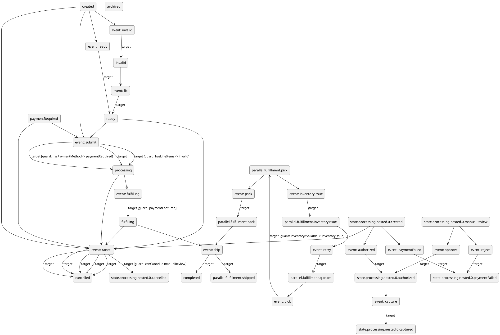

</details>

#### Outcomes view

*   **Objective:** Trace all declared success, failure, guard-failure, and transition outcomes as a structural map.
*   **Shows:** State types, entry outcomes, event targets, guard failure targets, exit failure targets, and repeated outcome paths.
*   **Useful developer detail:** Use it to verify that failures land in intentional warning/danger states and to compare happy-path outcomes with recovery paths.

<details>
<summary>Mermaid output: <code>mermaid-outcomes</code></summary>

```mermaid
flowchart TD
  root_created["created\nprimary"]:::primary
  root_ready["ready\ndefault"]:::default
  root_processing["processing\nprimary"]:::primary
  root_fulfilling["fulfilling\nprimary"]:::primary
  root_paymentRequired["paymentRequired\nwarning"]:::warning
  root_invalid["invalid\nwarning"]:::warning
  root_archived["archived\ninfo"]:::info
  root_completed["completed\nsuccess"]:::success
  root_cancelled["cancelled\ndanger"]:::danger
  root_state_processing_nested_0_created["created\nprimary"]:::primary
  root_state_processing_nested_0_authorized["authorized\nsuccess"]:::success
  root_state_processing_nested_0_captured["captured\nsuccess"]:::success
  root_state_processing_nested_0_manualReview["manualReview\nwarning"]:::warning
  root_state_processing_nested_0_paymentFailed["paymentFailed\ndanger"]:::danger
  root_state_processing_nested_0_cancelled["cancelled\ndanger"]:::danger
  root_parallel_fulfillment_queued["queued\ndefault"]:::default
  root_parallel_fulfillment_pick["pick\nprimary"]:::primary
  root_parallel_fulfillment_pack["pack\ndefault"]:::default
  root_parallel_fulfillment_shipped["shipped\nsuccess"]:::success
  root_parallel_fulfillment_inventoryIssue["inventoryIssue\nwarning"]:::warning
  root_created -->|"entry success: hydrateOrder"| root_ready
  root_created -->|"entry failure: hydrateOrder"| root_invalid
  root_created -->|"ready"| root_ready
  root_created -->|"invalid"| root_invalid
  root_created -->|"submit"| root_processing
  root_created -->|"guard failure: hasLineItems"| root_invalid
  root_created -->|"cancel"| root_cancelled
  root_ready -->|"submit"| root_processing
  root_ready -->|"guard failure: hasPaymentMethod"| root_paymentRequired
  root_ready -->|"cancel"| root_cancelled
  root_processing -->|"fulfilling"| root_fulfilling
  root_processing -->|"cancel"| root_cancelled
  root_processing -->|"exit failure: releaseReservation"| root_cancelled
  root_fulfilling -->|"ship"| root_completed
  root_fulfilling -->|"cancel"| root_cancelled
  root_paymentRequired -->|"submit"| root_processing
  root_paymentRequired -->|"cancel"| root_cancelled
  root_invalid -->|"fix"| root_ready
  root_state_processing_nested_0_created -->|"entry success: reserveFunds"| root_state_processing_nested_0_authorized
  root_state_processing_nested_0_created -->|"entry failure: reserveFunds"| root_state_processing_nested_0_paymentFailed
  root_state_processing_nested_0_created -->|"authorized"| root_state_processing_nested_0_authorized
  root_state_processing_nested_0_created -->|"paymentFailed"| root_state_processing_nested_0_paymentFailed
  root_state_processing_nested_0_created -->|"cancel"| root_state_processing_nested_0_cancelled
  root_state_processing_nested_0_created -->|"guard failure: canCancel"| root_state_processing_nested_0_manualReview
  root_state_processing_nested_0_authorized -->|"capture"| root_state_processing_nested_0_captured
  root_state_processing_nested_0_manualReview -->|"approve"| root_state_processing_nested_0_authorized
  root_state_processing_nested_0_manualReview -->|"reject"| root_state_processing_nested_0_paymentFailed
  root_parallel_fulfillment_queued -->|"pick"| root_parallel_fulfillment_pick
  root_parallel_fulfillment_queued -->|"guard failure: inventoryAvailable"| root_parallel_fulfillment_inventoryIssue
  root_parallel_fulfillment_queued -->|"guard failure: inventoryAvailable"| root_parallel_fulfillment_inventoryIssue
  root_parallel_fulfillment_pick -->|"entry success: allocateInventory"| root_parallel_fulfillment_pack
  root_parallel_fulfillment_pick -->|"entry failure: allocateInventory"| root_parallel_fulfillment_inventoryIssue
  root_parallel_fulfillment_pick -->|"pack"| root_parallel_fulfillment_pack
  root_parallel_fulfillment_pick -->|"inventoryIssue"| root_parallel_fulfillment_inventoryIssue
  root_parallel_fulfillment_pack -->|"ship"| root_parallel_fulfillment_shipped
  root_parallel_fulfillment_inventoryIssue -->|"retry"| root_parallel_fulfillment_queued
  classDef primary fill:#e8f1ff,stroke:#3164d4
  classDef warning fill:#fff8db,stroke:#b78b00
  classDef success fill:#e8f7ed,stroke:#20834d
  classDef danger fill:#ffecef,stroke:#cf2e46
  classDef default fill:#f7f7f7,stroke:#777

```

</details>

<details>
<summary>PlantUML output: <code>plantuml-outcomes</code></summary>

```plantuml
@startuml
skinparam rectangle {
  RoundCorner 12
  Shadowing false
}
skinparam rectangle<<primary>> BackgroundColor #E8F1FF
skinparam rectangle<<warning>> BackgroundColor #FFF8DB
skinparam rectangle<<success>> BackgroundColor #E8F7ED
skinparam rectangle<<danger>> BackgroundColor #FFECEF

rectangle "created\nprimary" as root_created <<primary>>
rectangle "ready\ndefault" as root_ready
rectangle "processing\nprimary" as root_processing <<primary>>
rectangle "fulfilling\nprimary" as root_fulfilling <<primary>>
rectangle "paymentRequired\nwarning" as root_paymentRequired <<warning>>
rectangle "invalid\nwarning" as root_invalid <<warning>>
rectangle "archived\ninfo" as root_archived <<info>>
rectangle "completed\nsuccess" as root_completed <<success>>
rectangle "cancelled\ndanger" as root_cancelled <<danger>>
rectangle "created\nprimary" as root_state_processing_nested_0_created <<primary>>
rectangle "authorized\nsuccess" as root_state_processing_nested_0_authorized <<success>>
rectangle "captured\nsuccess" as root_state_processing_nested_0_captured <<success>>
rectangle "manualReview\nwarning" as root_state_processing_nested_0_manualReview <<warning>>
rectangle "paymentFailed\ndanger" as root_state_processing_nested_0_paymentFailed <<danger>>
rectangle "cancelled\ndanger" as root_state_processing_nested_0_cancelled <<danger>>
rectangle "queued\ndefault" as root_parallel_fulfillment_queued
rectangle "pick\nprimary" as root_parallel_fulfillment_pick <<primary>>
rectangle "pack\ndefault" as root_parallel_fulfillment_pack
rectangle "shipped\nsuccess" as root_parallel_fulfillment_shipped <<success>>
rectangle "inventoryIssue\nwarning" as root_parallel_fulfillment_inventoryIssue <<warning>>
root_created --> root_ready : entry success: hydrateOrder
root_created --> root_invalid : entry failure: hydrateOrder
root_created --> root_ready : ready
root_created --> root_invalid : invalid
root_created --> root_processing : submit
root_created --> root_invalid : guard failure: hasLineItems
root_created --> root_cancelled : cancel
root_ready --> root_processing : submit
root_ready --> root_paymentRequired : guard failure: hasPaymentMethod
root_ready --> root_cancelled : cancel
root_processing --> root_fulfilling : fulfilling
root_processing --> root_cancelled : cancel
root_processing --> root_cancelled : exit failure: releaseReservation
root_fulfilling --> root_completed : ship
root_fulfilling --> root_cancelled : cancel
root_paymentRequired --> root_processing : submit
root_paymentRequired --> root_cancelled : cancel
root_invalid --> root_ready : fix
root_state_processing_nested_0_created --> root_state_processing_nested_0_authorized : entry success: reserveFunds
root_state_processing_nested_0_created --> root_state_processing_nested_0_paymentFailed : entry failure: reserveFunds
root_state_processing_nested_0_created --> root_state_processing_nested_0_authorized : authorized
root_state_processing_nested_0_created --> root_state_processing_nested_0_paymentFailed : paymentFailed
root_state_processing_nested_0_created --> root_state_processing_nested_0_cancelled : cancel
root_state_processing_nested_0_created --> root_state_processing_nested_0_manualReview : guard failure: canCancel
root_state_processing_nested_0_authorized --> root_state_processing_nested_0_captured : capture
root_state_processing_nested_0_manualReview --> root_state_processing_nested_0_authorized : approve
root_state_processing_nested_0_manualReview --> root_state_processing_nested_0_paymentFailed : reject
root_parallel_fulfillment_queued --> root_parallel_fulfillment_pick : pick
root_parallel_fulfillment_queued --> root_parallel_fulfillment_inventoryIssue : guard failure: inventoryAvailable
root_parallel_fulfillment_queued --> root_parallel_fulfillment_inventoryIssue : guard failure: inventoryAvailable
root_parallel_fulfillment_pick --> root_parallel_fulfillment_pack : entry success: allocateInventory
root_parallel_fulfillment_pick --> root_parallel_fulfillment_inventoryIssue : entry failure: allocateInventory
root_parallel_fulfillment_pick --> root_parallel_fulfillment_pack : pack
root_parallel_fulfillment_pick --> root_parallel_fulfillment_inventoryIssue : inventoryIssue
root_parallel_fulfillment_pack --> root_parallel_fulfillment_shipped : ship
root_parallel_fulfillment_inventoryIssue --> root_parallel_fulfillment_queued : retry
@enduml

```

</details>

#### Immediate view

*   **Objective:** Isolate automatic transitions that can fire without an external event.
*   **Shows:** The parent `processing -> fulfilling` immediate transition guarded by the nested payment result, and the fulfillment `queued -> pick` immediate transition guarded by inventory availability.
*   **Useful developer detail:** Use it to review implicit motion in the workflow before debugging why a state changes immediately after entry.

<details>
<summary>Mermaid output: <code>mermaid-immediate</code></summary>

```mermaid
flowchart TD
  root_created["created"]
  root_ready["ready"]
  root_processing["processing"]
  root_fulfilling["fulfilling"]
  root_paymentRequired["paymentRequired"]
  root_invalid["invalid"]
  root_archived["archived"]
  root_completed["completed"]
  root_cancelled["cancelled"]
  root_state_processing_nested_0_created["state.processing.nested.0.created"]
  root_state_processing_nested_0_authorized["state.processing.nested.0.authorized"]
  root_state_processing_nested_0_captured["state.processing.nested.0.captured"]
  root_state_processing_nested_0_manualReview["state.processing.nested.0.manualReview"]
  root_state_processing_nested_0_paymentFailed["state.processing.nested.0.paymentFailed"]
  root_state_processing_nested_0_cancelled["state.processing.nested.0.cancelled"]
  root_parallel_fulfillment_queued["parallel.fulfillment.queued"]
  root_parallel_fulfillment_pick["parallel.fulfillment.pick"]
  root_parallel_fulfillment_pack["parallel.fulfillment.pack"]
  root_parallel_fulfillment_shipped["parallel.fulfillment.shipped"]
  root_parallel_fulfillment_inventoryIssue["parallel.fulfillment.inventoryIssue"]
  root_processing -. "immediate [guard: paymentCaptured]" .-> root_fulfilling
  root_parallel_fulfillment_queued -. "immediate [guard: inventoryAvailable; failure: inventoryIssue]" .-> root_parallel_fulfillment_pick

```

</details>

<details>
<summary>PlantUML output: <code>plantuml-immediate</code></summary>

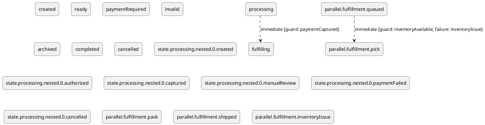

</details>

#### Guards view

*   **Objective:** Review conditional decision points independently from the full transition graph.
*   **Shows:** Only transitions that use guards, including event-based guards, immediate guards, target branches, and failure-target branches.
*   **Useful developer detail:** Use it to check whether every guard failure has the right recovery state and whether event and immediate guards branch to the expected targets.

Guard diagrams are focused review views. They make conditional paths easier to inspect, but they do not replace the full state diagram when you need to understand every state, unguarded transition, pulse, or nested/parallel relationship.

<details>
<summary>Mermaid output: <code>mermaid-guards</code></summary>

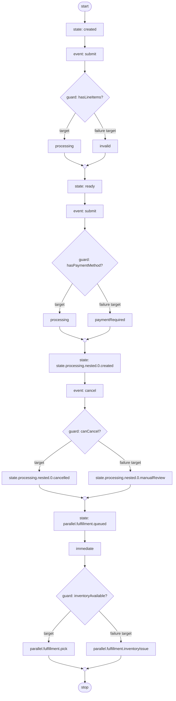

</details>

<details>
<summary>PlantUML output: <code>plantuml-guards</code></summary>

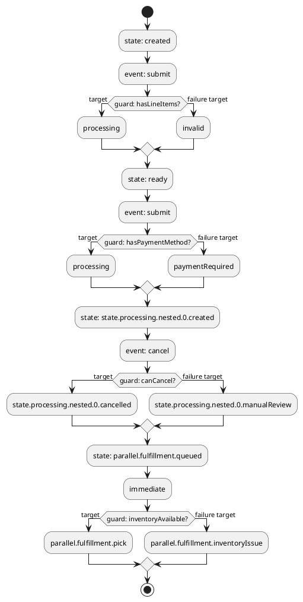

</details>

#### Composition view

*   **Objective:** Show only how the root, nested, and parallel machines are assembled.
*   **Shows:** The root machine, its states, the `Payment` nested machine attached to `processing`, and the `Fulfillment` parallel machine.
*   **Useful developer detail:** Use it as an onboarding map before a developer reads transition details; it keeps composition visible without event noise.

<details>
<summary>Mermaid output: <code>mermaid-composition</code></summary>

```mermaid
flowchart TD
  machine_root[["OrderWorkflow\ninitial: created"]]
  machine_root_state_processing_nested_0[["Payment\ninitial: created"]]
  machine_root_parallel_fulfillment[["Fulfillment\ninitial: queued"]]
  root_created["state: created"]
  root_ready["state: ready"]
  root_processing["state: processing"]
  root_fulfilling["state: fulfilling"]
  root_paymentRequired["state: paymentRequired"]
  root_invalid["state: invalid"]
  root_archived["state: archived"]
  root_completed["state: completed"]
  root_cancelled["state: cancelled"]
  root_state_processing_nested_0_created["state: state.processing.nested.0.created"]
  root_state_processing_nested_0_authorized["state: state.processing.nested.0.authorized"]
  root_state_processing_nested_0_captured["state: state.processing.nested.0.captured"]
  root_state_processing_nested_0_manualReview["state: state.processing.nested.0.manualReview"]
  root_state_processing_nested_0_paymentFailed["state: state.processing.nested.0.paymentFailed"]
  root_state_processing_nested_0_cancelled["state: state.processing.nested.0.cancelled"]
  root_parallel_fulfillment_queued["state: parallel.fulfillment.queued"]
  root_parallel_fulfillment_pick["state: parallel.fulfillment.pick"]
  root_parallel_fulfillment_pack["state: parallel.fulfillment.pack"]
  root_parallel_fulfillment_shipped["state: parallel.fulfillment.shipped"]
  root_parallel_fulfillment_inventoryIssue["state: parallel.fulfillment.inventoryIssue"]
  root_processing -->|"nested outcome: captured"| machine_root_state_processing_nested_0
  machine_root -->|"parallel: fulfillment"| machine_root_parallel_fulfillment
  machine_root -->|"has state"| root_created
  machine_root -->|"has state"| root_ready
  machine_root -->|"has state"| root_processing
  machine_root -->|"has state"| root_fulfilling
  machine_root -->|"has state"| root_paymentRequired
  machine_root -->|"has state"| root_invalid
  machine_root -->|"has state"| root_archived
  machine_root -->|"has state"| root_completed
  machine_root -->|"has state"| root_cancelled
  machine_root_state_processing_nested_0 -->|"has state"| root_state_processing_nested_0_created
  machine_root_state_processing_nested_0 -->|"has state"| root_state_processing_nested_0_authorized
  machine_root_state_processing_nested_0 -->|"has state"| root_state_processing_nested_0_captured
  machine_root_state_processing_nested_0 -->|"has state"| root_state_processing_nested_0_manualReview
  machine_root_state_processing_nested_0 -->|"has state"| root_state_processing_nested_0_paymentFailed
  machine_root_state_processing_nested_0 -->|"has state"| root_state_processing_nested_0_cancelled
  machine_root_parallel_fulfillment -->|"has state"| root_parallel_fulfillment_queued
  machine_root_parallel_fulfillment -->|"has state"| root_parallel_fulfillment_pick
  machine_root_parallel_fulfillment -->|"has state"| root_parallel_fulfillment_pack
  machine_root_parallel_fulfillment -->|"has state"| root_parallel_fulfillment_shipped
  machine_root_parallel_fulfillment -->|"has state"| root_parallel_fulfillment_inventoryIssue

```

</details>

<details>
<summary>PlantUML output: <code>plantuml-composition</code></summary>

```plantuml
@startuml
skinparam rectangle {
  RoundCorner 12
  Shadowing false
}

rectangle "OrderWorkflow\ninitial: created" as machine_root
rectangle "Payment\ninitial: created" as machine_root_state_processing_nested_0
rectangle "Fulfillment\ninitial: queued" as machine_root_parallel_fulfillment
rectangle "state: created" as root_created
rectangle "state: ready" as root_ready
rectangle "state: processing" as root_processing
rectangle "state: fulfilling" as root_fulfilling
rectangle "state: paymentRequired" as root_paymentRequired
rectangle "state: invalid" as root_invalid
rectangle "state: archived" as root_archived
rectangle "state: completed" as root_completed
rectangle "state: cancelled" as root_cancelled
rectangle "state: state.processing.nested.0.created" as root_state_processing_nested_0_created
rectangle "state: state.processing.nested.0.authorized" as root_state_processing_nested_0_authorized
rectangle "state: state.processing.nested.0.captured" as root_state_processing_nested_0_captured
rectangle "state: state.processing.nested.0.manualReview" as root_state_processing_nested_0_manualReview
rectangle "state: state.processing.nested.0.paymentFailed" as root_state_processing_nested_0_paymentFailed
rectangle "state: state.processing.nested.0.cancelled" as root_state_processing_nested_0_cancelled
rectangle "state: parallel.fulfillment.queued" as root_parallel_fulfillment_queued
rectangle "state: parallel.fulfillment.pick" as root_parallel_fulfillment_pick
rectangle "state: parallel.fulfillment.pack" as root_parallel_fulfillment_pack
rectangle "state: parallel.fulfillment.shipped" as root_parallel_fulfillment_shipped
rectangle "state: parallel.fulfillment.inventoryIssue" as root_parallel_fulfillment_inventoryIssue
root_processing --> machine_root_state_processing_nested_0 : nested outcome: captured
machine_root --> machine_root_parallel_fulfillment : parallel: fulfillment
machine_root --> root_created : has state
machine_root --> root_ready : has state
machine_root --> root_processing : has state
machine_root --> root_fulfilling : has state
machine_root --> root_paymentRequired : has state
machine_root --> root_invalid : has state
machine_root --> root_archived : has state
machine_root --> root_completed : has state
machine_root --> root_cancelled : has state
machine_root_state_processing_nested_0 --> root_state_processing_nested_0_created : has state
machine_root_state_processing_nested_0 --> root_state_processing_nested_0_authorized : has state
machine_root_state_processing_nested_0 --> root_state_processing_nested_0_captured : has state
machine_root_state_processing_nested_0 --> root_state_processing_nested_0_manualReview : has state
machine_root_state_processing_nested_0 --> root_state_processing_nested_0_paymentFailed : has state
machine_root_state_processing_nested_0 --> root_state_processing_nested_0_cancelled : has state
machine_root_parallel_fulfillment --> root_parallel_fulfillment_queued : has state
machine_root_parallel_fulfillment --> root_parallel_fulfillment_pick : has state
machine_root_parallel_fulfillment --> root_parallel_fulfillment_pack : has state
machine_root_parallel_fulfillment --> root_parallel_fulfillment_shipped : has state
machine_root_parallel_fulfillment --> root_parallel_fulfillment_inventoryIssue : has state
@enduml

```

</details>

#### Complexity view

*   **Objective:** Compare states by transition load and action load within the same machine.
*   **Shows:** A quadrant-style map that places each state relative to the busiest state in that same machine.
*   **Useful developer detail:** Use it to spot states worth reviewing. Dense states such as `processing`, `created`, and `pick` may deserve closer tests and review.

Complexity diagrams are documentation and audit aids, not runtime profiling output. They compare each state by two visible loads:

*   **X axis:** transition load, counted from outgoing, incoming, and immediate transitions. Values are relative to the highest transition load in the same machine, so "few" and "many" are local to that machine.
*   **Y axis:** action load, counted from entry pulses, exit pulses, and pulse failure branches. Values are relative to the highest action load in the same machine.
*   **Quadrants:** low/high X and low/high Y produce the four visual categories: few/many transitions crossed with few/many actions.

> The generated view includes the maximum transition and action loads so you can interpret what "busy" means for that machine. Dot positions are approximate visual placements for comparison, not exact measurements; use the quadrants and relative position to decide which states are worth reviewing.

<details>
<summary>Mermaid output: <code>mermaid-complexity</code></summary>

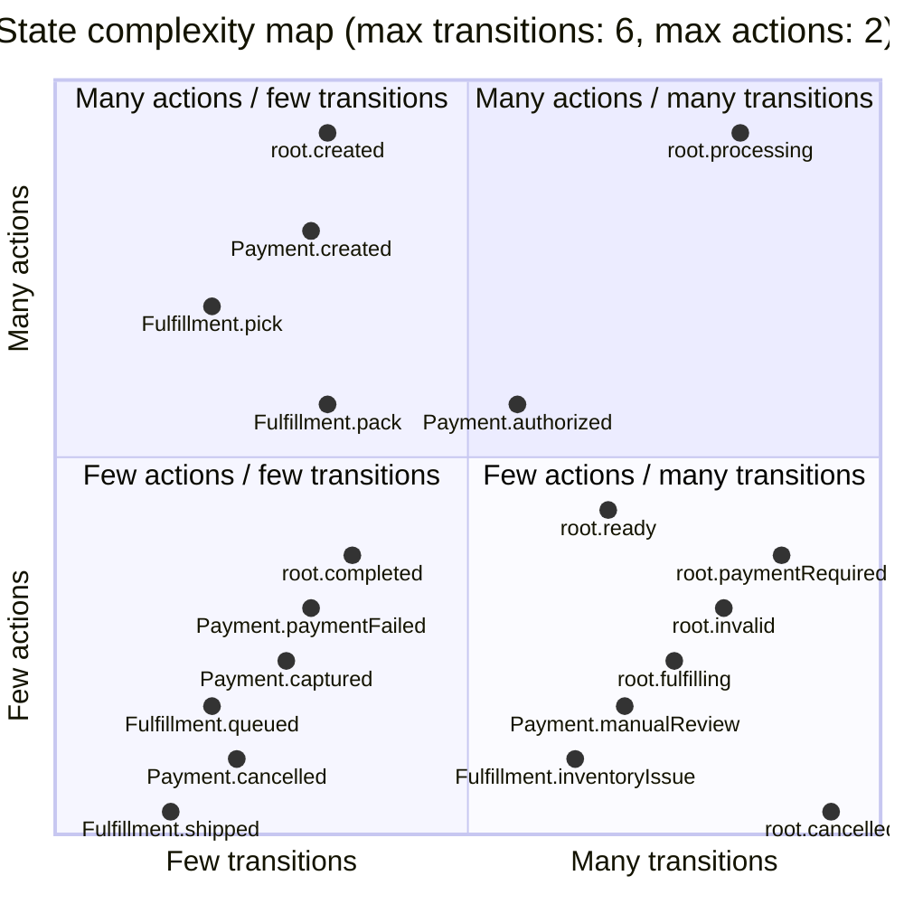

</details>

<details>
<summary>PlantUML output: <code>plantuml-complexity</code></summary>

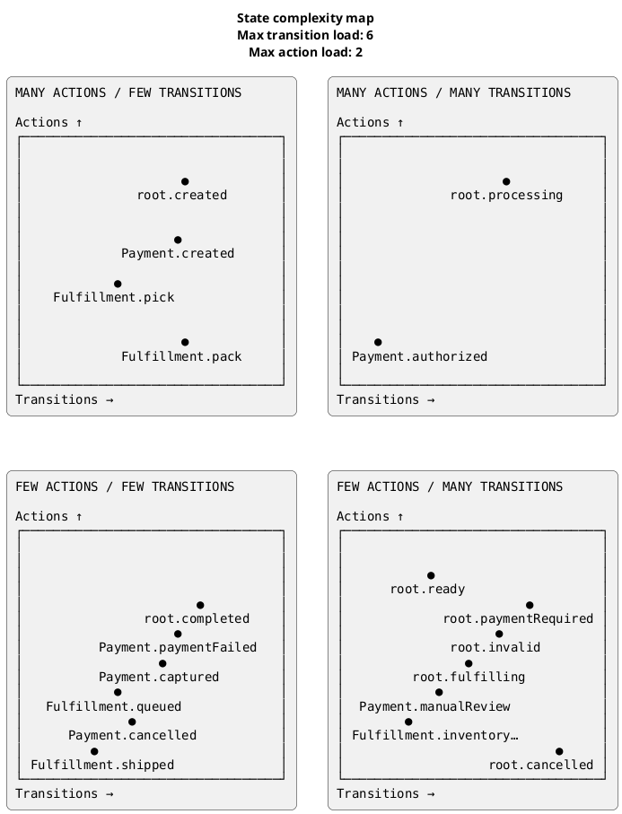

</details>

### `format: "all"`

`format: "all"` includes the existing state-diagram outputs, but it does not include sequence diagrams or the additional structural map image formats. Request those formats directly when you need them:

```javascript
const { mermaid } = await documentate(orderMachine, {
  format: "mermaid-sequence"
});

const { plantuml } = await documentate(orderMachine, {
  format: "plantuml-sequence"
});

const { png } = await documentate(orderMachine, {
  format: "png-complexity"
});
```

## Viewing PlantUML in VS Code Markdown

Mermaid is the easiest option for Markdown-native previews because many renderers support fenced `mermaid` blocks directly. PlantUML is useful when you want the more expressive PlantUML views or when you plan to export SVG/PNG images.

To preview PlantUML blocks in VS Code Markdown without assuming this repository is checked out locally:

1.  Install the **Markdown Preview Enhanced** extension in VS Code.
2.  Make sure Java is available on your PATH.
3.  Configure `markdown-preview-enhanced.plantumlJarPath` to an absolute path for a local `plantuml.jar`.

Ways to provide the jar:

*   Install or download PlantUML locally and point VS Code at that jar.
*   If your project depends on `x-robot` and the published package includes the vendored jar, try an absolute path to `node_modules/x-robot/vendor/plantuml.jar` inside your project.
*   Use a company-managed or global PlantUML jar path if your team already standardizes one.

Example workspace setting:

```json
{
  "markdown-preview-enhanced.plantumlJarPath": "/absolute/path/to/plantuml.jar"
}
```

## Mermaid Generation

X-Robot also supports generating [Mermaid](https://mermaid.js.org/) diagrams, which can be embedded directly in Markdown documentation:

```javascript
// Generate Mermaid code
const { mermaid } = await documentate(myMachine, { format: "mermaid" });

// With high detail level
const { mermaid } = await documentate(myMachine, {
  format: "mermaid",
  level: "high"
});

// Save to file
fs.writeFileSync("diagram.mmd", mermaid);
```

### Mermaid Options

The Mermaid output includes:

*   Color-coded state types (danger, warning, success, primary, info)
*   Base styling for default states through the `def` class
*   Left-aligned text in states
*   Transitions with proper styling

### Example Output

````markdown
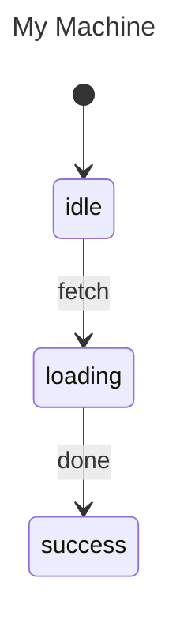
````

This generates:

```mermaid
---
title: My Machine
---

stateDiagram-v2

classDef danger fill:#f8d7da,stroke:#721c24,stroke-width:2px,text-align:left,color:#721c24
classDef success fill:#d4edda,stroke:#155724,stroke-width:2px,text-align:left,color:#155724

state idle
state loading
state success

[*] --> idle
idle --> loading: fetch
loading --> success: done
```

## Next Steps

*   [Serialization](./serialization.md) — Machine definition format
*   [Code Generation](./code-generation.md) — Generate code
*   [SCXML Import/Export](./scxml.md) — Standard format
*   [API: documentate()](../api/modules/x_robot_documentate.md) — Full reference
