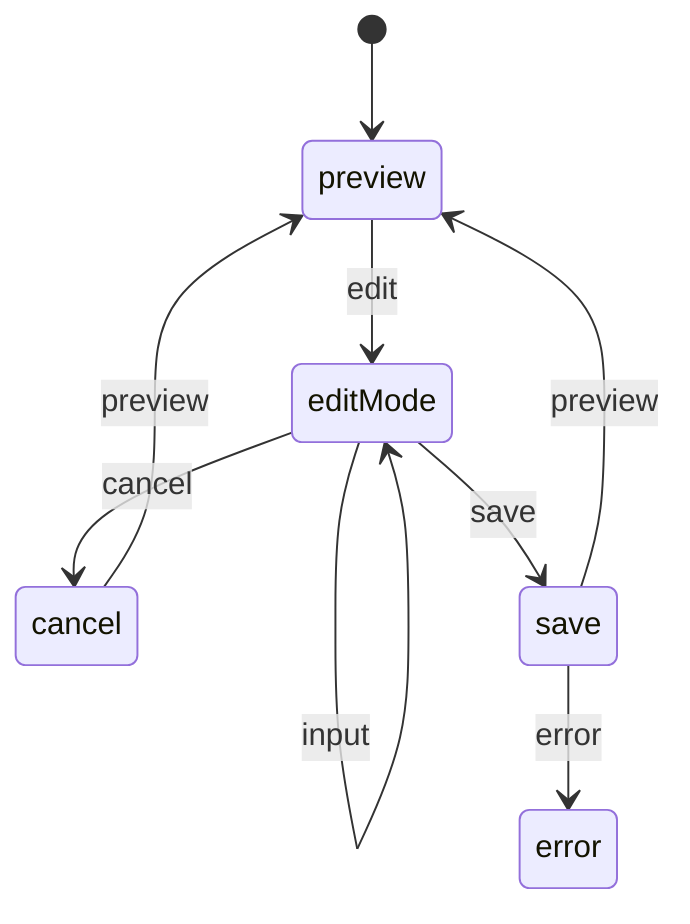
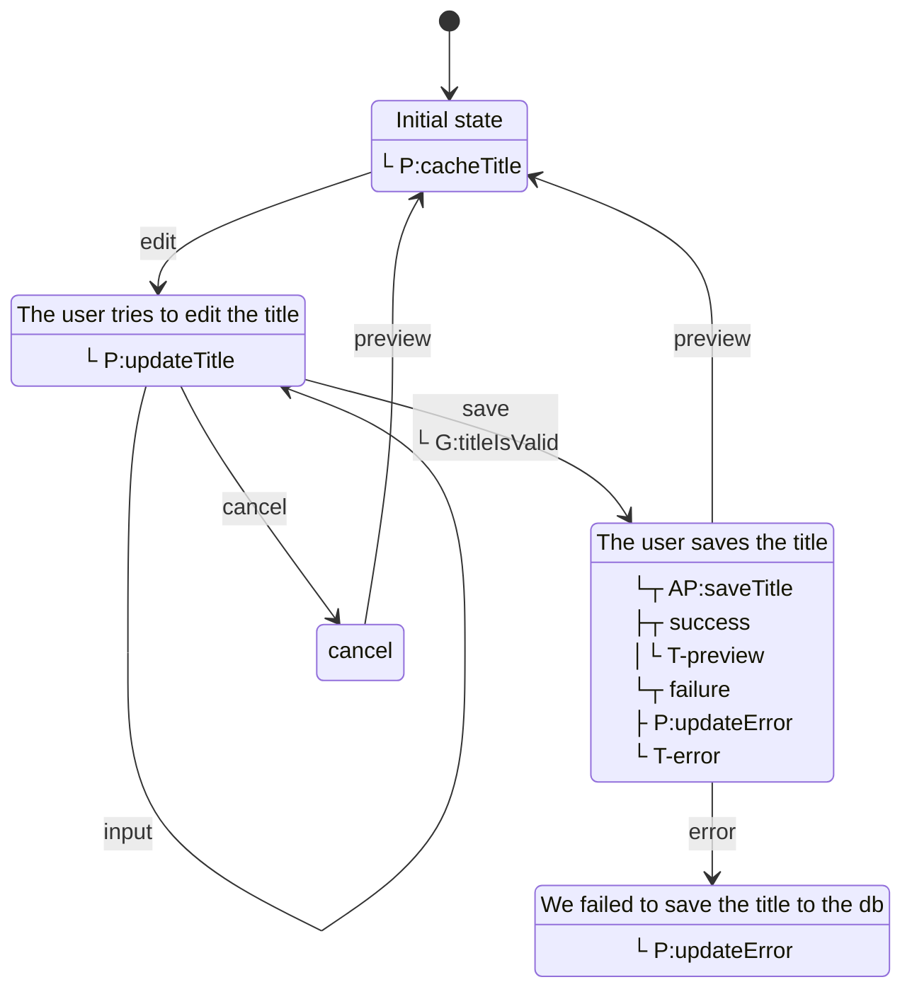

# Mermaid Export Implementation Plan

> **For Claude:** Use superpowers:subagent-driven-development to implement this plan task-by-task.

**Goal:** Add Mermaid diagram export support to documentate() function, following the same pattern as PlantUML export.

**Architecture:** 
- Phase 1: Add Mermaid string code generation (no external dependencies)
- Level Low: States + transitions only
- Level High: States + transitions + guards + entry/exit pulses + descriptions
- Mermaid syntax: No ":" in transition messages, use "<br>" for newlines, entry pulses inside state

**Tech Stack:** TypeScript, x-robot documentate module

---

## Formato Mermaid Esperado

### Nivel Low


### Nivel High (con pulses y guards)


---

### Task 1: Update Types in types.ts

**Files:**
- Modify: `lib/documentate/types.ts:11-21` - Add 'mermaid' to OutputFormat
- Modify: `lib/documentate/types.ts:42-63` - Add mermaid?: string to DocumentateResult
- Modify: `lib/documentate/types.ts:26-37` - Add mermaid options to DocumentateOptions

**Step 1: Write the failing test**

Run: `npm run test 2>&1 | head -20`
Expected: Tests pass initially

**Step 2: Modify types.ts**

Add 'mermaid' to OutputFormat type (line ~17):
```typescript
export type OutputFormat = 
  | 'ts' 
  | 'mjs' 
  | 'cjs' 
  | 'json' 
  | 'scxml' 
  | 'plantuml' 
  | 'mermaid'
  | 'svg' 
  | 'png' 
  | 'serialized'
  | 'all';
```

Add mermaid to DocumentateResult (line ~54):
```typescript
export interface DocumentateResult {
  ts?: string;
  mjs?: string;
  cjs?: string;
  json?: string;
  scxml?: string;
  plantuml?: string;
  mermaid?: string;  // NEW
  svg?: string;
  png?: string;
  serialized?: SerializedMachine;
  files?: string[];
}
```

Add mermaid to DocumentateOptions (line ~30):
```typescript
export interface DocumentateOptions {
  format: OutputFormat;
  level?: 'low' | 'high';
  output?: string;
  fileName?: string;
  skinparam?: string;
  mermaidTheme?: 'default' | 'neutral' | 'dark';  // NEW - optional theme
}
```

**Step 3: Run tests**

Run: `npm run test`
Expected: PASS (no new failures)

---

### Task 2: Add getMermaidCode function in visualize.ts

**Files:**
- Modify: `lib/documentate/visualize.ts:1-711` - Add mermaid generation functions

**Step 1: Add mermaid constants and helper functions**

Add after VISUALIZATION_LEVEL (around line 40):
```typescript
export const MERMAID_THEME = {
  DEFAULT: 'default',
  NEUTRAL: 'neutral',
  DARK: 'dark'
};

export interface mermaidOptions {
  level?: string;
  theme?: string;
  skinparam?: string;
}
```

**Step 2: Add getInnerMermaidCode function**

Add after getInnerPlantUmlCode function (~line 297):
```typescript
function getInnerMermaidCode(
  serializedMachine: SerializedMachine,
  options: mermaidOptions,
  parentName = "",
  childLevel = 0
): string {
  let mermaidCode = "";
  let { level } = options;
  const isChild = childLevel > 0;
  const space = Array.from({ length: childLevel })
    .map(() => "  ")
    .join("");

  // Add title
  if (serializedMachine.title && !isChild) {
    mermaidCode += `title ${serializedMachine.title}\n\n`;
  }

  const stateNames: Record<string, string> = {};
  for (const stateName in serializedMachine.states) {
    stateNames[stateName] = isChild ? `${parentName}${stateName}` : stateName;
  }

  // Add states
  for (const stateName in serializedMachine.states) {
    const state = serializedMachine.states[stateName];
    const stateId = stateNames[stateName];
    
    // Add state type stereotype if exists
    if (state.type) {
      mermaidCode += `state ${stateId}<<${state.type}>>\n`;
    } else {
      mermaidCode += `state ${stateId}\n`;
    }
  }

  // Add descriptions and entry/exit pulses (high level only)
  if (level === 'high') {
    for (const stateName in serializedMachine.states) {
      const state = serializedMachine.states[stateName];
      const stateId = stateNames[stateName];
      
      // Add description
      if (state.description) {
        mermaidCode += `${stateId}: ${state.description}\n`;
      }
      
      // Add entry/exit pulses
      if (state.run && state.run.length > 0) {
        const pulses = state.run.map(p => {
          let pulseStr = p.isAsync ? "AP" : "P";
          pulseStr += `:${p.pulse}`;
          if (p.success) pulseStr += `<br>├┬ success<br>│└ T-${p.success}`;
          if (p.failure) pulseStr += `<br>└┬ failure<br>├ P:${p.failure.split(' ')[0]}<br>└ T-${p.failure}`;
          return pulseStr;
        }).join('<br>');
        mermaidCode += `${stateId}: ${pulses}\n`;
      }
    }
    mermaidCode += '\n';
  }

  // Add initial state
  if (serializedMachine.initial && !isChild) {
    mermaidCode += `[*] --> ${stateNames[serializedMachine.initial] || serializedMachine.initial}\n`;
  }

  // Add transitions
  for (const stateName in serializedMachine.states) {
    const state = serializedMachine.states[stateName];
    const fromState = stateNames[stateName];

    if (state.on) {
      for (const event in state.on) {
        const transition = state.on[event];
        const toState = stateNames[transition.target] || transition.target;
        
        let label = event;
        
        // Add guards (high level)
        if (level === 'high' && transition.guards && transition.guards.length > 0) {
          const guardNames = transition.guards.map(g => `G:${g.guard}`).join('<br>');
          label += `<br>└ ${guardNames}`;
        }
        
        mermaidCode += `${fromState} --> ${toState}: ${label}\n`;
      }
    }
  }

  return mermaidCode;
}
```

**Step 3: Add getMermaidCode function**

Add after getPlantUmlCode function (~line 359):
```typescript
export function getMermaidCode(
  serializedMachine: SerializedMachine,
  optionsOrLevel: string | mermaidOptions = MERMAID_THEME.DEFAULT
): string {
  let opts: mermaidOptions =
    typeof optionsOrLevel === "string"
      ? { level: optionsOrLevel }
      : optionsOrLevel;
  let { theme, skinparam } = opts;

  let mermaidCode = `stateDiagram-v2\n\n`;

  mermaidCode += getInnerMermaidCode(serializedMachine, opts);

  // Add theme
  if (theme && theme !== MERMAID_THEME.DEFAULT) {
    mermaidCode += `\n%% Theme: ${theme}\n`;
  }

  return mermaidCode;
}
```

**Step 4: Add getMermaidCodeFromMachine function**

Add after getPlantUmlCodeFromMachine (~line 554):
```typescript
export function getMermaidCodeFromMachine(
  machine: Machine,
  optionsOrLevel: string | mermaidOptions = MERMAID_THEME.DEFAULT
): string {
  return getMermaidCode(serialize(machine), optionsOrLevel);
}
```

**Step 5: Run tests**

Run: `npm run test`
Expected: PASS (no new failures)

---

### Task 3: Update documentate/index.ts to support mermaid

**Files:**
- Modify: `lib/documentate/index.ts:90-165` - Add mermaid case to format switch

**Step 1: Modify index.ts**

Add after plantuml case (~line 140):
```typescript
if (format === 'all' || format === 'mermaid') {
  result.mermaid = getMermaidCode(serialized, { level, skinparam });
}
```

**Step 2: Run tests**

Run: `npm run test`
Expected: PASS

---

### Task 4: Add unit tests for mermaid export

**Files:**
- Create: `tests/mermaid-export.test.ts` - Test mermaid code generation

**Step 1: Write the failing test**

```typescript
import { documentate } from "../lib/documentate";
import {
  context,
  description,
  entry,
  guard,
  infoState,
  init,
  initial,
  machine,
  primaryState,
  state,
  successState,
  transition,
  warningState,
} from "../lib";
import { describe, it } from "mocha";
import expect from "expect";

describe("Mermaid Export", () => {
  const getMachine = (title?: string) => {
    const getState = () => ({ title: "Ok", error: null });
    const titleIsValid = (context: any) => context.title.length > 0 ? true : [{ message: "Title is required" }];
    async function saveTitle(context: any) { await new Promise(r => setTimeout(r, 100)); }
    function cacheTitle(context: any) { return { ...context, oldTitle: context.title }; }
    function updateTitle(context: any, event: any) { return event ? { ...context, title: event.target?.value } : context; }
    function restoreTitle(context: any) { return { ...context, title: context.oldTitle }; }
    function updateError(context: any, error: any) { return { ...context, error }; }

    return machine(
      title || "My machine",
      init(context(getState), initial("preview")),
      successState("preview", description("Initial state"), entry(cacheTitle), transition("edit", "editMode")),
      infoState("editMode", description("The user tries to edit the title"), entry(updateTitle), transition("input", "editMode"), transition("cancel", "cancel"), transition("save", "save", guard(titleIsValid))),
      warningState("cancel", description("The user cancels the edition"), entry(restoreTitle)),
      primaryState("save", description("The user saves the title"), entry(saveTitle, "preview", "error")),
      warningState("error", description("We failed to save the title to the db"), entry(updateError))
    );
  };

  it("should generate mermaid code in low level format", async () => {
    const result = await documentate(getMachine(), { format: 'mermaid' });
    expect(result.mermaid).toContain("stateDiagram-v2");
    expect(result.mermaid).toContain("[*] --> preview");
    expect(result.mermaid).toContain("preview --> editMode: edit");
  });

  it("should generate mermaid code in high level format", async () => {
    const result = await documentate(getMachine(), { format: 'mermaid', level: 'high' });
    expect(result.mermaid).toContain("title My machine");
    expect(result.mermaid).toContain("preview: Initial state");
    expect(result.mermaid).toContain("preview: └ P:cacheTitle");
    expect(result.mermaid).toContain("editMode --> save: save<br>└ G:titleIsValid");
  });

  it("should allow custom title", async () => {
    const result = await documentate(getMachine("Custom Title"), { format: 'mermaid', level: 'high' });
    expect(result.mermaid).toContain("title Custom Title");
  });

  it("should include state descriptions in high level", async () => {
    const result = await documentate(getMachine(), { format: 'mermaid', level: 'high' });
    expect(result.mermaid).toContain("preview: Initial state");
    expect(result.mermaid).toContain("save: The user saves the title");
    expect(result.mermaid).toContain("error: We failed to save the title to the db");
  });
});
```

**Step 2: Run test to verify it fails**

Run: `npm run test -- --grep "Mermaid"`
Expected: FAIL (mermaid format not implemented yet)

**Step 3: Run all tests**

Run: `npm run test`
Expected: PASS after implementation

---

### Task 5: Build and verify

**Step 1: Build**

Run: `npm run build`
Expected: SUCCESS

**Step 2: Run all tests**

Run: `npm run test`
Expected: ALL PASS

---

## Summary

| Task | Description | Files |
|------|-------------|-------|
| 1 | Update types.ts | 1 file modified |
| 2 | Add mermaid functions to visualize.ts | 1 file modified |
| 3 | Update index.ts for mermaid case | 1 file modified |
| 4 | Add unit tests | 1 file created |
| 5 | Build and verify | - |

**Total: 3 files modified, 1 file created**
