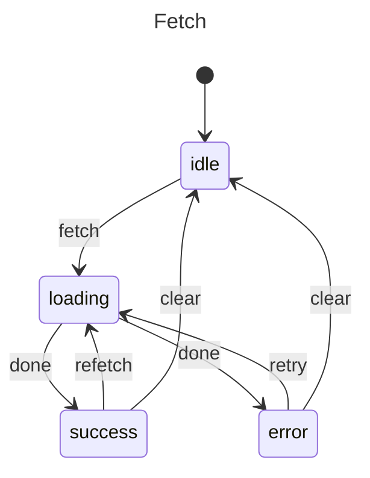

# API Data Fetch

Common pattern for server data fetching.

## Problem

Track API call states: idle, loading, success, error with data and error handling.

## Solution

```javascript
import { machine, state, transition, initial, init, context, invoke, entry } from "x-robot";

async function fetchData(ctx) {
  const { params } = ctx;
  const url = params ? `/api/data?${new URLSearchParams(params)}` : "/api/data";
  const res = await fetch(url);
  if (!res.ok) {
    throw new Error(`HTTP ${res.status}`);
  }
  ctx.data = await res.json();
}

const fetchMachine = machine(
  "Fetch",
  init(
    initial("idle"),
    context({ data: null, error: null, params: null })
  ),
  state("idle", 
    transition("fetch", "loading")
  ),
  state("loading", 
    entry(fetchData, "success", "error")
  ),
  state("success", 
    transition("refetch", "loading"),
    transition("clear", "idle")
  ),
  state("error", 
    transition("retry", "loading"),
    transition("clear", "idle")
  )
);

// Usage
await invoke(fetchMachine, "fetch", { page: 1 });

if (fetchMachine.current === "success") {
  console.log(fetchMachine.context.data);
}
```

## With Parameters

```javascript
invoke(fetchMachine, "fetch", { category: "books", page: 1 });
```

## Diagram



## With Caching

```javascript
function checkCache(ctx) {
  const key = JSON.stringify(ctx.params);
  if (ctx.cache.has(key)) {
    ctx.data = ctx.cache.get(key);
    return; 
  }
}

async function fetchAndCache(ctx) {
  const res = await fetch(`/api/data?${new URLSearchParams(ctx.params)}`);
  ctx.data = await res.json();
  ctx.cache.set(JSON.stringify(ctx.params), ctx.data);
}

const fetchMachine = machine(
  "Fetch",
  init(initial("idle"), context({ data: null, cache: new Map() })),
  state("idle", transition("fetch", "loading")),
  state("loading", 
    entry(checkCache, "success", "error"),
    entry(fetchAndCache, "success", "error")
  ),
  state("success", transition("clear", "idle")),
  state("error", transition("retry", "loading"))
);
```

## With Pagination

```javascript
async function loadPage(ctx) {
  const res = await fetch(`/api/items?page=${ctx.page}`);
  const newItems = await res.json();
  ctx.items = [...ctx.items, ...newItems];
  ctx.hasMore = newItems.length > 0;
  if (ctx.hasMore) ctx.page++;
}

const listMachine = machine(
  "List",
  init(initial("idle"), context({ items: [], page: 1, hasMore: true })),
  state("idle", transition("load", "loading")),
  state("loading", 
    entry(loadPage, "success", "error")
  ),
  state("success", transition("loadMore", "loading")),
  state("error", transition("retry", "loading"))
);
```

## Next Steps

- [Login Flow](./login-flow.md) — Authentication
- [Modal Dialog](./modal-dialog.md) — UI states
