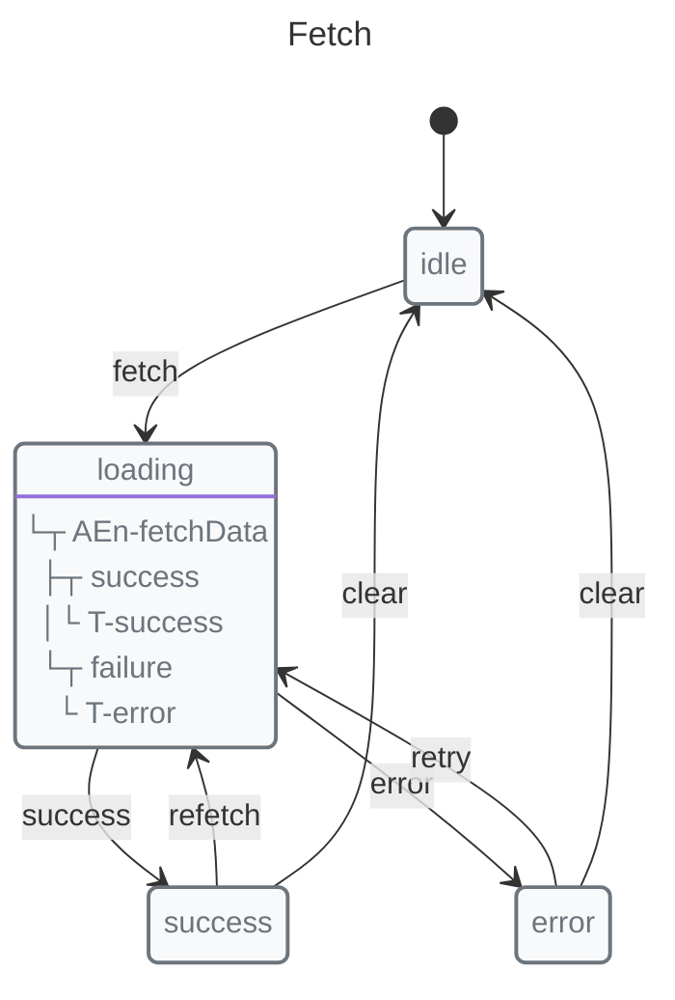
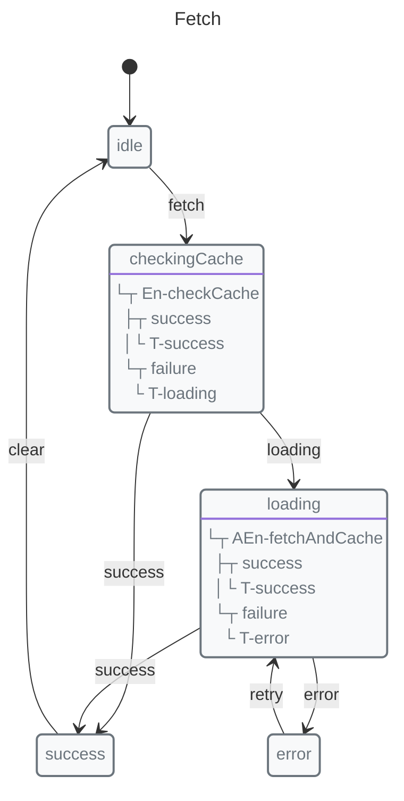
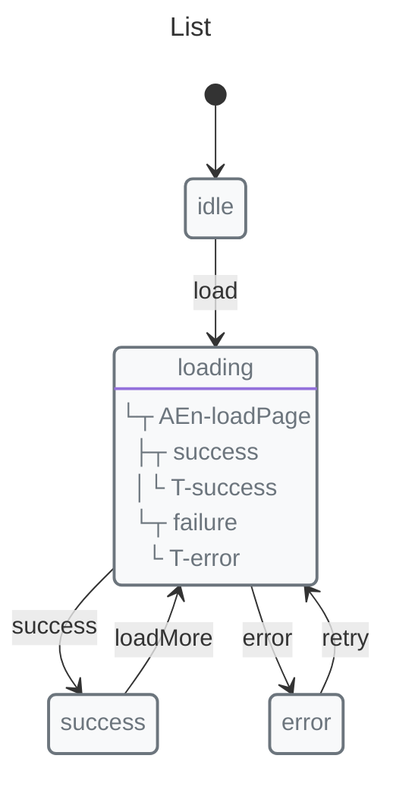

# API Data Fetch

Common pattern for server data fetching.

## Problem

Track API call states: idle, loading, success, error with data and error handling.

## Solution


```mermaid
---
title: Fetch
---

stateDiagram-v2
direction TB

classDef danger fill:#f8d7da,stroke:#721c24,stroke-width:2px,text-align:left,color:#721c24
classDef warning fill:#fff3cd,stroke:#856404,stroke-width:2px,text-align:left,color:#856404
classDef success fill:#d4edda,stroke:#155724,stroke-width:2px,text-align:left,color:#155724
classDef primary fill:#cce5ff,stroke:#004085,stroke-width:2px,text-align:left,color:#004085
classDef info fill:#d1ecf1,stroke:#0c5460,stroke-width:2px,text-align:left,color:#0c5460
classDef def fill:#f8f9fa,stroke:#6c757d,stroke-width:2px,text-align:left,color:#6c757d

state "idle" as idle
state "loading" as loading
state "success" as success
state "error" as error
class idle def
class loading def
class success def
class error def

loading: └┬ AEn-fetchData<br> ├┬ success<br> │└ T-success<br> └┬ failure<br>  └ T-error

[*] --> idle
idle --> loading: fetch
loading --> success: success
loading --> error: error
success --> loading: refetch
success --> idle: clear
error --> loading: retry
error --> idle: clear
```
```javascript
import {
  machine,
  state,
  transition,
  initial,
  init,
  context,
  invoke,
  entry
} from "x-robot";

async function fetchData(ctx, params) {
  const url = params ? `/api/data?${new URLSearchParams(params)}` : "/api/data";
  const res = await fetch(url);
  if (!res.ok) {
    throw new Error(`HTTP ${res.status}`);
  }
  ctx.params = params ?? null;
  ctx.data = await res.json();
}

const fetchMachine = machine(
  "Fetch",
  init(initial("idle"), context({ data: null, error: null, params: null })),
  state("idle", transition("fetch", "loading")),
  state("loading", entry(fetchData, "success", "error")),
  state(
    "success",
    transition("refetch", "loading"),
    transition("clear", "idle")
  ),
  state("error", transition("retry", "loading"), transition("clear", "idle"))
);

// Usage
await invoke(fetchMachine, "fetch", { page: 1 });

if (fetchMachine.current === "success") {
  console.log(fetchMachine.context.data);
}
```

## With Parameters

```javascript
invoke(fetchMachine, "fetch", { category: "books", page: 1 });
```

## Diagram

```mermaid
---
title: Fetch
---

stateDiagram-v2

classDef danger fill:#f8d7da,stroke:#721c24,stroke-width:2px,text-align:left,color:#721c24
classDef warning fill:#fff3cd,stroke:#856404,stroke-width:2px,text-align:left,color:#856404
classDef success fill:#d4edda,stroke:#155724,stroke-width:2px,text-align:left,color:#155724
classDef primary fill:#cce5ff,stroke:#004085,stroke-width:2px,text-align:left,color:#004085
classDef info fill:#d1ecf1,stroke:#0c5460,stroke-width:2px,text-align:left,color:#0c5460
classDef def fill:#f8f9fa,stroke:#6c757d,stroke-width:2px,text-align:left,color:#6c757d

state idle
state loading
state success
state error

loading:

[*] --> idle
idle --> loading: fetch
loading --> success: success
loading --> error: error
success --> loading: refetch
success --> idle: clear
error --> loading: retry
error --> idle: clear

```

## With Caching


```mermaid
---
title: Fetch
---

stateDiagram-v2
direction TB

classDef danger fill:#f8d7da,stroke:#721c24,stroke-width:2px,text-align:left,color:#721c24
classDef warning fill:#fff3cd,stroke:#856404,stroke-width:2px,text-align:left,color:#856404
classDef success fill:#d4edda,stroke:#155724,stroke-width:2px,text-align:left,color:#155724
classDef primary fill:#cce5ff,stroke:#004085,stroke-width:2px,text-align:left,color:#004085
classDef info fill:#d1ecf1,stroke:#0c5460,stroke-width:2px,text-align:left,color:#0c5460
classDef def fill:#f8f9fa,stroke:#6c757d,stroke-width:2px,text-align:left,color:#6c757d

state "idle" as idle
state "checkingCache" as checkingCache
state "loading" as loading
state "success" as success
state "error" as error
class idle def
class checkingCache def
class loading def
class success def
class error def

checkingCache: └┬ En-checkCache<br> ├┬ success<br> │└ T-success<br> └┬ failure<br>  └ T-loading
loading: └┬ AEn-fetchAndCache<br> ├┬ success<br> │└ T-success<br> └┬ failure<br>  └ T-error

[*] --> idle
idle --> checkingCache: fetch
checkingCache --> success: success
checkingCache --> loading: loading
loading --> success: success
loading --> error: error
success --> idle: clear
error --> loading: retry
```
```javascript
function checkCache(ctx, params) {
  const nextParams = params ?? ctx.params ?? null;
  const key = JSON.stringify(nextParams);
  if (ctx.cache.has(key)) {
    ctx.params = nextParams;
    ctx.data = ctx.cache.get(key);
    return;
  }
}

async function fetchAndCache(ctx, params) {
  const nextParams = params ?? ctx.params ?? null;
  const res = await fetch(`/api/data?${new URLSearchParams(nextParams || {})}`);
  ctx.data = await res.json();
  ctx.params = nextParams;
  ctx.cache.set(JSON.stringify(nextParams), ctx.data);
}

const fetchMachine = machine(
  "Fetch",
  init(
    initial("idle"),
    context({ data: null, params: null, cache: new Map() })
  ),
  state("idle", transition("fetch", "checkingCache")),
  state("checkingCache", entry(checkCache, "success", "loading")),
  state("loading", entry(fetchAndCache, "success", "error")),
  state("success", transition("clear", "idle")),
  state("error", transition("retry", "loading"))
);
```

## With Pagination


```mermaid
---
title: List
---

stateDiagram-v2
direction TB

classDef danger fill:#f8d7da,stroke:#721c24,stroke-width:2px,text-align:left,color:#721c24
classDef warning fill:#fff3cd,stroke:#856404,stroke-width:2px,text-align:left,color:#856404
classDef success fill:#d4edda,stroke:#155724,stroke-width:2px,text-align:left,color:#155724
classDef primary fill:#cce5ff,stroke:#004085,stroke-width:2px,text-align:left,color:#004085
classDef info fill:#d1ecf1,stroke:#0c5460,stroke-width:2px,text-align:left,color:#0c5460
classDef def fill:#f8f9fa,stroke:#6c757d,stroke-width:2px,text-align:left,color:#6c757d

state "idle" as idle
state "loading" as loading
state "success" as success
state "error" as error
class idle def
class loading def
class success def
class error def

loading: └┬ AEn-loadPage<br> ├┬ success<br> │└ T-success<br> └┬ failure<br>  └ T-error

[*] --> idle
idle --> loading: load
loading --> success: success
loading --> error: error
success --> loading: loadMore
error --> loading: retry
```
```javascript
async function loadPage(ctx) {
  const res = await fetch(`/api/items?page=${ctx.page}`);
  const newItems = await res.json();
  ctx.items = [...ctx.items, ...newItems];
  ctx.hasMore = newItems.length > 0;
  if (ctx.hasMore) ctx.page++;
}

const listMachine = machine(
  "List",
  init(initial("idle"), context({ items: [], page: 1, hasMore: true })),
  state("idle", transition("load", "loading")),
  state("loading", entry(loadPage, "success", "error")),
  state("success", transition("loadMore", "loading")),
  state("error", transition("retry", "loading"))
);
```

## Next Steps

*   [Login Flow](./login-flow.md) — Authentication
*   [Modal Dialog](./modal-dialog.md) — UI states
