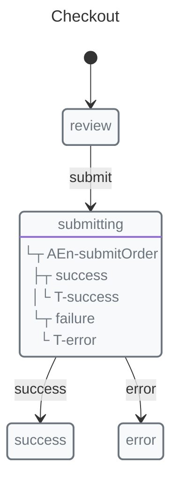

# Devtools Checkout

Compact checkout flow with Redux DevTools wired only in development.

## Machine



```javascript
import {
  context,
  entry,
  init,
  initial,
  machine,
  state,
  transition
} from "x-robot";

async function submitOrder(ctx, payload) {
  ctx.orderId = payload.orderId;
}

const checkoutMachine = machine(
  "Checkout",
  init(initial("review"), context({ orderId: null })),
  state("review", transition("submit", "submitting")),
  state("submitting", entry(submitOrder, "success", "error")),
  state("success"),
  state("error")
);

let disposeDevtools = () => undefined;

if (import.meta.env.DEV) {
  const { connectXRobot } = await import("x-robot/devtools");
  const {
    machine: checkout,
    start,
    invoke,
    snapshot,
    cleanup
  } = connectXRobot(checkoutMachine, {
    name: "Checkout"
  });

  await start();
  await invoke("submit", { orderId: 42 });

  console.log(checkout.current);
  console.log(snapshot());

  disposeDevtools = cleanup;
}
```

## Lifecycle Integration

Use `cleanup()` or `disconnect()` when the owning view, page, or component goes away.

```javascript
function dispose() {
  disposeDevtools();
}
```

## Host Patterns

*   Vanilla JavaScript: create the devtools connection during setup and call the stored disposer when tearing down the page or widget.
*   Effect-style lifecycle: create the connection inside the effect and return `cleanup` from the effect callback.
*   Mount/unmount lifecycle: connect on mount, disconnect on unmount.

Use the wrapped `start()` and `invoke()` methods for tracked transitions. Direct `invoke(checkoutMachine, ...)` calls bypass the connection and do not appear in Redux DevTools.
