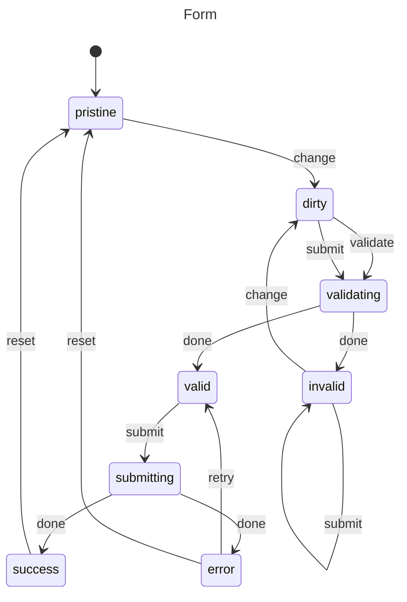

# Form Validation

Managing form state with validation.

## Problem

Track form states: pristine, dirty, validating, valid, invalid, submitting, success, error.

## Solution

```javascript
import { machine, state, transition, initial, init, context, invoke, entry, guard } from "x-robot";

function validateForm(values) {
  const errors = {};
  if (!values.email || !/@/.test(values.email)) {
    errors.email = "Invalid email";
  }
  if (!values.password || values.password.length < 8) {
    errors.password = "Password must be 8+ characters";
  }
  return errors;
}

function canSubmitForm(ctx) {
  const errors = validateForm(ctx.values);
  return Object.keys(errors).length === 0;
}

function validateFormInContext(ctx) {
  ctx.errors = validateForm(ctx.values);
}

async function submitForm(ctx) {
  const res = await fetch("/api/submit", {
    method: "POST",
    body: JSON.stringify(ctx.values)
  });
  if (!res.ok) throw new Error("Submit failed");
  ctx.submitted = true;
}

const formMachine = machine(
  "Form",
  init(
    initial("pristine"),
    context({ values: {}, errors: {}, submitted: false })
  ),
  state("pristine", 
    transition("change", "dirty")
  ),
  state("dirty", 
    transition("validate", "validating"),
    transition("submit", "validating", guard(canSubmitForm))
  ),
  state("validating", 
    entry(validateFormInContext, "valid", "invalid")
  ),
  state("valid", 
    transition("submit", "submitting")
  ),
  state("invalid", 
    transition("change", "dirty"),
    transition("submit", "invalid")
  ),
  state("submitting", 
    entry(submitForm, "success", "error")
  ),
  state("success", 
    transition("reset", "pristine")
  ),
  state("error", 
    transition("retry", "valid"),
    transition("reset", "pristine")
  )
);

// Usage
invoke(formMachine, "change", { email: "test" });
invoke(formMachine, "validate");
await invoke(formMachine, "submit");
```

## Diagram



## With Async Validation

```javascript
async function validateOnServer(ctx) {
  // Server-side validation
  const res = await fetch("/api/validate", {
    method: "POST",
    body: JSON.stringify(ctx.values)
  });
  ctx.errors = await res.json();
}

state("validating", 
  entry(validateOnServer, "valid", "invalid")
)
```

## Next Steps

- [API Fetch](./api-fetch.md) — Data fetching
- [Wizard](./wizard.md) — Multi-step forms
