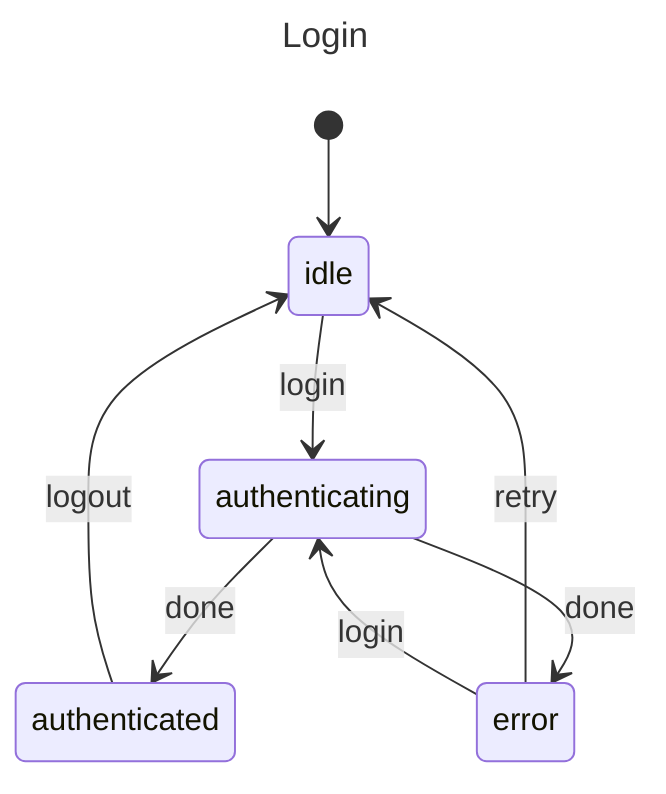

# Login Flow

A common pattern for authentication.

## Problem

Track login states: idle, authenticating, authenticated, error.

## Solution

```javascript
import { machine, state, transition, initial, init, context, invoke, entry } from "x-robot";

async function authenticateUser(ctx) {
  const res = await fetch("/api/login", {
    method: "POST",
    body: JSON.stringify(ctx.credentials)
  });
  if (!res.ok) {
    throw new Error("Invalid credentials");
  }
  ctx.user = await res.json();
}

const loginMachine = machine(
  "Login",
  init(
    initial("idle"),
    context({ user: null, error: null })
  ),
  state("idle", 
    transition("login", "authenticating")
  ),
  state("authenticating", 
    entry(authenticateUser, "authenticated", "error")
  ),
  state("authenticated", 
    transition("logout", "idle")
  ),
  state("error", 
    transition("retry", "idle"),
    transition("login", "authenticating")
  )
);

// Usage
await invoke(loginMachine, "login", { 
  username: "user", 
  password: "pass" 
});

if (loginMachine.current === "authenticated") {
  console.log("Logged in as:", loginMachine.context.user);
}
```

## Diagram



## Key Points

- Pulse handles async login
- Success/error transitions automatic
- Error state allows retry

## Variations

### With Remember Me

```javascript
async function authenticateWithRemember(ctx) {
  const res = await fetch("/api/login", {
    headers: ctx.remember ? { "X-Remember": "true" } : {}
  });
  ctx.user = await res.json();
}

state("authenticating", 
  entry(authenticateWithRemember, "authenticated", "error")
)
```

### With Token Refresh

```javascript
async function refreshToken(ctx) {
  ctx.token = await refreshToken(ctx.token);
}

state("authenticated", 
  transition("refresh", "refreshing")
),
state("refreshing", 
  entry(refreshToken, "authenticated", "idle")
)
```

## Next Steps

- [Form Validation](./form-validation.md) — Input handling
- [API Fetch](./api-fetch.md) — Data fetching patterns
