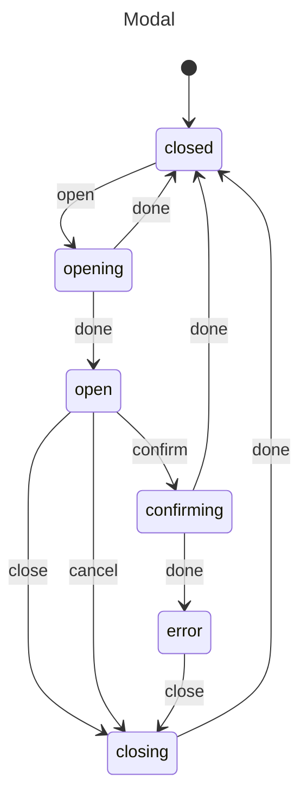

# Modal Dialog

Managing modal dialog state.

## Problem

Track modal states: closed, opening, open, closing.

## Solution

```javascript
import { machine, state, transition, initial, init, context, invoke, entry } from "x-robot";

function prepareContent(ctx) {
  ctx.content = { title: "Confirm", message: "Are you sure?" };
}

async function handleConfirmation(ctx) {
  // Handle confirmation
  await handleConfirm(ctx.data);
}

function clearContent(ctx) {
  ctx.content = null;
}

const modalMachine = machine(
  "Modal",
  init(
    initial("closed"),
    context({ content: null })
  ),
  state("closed", 
    transition("open", "opening")
  ),
  state("opening", 
    entry(prepareContent, "open", "closed")
  ),
  state("open", 
    transition("close", "closing"),
    transition("confirm", "confirming"),
    transition("cancel", "closing")
  ),
  state("confirming", 
    entry(handleConfirmation, "closed", "error")
  ),
  state("closing", 
    entry(clearContent, "closed")
  ),
  state("error", 
    transition("close", "closing")
  )
);

// Usage
invoke(modalMachine, "open");
// After animation: modalMachine.current === "open"

invoke(modalMachine, "confirm");
// modalMachine.current === "closed"
```

## Diagram



## With Animation Support

```javascript
function startOpenAnimation(ctx) {
  // Start opening animation
  animateOpen();
}

function onOpenComplete(ctx) {
  // Animation complete
}

function startCloseAnimation(ctx) {
  // Start closing animation
  animateClose();
}

const modalMachine = machine(
  "Modal",
  init(initial("closed")),
  state("closed", transition("open", "opening")),
  state("opening", 
    entry(startOpenAnimation, "open", "closed"),
    transition("cancel", "closing")
  ),
  state("open", 
    entry(onOpenComplete),
    transition("close", "closing")
  ),
  state("closing", 
    entry(startCloseAnimation, "closed")
  )
);
```

## State Diagram

```
closed → opening → open → closing → closed
              ↑         |         |
              |         ↓         ↓
              └──── confirming → error
```

## Use Cases

- Confirmation dialogs
- Alert modals
- Form modals
- Side panels

## Variations

### Alert Only

```javascript
function showAlert(ctx) {
  // Show alert
}

function hideAlert(ctx) {
  // Hide alert
}

const alertMachine = machine(
  "Alert",
  init(initial("hidden")),
  state("hidden", transition("show", "showing")),
  state("showing", entry(showAlert, "visible", "hidden")),
  state("visible", transition("dismiss", "hiding")),
  state("hiding", entry(hideAlert, "hidden"))
);
```

### With Form

```javascript
async function submitFormData(ctx) {
  await submitForm(ctx.formData);
}

const formModal = machine(
  "FormModal",
  init(initial("closed"), context({ formData: {} })),
  state("closed", transition("open", "opening")),
  state("opening", transition("ready", "open")),
  state("open", 
    transition("close", "closing"),
    transition("submit", "submitting")
  ),
  state("submitting", 
    entry(submitFormData, "closed", "error")
  ),
  state("closing", transition("closed")),
  state("error", transition("retry", "open"))
);
```

## Next Steps

- [Wizard](./wizard.md) — Multi-step forms
- [Form Validation](./form-validation.md) — Input handling
