# Order Processing Flow

A complete finite state machine for an e-commerce order processing system. This example demonstrates how X-Robot handles complex real-world scenarios with many states, multiple entry actions, failure handling, and automatic transitions.

## Overview

This machine manages the complete lifecycle of an order from creation to delivery, including:

*   Draft and creation states
*   Payment authorization and capture
*   Store confirmation
*   Processing and fulfillment
*   Multiple cancellation paths
*   Error handling and recovery

## The Machine

```mermaid
---
title: Order
---

stateDiagram-v2

classDef danger fill:#f8d7da,stroke:#721c24,stroke-width:2px,text-align:left,color:#721c24
classDef warning fill:#fff3cd,stroke:#856404,stroke-width:2px,text-align:left,color:#856404
classDef success fill:#d4edda,stroke:#155724,stroke-width:2px,text-align:left,color:#155724
classDef primary fill:#cce5ff,stroke:#004085,stroke-width:2px,text-align:left,color:#004085
classDef info fill:#d1ecf1,stroke:#0c5460,stroke-width:2px,text-align:left,color:#0c5460
classDef def fill:#f8f9fa,stroke:#6c757d,stroke-width:2px,text-align:left,color:#6c757d

state fatal
state authorizationFailure
state voidOrRefundFailure
state captureFailure
state draft
state expiredDraft
state created
state expired
state waitingForStore
state cancelledByStore
state cancelledByClient
state cancelledByCustomerSupport
state changesRequestedByStore
state changesRejectedByClient
state changesAcceptedByClient
state processing
state processingCancelledByStore
state processed
state ready
state readyCancelledByStore
state waitingForDelivery
state waitingForDeliveryCancelledByStore
state completed
state completedCancelledByStore
class fatal danger
class authorizationFailure danger
class voidOrRefundFailure danger
class captureFailure danger
class draft def
class expiredDraft warning
class created primary
class expired warning
class waitingForStore primary
class cancelledByStore warning
class cancelledByClient warning
class cancelledByCustomerSupport warning
class changesRequestedByStore def
class changesRejectedByClient warning
class changesAcceptedByClient def
class processing primary
class processingCancelledByStore warning
class processed def
class ready primary
class readyCancelledByStore warning
class waitingForDelivery def
class waitingForDeliveryCancelledByStore warning
class completed success
class completedCancelledByStore warning

fatal: ├ AEn-update<br>└ AEn-updateTransaction
authorizationFailure: ├ AEn-setError<br>├ AEn-createTransaction<br>├ AEn-update<br>├ AEn-sendNotificationToClient<br>└ AEn-throwError
voidOrRefundFailure: ├ AEn-setError<br>├ AEn-updateTransaction<br>├ AEn-update<br>└ AEn-throwError
captureFailure: ├ AEn-setError<br>├┬ AEn-voidOrRefundOrder<br>│└┬ failure<br>│ └ T-voidOrRefundFailure<br>├ AEn-update<br>├ AEn-updateTransaction<br>├ AEn-sendNotificationToClient<br>├ AEn-sendNotificationToStore<br>└ AEn-throwError
draft: ├ AEn-getClient<br>├ AEn-getItemsAndTaxes<br>├ AEn-getAmounts<br>└ AEn-draft
expiredDraft: ├ AEn-getClient<br>└ AEn-expireDraft
created: ├ AEn-getClient<br>├ AEn-getStore<br>├ AEn-getRetailer<br>├ AEn-setI18N<br>├ AEn-validatePickupTime<br>├ AEn-getItemsAndTaxes<br>├ AEn-getAmounts<br>├ AEn-getCard<br>├ AEn-create<br>├┬ AEn-authorize<br>│└┬ failure<br>│ └ T-authorizationFailure<br>├ AEn-createTransaction<br>└ AEn-update
expired: ├ AEn-getClient<br>├ AEn-getStore<br>├ AEn-getRetailer<br>├ AEn-setI18N<br>├ AEn-getCard<br>├ AEn-getItemsAndTaxes<br>├ AEn-expire<br>├ AEn-getTransaction<br>├┬ AEn-voidOrRefundOrder<br>│└┬ failure<br>│ └ T-voidOrRefundFailure<br>├ AEn-update<br>├ AEn-updateTransaction<br>└ AEn-sendNotificationToClient
waitingForStore: ├ AEn-sendNotificationToClient<br>├ AEn-setTimeoutTasks<br>└ AEn-update
cancelledByStore: ├ AEn-getClient<br>├ AEn-getStore<br>├ AEn-getRetailer<br>├ AEn-setI18N<br>├ AEn-getCard<br>├ AEn-getItemsAndTaxes<br>├ AEn-update<br>├┬ AEn-voidOrRefundOrder<br>│└┬ failure<br>│ └ T-voidOrRefundFailure<br>├ AEn-update<br>├ AEn-updateTransaction<br>└ AEn-sendNotificationToClient
cancelledByClient: ├ AEn-getClient<br>├ AEn-getStore<br>├ AEn-getRetailer<br>├ AEn-setI18N<br>├ AEn-getCard<br>├ AEn-getItemsAndTaxes<br>├ AEn-getTransaction<br>├┬ AEn-voidOrRefundOrder<br>│└┬ failure<br>│ └ T-voidOrRefundFailure<br>├ AEn-update<br>├ AEn-sendNotificationToStore<br>└ AEn-sendNotificationToClient
cancelledByCustomerSupport: ├ AEn-getClient<br>├ AEn-getStore<br>├ AEn-getRetailer<br>├ AEn-setI18N<br>├ AEn-getCard<br>├ AEn-getItemsAndTaxes<br>├ AEn-getTransaction<br>├ AEn-setCancelledById<br>├┬ AEn-voidOrRefundOrder<br>│└┬ failure<br>│ └ T-voidOrRefundFailure<br>├ AEn-decreaseSuccessfulStoreOrderCount<br>├ AEn-update<br>├ AEn-updateTransaction<br>└ AEn-sendNotificationToClient
changesRequestedByStore: ├ AEn-getClient<br>├ AEn-getStore<br>├ AEn-getRetailer<br>├ AEn-setI18N<br>├ AEn-getCard<br>├ AEn-getItemsAndTaxes<br>├ AEn-getAmounts<br>├ AEn-update<br>└ AEn-sendNotificationToClient
changesRejectedByClient: ├ AEn-getClient<br>├ AEn-getStore<br>├ AEn-getRetailer<br>├ AEn-setI18N<br>├ AEn-getCard<br>├ AEn-getItemsAndTaxes<br>├ AEn-getTransaction<br>├┬ AEn-voidOrRefundOrder<br>│└┬ failure<br>│ └ T-voidOrRefundFailure<br>├ AEn-update<br>├ AEn-updateTransaction<br>├ AEn-sendNotificationToClient<br>└ AEn-sendNotificationToStore
changesAcceptedByClient: ├ AEn-getClient<br>├ AEn-getStore<br>├ AEn-getRetailer<br>├ AEn-setI18N<br>├ AEn-getCard<br>├ AEn-getItemsAndTaxes<br>├ AEn-update<br>└ AEn-sendNotificationToStore
processing: ├ AEn-getClient<br>├ AEn-getStore<br>├ AEn-getRetailer<br>├ AEn-setI18N<br>├ AEn-getCard<br>├ AEn-getItemsAndTaxes<br>├ AEn-update<br>└ AEn-sendNotificationToClient
processingCancelledByStore: ├ AEn-getClient<br>├ AEn-getStore<br>├ AEn-getRetailer<br>├ AEn-setI18N<br>├ AEn-getCard<br>├ AEn-getItemsAndTaxes<br>├ AEn-getTransaction<br>├┬ AEn-voidOrRefundOrder<br>│└┬ failure<br>│ └ T-voidOrRefundFailure<br>├ AEn-update<br>├ AEn-updateTransaction<br>└ AEn-sendNotificationToClient
processed: ├ AEn-getClient<br>├ AEn-getStore<br>├ AEn-getRetailer<br>├ AEn-setI18N<br>├ AEn-getCard<br>├ AEn-getItemsAndTaxes<br>├ AEn-getTransaction<br>├ AEn-update<br>├┬ AEn-capture<br>│└┬ failure<br>│ └ T-captureFailure<br>└ AEn-updateTransaction
ready: ├ AEn-increaseSuccessfulStoreOrderCount<br>├ AEn-update<br>└ AEn-sendNotificationToClient
readyCancelledByStore: ├ AEn-getClient<br>├ AEn-getStore<br>├ AEn-getRetailer<br>├ AEn-setI18N<br>├ AEn-getCard<br>├ AEn-getItemsAndTaxes<br>├ AEn-getTransaction<br>├┬ AEn-voidOrRefundOrder<br>│└┬ failure<br>│ └ T-voidOrRefundFailure<br>├ AEn-decreaseSuccessfulStoreOrderCount<br>├ AEn-update<br>├ AEn-updateTransaction<br>└ AEn-sendNotificationToClient
waitingForDelivery: ├ AEn-getClient<br>├ AEn-getStore<br>├ AEn-getRetailer<br>├ AEn-setI18N<br>├ AEn-getCard<br>├ AEn-getItemsAndTaxes<br>├ AEn-getTransaction<br>└ AEn-update
waitingForDeliveryCancelledByStore: ├ AEn-getClient<br>├ AEn-getStore<br>├ AEn-getRetailer<br>├ AEn-setI18N<br>├ AEn-getCard<br>├ AEn-getItemsAndTaxes<br>├ AEn-getTransaction<br>├┬ AEn-voidOrRefundOrder<br>│└┬ failure<br>│ └ T-voidOrRefundFailure<br>├ AEn-decreaseSuccessfulStoreOrderCount<br>├ AEn-update<br>├ AEn-updateTransaction<br>└ AEn-sendNotificationToClient
completed: ├ AEn-getClient<br>├ AEn-getStore<br>├ AEn-getRetailer<br>├ AEn-setI18N<br>├ AEn-getCard<br>└ AEn-update
completedCancelledByStore: ├ AEn-getClient<br>├ AEn-getStore<br>├ AEn-getRetailer<br>├ AEn-setI18N<br>├ AEn-getCard<br>├ AEn-getItemsAndTaxes<br>├ AEn-getTransaction<br>├┬ AEn-voidOrRefundOrder<br>│└┬ failure<br>│ └ T-voidOrRefundFailure<br>├ AEn-decreaseSuccessfulStoreOrderCount<br>├ AEn-update<br>├ AEn-updateTransaction<br>└ AEn-sendNotificationToClient

[*] --> draft
captureFailure --> voidOrRefundFailure: voidOrRefundFailure
draft --> expiredDraft: expiredDraft
draft --> created: create
created --> authorizationFailure: authorizationFailure
created --> waitingForStore: waitingForStore
created --> expired: expire
expired --> voidOrRefundFailure: voidOrRefundFailure
waitingForStore --> expired: expire
waitingForStore --> cancelledByStore: cancel
waitingForStore --> cancelledByClient: cancelByClient
waitingForStore --> cancelledByCustomerSupport: cancelByCustomerSupport
waitingForStore --> changesRequestedByStore: requestChanges
waitingForStore --> processing: process
cancelledByStore --> voidOrRefundFailure: voidOrRefundFailure
cancelledByClient --> voidOrRefundFailure: voidOrRefundFailure
cancelledByCustomerSupport --> voidOrRefundFailure: voidOrRefundFailure
changesRequestedByStore --> changesRejectedByClient: rejectChanges
changesRequestedByStore --> changesAcceptedByClient: acceptChanges
changesRequestedByStore --> cancelledByCustomerSupport: cancelByCustomerSupport
changesRejectedByClient --> voidOrRefundFailure: voidOrRefundFailure
changesAcceptedByClient --> cancelledByCustomerSupport: cancelByCustomerSupport
changesAcceptedByClient --> processing: process
changesAcceptedByClient --> cancelledByStore: cancel
processing --> processingCancelledByStore: cancelProcessing
processing --> processed: finishProcessing
processing --> cancelledByCustomerSupport: cancelByCustomerSupport
processingCancelledByStore --> voidOrRefundFailure: voidOrRefundFailure
processed --> captureFailure: captureFailure
processed --> ready: ready
ready --> completed: complete
ready --> readyCancelledByStore: cancelReady
ready --> cancelledByCustomerSupport: cancelByCustomerSupport
ready --> waitingForDelivery: deliver
readyCancelledByStore --> voidOrRefundFailure: voidOrRefundFailure
waitingForDelivery --> completed: complete
waitingForDelivery --> waitingForDeliveryCancelledByStore: cancelWaitingForDelivery
waitingForDelivery --> cancelledByCustomerSupport: cancelByCustomerSupport
waitingForDeliveryCancelledByStore --> voidOrRefundFailure: voidOrRefundFailure
completed --> completedCancelledByStore: cancelCompleted
completed --> cancelledByCustomerSupport: cancelByCustomerSupport
completedCancelledByStore --> voidOrRefundFailure: voidOrRefundFailure
```



```javascript
import {
  context,
  dangerState,
  entry,
  immediate,
  init,
  initial,
  machine,
  primaryState,
  state,
  successState,
  transition,
  warningState,
} from "x-robot";
import { validate } from "x-robot/validate";

// Helper: updates context with payload data
function updateState(context, payload) {
  return { ...context, ...payload };
}

// Entry actions (async operations)
async function getClient() {}
async function getItemsAndTaxes() {}
async function getAmounts() {}
async function draft() {}
async function expireDraft() {}
async function getStore() {}
async function getRetailer() {}
async function setI18N() {}
async function validatePickupTime() {}
async function getCard() {}
async function create() {}
async function authorize() {}
async function capture() {}
async function voidOrRefundOrder() {}
async function update() {}
async function sendNotificationToClient() {}
async function sendNotificationToStore() {}
async function increaseSuccessfulStoreOrderCount() {}
async function decreaseSuccessfulStoreOrderCount() {}
async function setError() {}
async function createTransaction() {}
async function throwError() {}
async function setTimeoutTasks() {}
async function getTransaction() {}
async function expire() {}
async function updateTransaction() {}
async function setCancelledById() {}

// Create entry action directives
const actionGetClient = entry(getClient);
const actionGetItemsAndTaxes = entry(getItemsAndTaxes);
const actionGetAmounts = entry(getAmounts);
const actionDraft = entry(draft);
const actionExpireDraft = entry(expireDraft);
const actionGetStore = entry(getStore);
const actionGetRetailer = entry(getRetailer);
const actionSetI18N = entry(setI18N);
const actionValidatePickupTime = entry(validatePickupTime);
const actionGetCard = entry(getCard);
const actionCreate = entry(create);
const actionAuthorize = entry(authorize, undefined, "authorizationFailure");
const actionCapture = entry(capture, undefined, "captureFailure");
const actionVoidOrRefundOrder = entry(voidOrRefundOrder, undefined, "voidOrRefundFailure");
const actionUpdate = entry(update);
const actionSendNotificationToClient = entry(sendNotificationToClient);
const actionSendNotificationToStore = entry(sendNotificationToStore);
const actionIncreaseSuccessfulStoreOrderCount = entry(increaseSuccessfulStoreOrderCount);
const actionDecreaseSuccessfulStoreOrderCount = entry(decreaseSuccessfulStoreOrderCount);
const actionSetError = entry(setError);
const actionCreateTransaction = entry(createTransaction);
const actionThrowError = entry(throwError);
const actionSetTimeoutTasks = entry(setTimeoutTasks);
const actionGetTransaction = entry(getTransaction);
const actionExpire = entry(expire);
const actionUpdateTransaction = entry(updateTransaction);
const actionSetCancelledById = entry(setCancelledById);

const orderMachine = machine(
  "Order",
  init(
    initial("draft"),
    context({})
  ),
  
  // Error states (danger)
  dangerState("fatal", actionUpdate, actionUpdateTransaction),
  dangerState("authorizationFailure", actionSetError, actionCreateTransaction, actionUpdate, actionSendNotificationToClient, actionThrowError),
  dangerState("voidOrRefundFailure", actionSetError, actionUpdateTransaction, actionUpdate, actionThrowError),
  dangerState("captureFailure", actionSetError, actionVoidOrRefundOrder, actionUpdate, actionUpdateTransaction, actionSendNotificationToClient, actionSendNotificationToStore, actionThrowError),

  // Initial state - draft
  state(
    "draft",
    actionGetClient,
    actionGetItemsAndTaxes,
    actionGetAmounts,
    actionDraft,
    transition("expiredDraft", "expiredDraft"),
    transition("create", "created")
  ),

  // Draft expired
  warningState("expiredDraft", actionGetClient, actionExpireDraft),

  // Order created - primary workflow starts here
  primaryState(
    "created",
    actionGetClient,
    actionGetStore,
    actionGetRetailer,
    actionSetI18N,
    actionValidatePickupTime,
    actionGetItemsAndTaxes,
    actionGetAmounts,
    actionGetCard,
    actionCreate,
    actionAuthorize,
    actionCreateTransaction,
    actionUpdate,
    immediate("waitingForStore"),
    transition("expire", "expired")
  ),

  // Order expired
  warningState(
    "expired",
    actionGetClient,
    actionGetStore,
    actionGetRetailer,
    actionSetI18N,
    actionGetCard,
    actionGetItemsAndTaxes,
    actionExpire,
    actionGetTransaction,
    actionVoidOrRefundOrder,
    actionUpdate,
    actionUpdateTransaction,
    actionSendNotificationToClient
  ),

  // Waiting for store confirmation
  primaryState(
    "waitingForStore",
    actionSendNotificationToClient,
    actionSetTimeoutTasks,
    actionUpdate,
    transition("expire", "expired"),
    transition("cancel", "cancelledByStore"),
    transition("cancelByClient", "cancelledByClient"),
    transition("cancelByCustomerSupport", "cancelledByCustomerSupport"),
    transition("requestChanges", "changesRequestedByStore"),
    transition("process", "processing")
  ),

  // Cancellation states
  warningState(
    "cancelledByStore",
    actionGetClient,
    actionGetStore,
    actionGetRetailer,
    actionSetI18N,
    actionGetCard,
    actionGetItemsAndTaxes,
    actionUpdate,
    actionVoidOrRefundOrder,
    actionUpdate,
    actionUpdateTransaction,
    actionSendNotificationToClient
  ),

  warningState(
    "cancelledByClient",
    actionGetClient,
    actionGetStore,
    actionGetRetailer,
    actionSetI18N,
    actionGetCard,
    actionGetItemsAndTaxes,
    actionGetTransaction,
    actionVoidOrRefundOrder,
    actionUpdate,
    actionSendNotificationToStore,
    actionSendNotificationToClient
  ),

  warningState(
    "cancelledByCustomerSupport",
    actionGetClient,
    actionGetStore,
    actionGetRetailer,
    actionSetI18N,
    actionGetCard,
    actionGetItemsAndTaxes,
    actionGetTransaction,
    actionSetCancelledById,
    actionVoidOrRefundOrder,
    actionDecreaseSuccessfulStoreOrderCount,
    actionUpdate,
    actionUpdateTransaction,
    actionSendNotificationToClient
  ),

  // Change request states
  state(
    "changesRequestedByStore",
    actionGetClient,
    actionGetStore,
    actionGetRetailer,
    actionSetI18N,
    actionGetCard,
    actionGetItemsAndTaxes,
    actionGetAmounts,
    actionUpdate,
    actionSendNotificationToClient,
    transition("rejectChanges", "changesRejectedByClient"),
    transition("acceptChanges", "changesAcceptedByClient"),
    transition("cancelByCustomerSupport", "cancelledByCustomerSupport")
  ),

  warningState(
    "changesRejectedByClient",
    actionGetClient,
    actionGetStore,
    actionGetRetailer,
    actionSetI18N,
    actionGetCard,
    actionGetItemsAndTaxes,
    actionGetTransaction,
    actionVoidOrRefundOrder,
    actionUpdate,
    actionUpdateTransaction,
    actionSendNotificationToClient,
    actionSendNotificationToStore
  ),

  state(
    "changesAcceptedByClient",
    actionGetClient,
    actionGetStore,
    actionGetRetailer,
    actionSetI18N,
    actionGetCard,
    actionGetItemsAndTaxes,
    actionUpdate,
    actionSendNotificationToStore,
    transition("cancelByCustomerSupport", "cancelledByCustomerSupport"),
    transition("process", "processing"),
    transition("cancel", "cancelledByStore")
  ),

  // Processing states
  primaryState(
    "processing",
    actionGetClient,
    actionGetStore,
    actionGetRetailer,
    actionSetI18N,
    actionGetCard,
    actionGetItemsAndTaxes,
    actionUpdate,
    actionSendNotificationToClient,
    transition("cancelProcessing", "processingCancelledByStore"),
    transition("finishProcessing", "processed"),
    transition("cancelByCustomerSupport", "cancelledByCustomerSupport")
  ),

  warningState(
    "processingCancelledByStore",
    actionGetClient,
    actionGetStore,
    actionGetRetailer,
    actionSetI18N,
    actionGetCard,
    actionGetItemsAndTaxes,
    actionGetTransaction,
    actionVoidOrRefundOrder,
    actionUpdate,
    actionUpdateTransaction,
    actionSendNotificationToClient
  ),

  state(
    "processed",
    actionGetClient,
    actionGetStore,
    actionGetRetailer,
    actionSetI18N,
    actionGetCard,
    actionGetItemsAndTaxes,
    actionGetTransaction,
    actionUpdate,
    actionCapture,
    actionUpdateTransaction,
    immediate("ready")
  ),

  // Ready for delivery
  primaryState(
    "ready",
    actionIncreaseSuccessfulStoreOrderCount,
    actionUpdate,
    actionSendNotificationToClient,
    transition("complete", "completed"),
    transition("cancelReady", "readyCancelledByStore"),
    transition("cancelByCustomerSupport", "cancelledByCustomerSupport"),
    transition("deliver", "waitingForDelivery")
  ),

  warningState(
    "readyCancelledByStore",
    actionGetClient,
    actionGetStore,
    actionGetRetailer,
    actionSetI18N,
    actionGetCard,
    actionGetItemsAndTaxes,
    actionGetTransaction,
    actionVoidOrRefundOrder,
    actionDecreaseSuccessfulStoreOrderCount,
    actionUpdate,
    actionUpdateTransaction,
    actionSendNotificationToClient
  ),

  // Delivery states
  state(
    "waitingForDelivery",
    actionGetClient,
    actionGetStore,
    actionGetRetailer,
    actionSetI18N,
    actionGetCard,
    actionGetItemsAndTaxes,
    actionGetTransaction,
    actionUpdate,
    transition("complete", "completed"),
    transition("cancelWaitingForDelivery", "waitingForDeliveryCancelledByStore"),
    transition("cancelByCustomerSupport", "cancelledByCustomerSupport")
  ),

  warningState(
    "waitingForDeliveryCancelledByStore",
    actionGetClient,
    actionGetStore,
    actionGetRetailer,
    actionSetI18N,
    actionGetCard,
    actionGetItemsAndTaxes,
    actionGetTransaction,
    actionVoidOrRefundOrder,
    actionDecreaseSuccessfulStoreOrderCount,
    actionUpdate,
    actionUpdateTransaction,
    actionSendNotificationToClient
  ),

  // Final success state
  successState(
    "completed",
    actionGetClient,
    actionGetStore,
    actionGetRetailer,
    actionSetI18N,
    actionGetCard,
    actionUpdate,
    transition("cancelCompleted", "completedCancelledByStore"),
    transition("cancelByCustomerSupport", "cancelledByCustomerSupport")
  ),

  warningState(
    "completedCancelledByStore",
    actionGetClient,
    actionGetStore,
    actionGetRetailer,
    actionSetI18N,
    actionGetCard,
    actionGetItemsAndTaxes,
    actionGetTransaction,
    actionVoidOrRefundOrder,
    actionDecreaseSuccessfulStoreOrderCount,
    actionUpdate,
    actionUpdateTransaction,
    actionSendNotificationToClient
  )
);

// Validate the machine structure
validate(orderMachine);
```

## Key Patterns

### 1. State Types

X-Robot provides visual state types that help categorize states in diagrams:

```javascript
primaryState("created", ...)   // Blue - main workflow
warningState("expired", ...)   // Yellow - warnings/cancellations  
dangerState("fatal", ...)      // Red - errors/failures
successState("completed", ...)  // Green - final success
state("draft", ...)            // Default - neutral
```

### 2. Multiple Entry Actions

Each state can have multiple entry actions that run sequentially:

```javascript
primaryState(
  "created",
  actionGetClient,      // Runs first
  actionGetStore,      // Runs second
  actionGetRetailer,    // Runs third
  actionSetI18N,
  actionValidatePickupTime,
  actionGetItemsAndTaxes,
  actionGetAmounts,
  actionGetCard,
  actionCreate,
  actionAuthorize,
  actionCreateTransaction,
  actionUpdate
)
```

### 3. Failure Transitions

Entry actions can trigger failure transitions when errors occur:

```javascript
// On success: continues normally
// On failure: transitions to "authorizationFailure"
actionAuthorize = entry(authorize, undefined, "authorizationFailure")

// Capture with failure handling
actionCapture = entry(capture, undefined, "captureFailure")

// Void or refund with failure
actionVoidOrRefundOrder = entry(voidOrRefundOrder, undefined, "voidOrRefundFailure")
```

### 4. Immediate Transitions

States can automatically transition to other states without events:

```javascript
// After "created" entry actions complete, immediately go to "waitingForStore"
primaryState(
  "created",
  ...actions,
  immediate("waitingForStore")
)

// After processing completes, immediately go to "ready"
state(
  "processed",
  ...actions,
  immediate("ready")
)
```

### 5. Validation

Validate the machine structure before use:

```javascript
import { validate } from "x-robot/validate";

validate(orderMachine); // Throws if invalid
```

## Diagram

```mermaid
---
title: Order
---

stateDiagram-v2

classDef danger fill:#f8d7da,stroke:#721c24,stroke-width:2px,text-align:left,color:#721c24
classDef warning fill:#fff3cd,stroke:#856404,stroke-width:2px,text-align:left,color:#856404
classDef success fill:#d4edda,stroke:#155724,stroke-width:2px,text-align:left,color:#155724
classDef primary fill:#cce5ff,stroke:#004085,stroke-width:2px,text-align:left,color:#004085
classDef info fill:#d1ecf1,stroke:#0c5460,stroke-width:2px,text-align:left,color:#0c5460
classDef def fill:#f8f9fa,stroke:#6c757d,stroke-width:2px,text-align:left,color:#6c757d

state fatal
state authorizationFailure
state voidOrRefundFailure
state captureFailure
state draft
state expiredDraft
state created
state expired
state waitingForStore
state cancelledByStore
state cancelledByClient
state cancelledByCustomerSupport
state changesRequestedByStore
state changesRejectedByClient
state changesAcceptedByClient
state processing
state processingCancelledByStore
state processed
state ready
state readyCancelledByStore
state waitingForDelivery
state waitingForDeliveryCancelledByStore
state completed
state completedCancelledByStore
class fatal danger
class authorizationFailure danger
class voidOrRefundFailure danger
class captureFailure danger
class expiredDraft warning
class created primary
class expired warning
class waitingForStore primary
class cancelledByStore warning
class cancelledByClient warning
class cancelledByCustomerSupport warning
class changesRejectedByClient warning
class processing primary
class processingCancelledByStore warning
class ready primary
class readyCancelledByStore warning
class waitingForDeliveryCancelledByStore warning
class completed success
class completedCancelledByStore warning

fatal: Fatal error
fatal: ├ AEn:setError<br>├ AEn:createTransaction<br>├ AEn:update<br>├ AEn:sendNotificationToClient<br>└ AEn:throwError
authorizationFailure: Payment authorization failed
authorizationFailure: ├ AEn:setError<br>├ AEn:createTransaction<br>├ AEn:update<br>├ AEn:sendNotificationToClient<br>└ AEn:throwError
voidOrRefundFailure: Void or refund failed
voidOrRefundFailure: ├ AEn:setError<br>├ AEn:updateTransaction<br>├ AEn:update<br>└ AEn:throwError
captureFailure: Payment capture failed
captureFailure: ├ AEn:setError<br>├ AEn:voidOrRefundOrder<br>├ AEn:update<br>├ AEn:updateTransaction<br>├ AEn:sendNotificationToClient<br>├ AEn:sendNotificationToStore<br>└ AEn:throwError
draft: Draft order
draft: ├ AEn:getClient<br>├ AEn:getItemsAndTaxes<br>├ AEn:getAmounts<br>└ AEn:draft
expiredDraft: Draft expired
expiredDraft: ├ AEn:getClient<br>└ AEn:expireDraft
created: Order created
created: ├ AEn:getClient<br>├ AEn:getStore<br>├ AEn:getRetailer<br>├ AEn:setI18N<br>├ AEn:validatePickupTime<br>├ AEn:getItemsAndTaxes<br>├ AEn:getAmounts<br>├ AEn:getCard<br>├ AEn:create<br>├ AEn:authorize<br>├ AEn:createTransaction<br>└ AEn:update
expired: Order expired
expired: ├ AEn:getClient<br>├ AEn:getStore<br>├ AEn:getRetailer<br>├ AEn:setI18N<br>├ AEn:getCard<br>├ AEn:getItemsAndTaxes<br>├ AEn:expire<br>├ AEn:getTransaction<br>├ AEn:voidOrRefundOrder<br>├ AEn:update<br>├ AEn:updateTransaction<br>└ AEn:sendNotificationToClient
waitingForStore: Waiting for store confirmation
waitingForStore: ├ AEn:sendNotificationToClient<br>├ AEn:setTimeoutTasks<br>└ AEn:update
cancelledByStore: Cancelled by store
cancelledByStore: ├ AEn:getClient<br>├ AEn:getStore<br>├ AEn:getRetailer<br>├ AEn:setI18N<br>├ AEn:getCard<br>├ AEn:getItemsAndTaxes<br>├ AEn:update<br>├ AEn:voidOrRefundOrder<br>├ AEn:update<br>├ AEn:updateTransaction<br>└ AEn:sendNotificationToClient
cancelledByClient: Cancelled by client
cancelledByClient: ├ AEn:getClient<br>├ AEn:getStore<br>├ AEn:getRetailer<br>├ AEn:setI18N<br>├ AEn:getCard<br>├ AEn:getItemsAndTaxes<br>├ AEn:getTransaction<br>├ AEn:voidOrRefundOrder<br>├ AEn:update<br>├ AEn:sendNotificationToStore<br>└ AEn:sendNotificationToClient
cancelledByCustomerSupport: Cancelled by customer support
cancelledByCustomerSupport: ├ AEn:getClient<br>├ AEn:getStore<br>├ AEn:getRetailer<br>├ AEn:setI18N<br>├ AEn:getCard<br>├ AEn:getItemsAndTaxes<br>├ AEn:getTransaction<br>├ AEn:setCancelledById<br>├ AEn:voidOrRefundOrder<br>├ AEn:decreaseSuccessfulStoreOrderCount<br>├ AEn:update<br>├ AEn:updateTransaction<br>└ AEn:sendNotificationToClient
changesRequestedByStore: Changes requested by store
changesRequestedByStore: ├ AEn:getClient<br>├ AEn:getStore<br>├ AEn:getRetailer<br>├ AEn:setI18N<br>├ AEn:getCard<br>├ AEn:getItemsAndTaxes<br>├ AEn:getAmounts<br>├ AEn:update<br>└ AEn:sendNotificationToClient
changesRejectedByClient: Changes rejected by client
changesRejectedByClient: ├ AEn:getClient<br>├ AEn:getStore<br>├ AEn:getRetailer<br>├ AEn:setI18N<br>├ AEn:getCard<br>├ AEn:getItemsAndTaxes<br>├ AEn:getTransaction<br>├ AEn:voidOrRefundOrder<br>├ AEn:update<br>├ AEn:updateTransaction<br>├ AEn:sendNotificationToClient<br>└ AEn:sendNotificationToStore
changesAcceptedByClient: Changes accepted by client
changesAcceptedByClient: ├ AEn:getClient<br>├ AEn:getStore<br>├ AEn:getRetailer<br>├ AEn:setI18N<br>├ AEn:getCard<br>├ AEn:getItemsAndTaxes<br>├ AEn:update<br>└ AEn:sendNotificationToStore
processing: Processing order
processing: ├ AEn:getClient<br>├ AEn:getStore<br>├ AEn:getRetailer<br>├ AEn:setI18N<br>├ AEn:getCard<br>├ AEn:getItemsAndTaxes<br>├ AEn:update<br>└ AEn:sendNotificationToClient
processingCancelledByStore: Processing cancelled by store
processingCancelledByStore: ├ AEn:getClient<br>├ AEn:getStore<br>├ AEn:getRetailer<br>├ AEn:setI18N<br>├ AEn:getCard<br>├ AEn:getItemsAndTaxes<br>├ AEn:getTransaction<br>├ AEn:voidOrRefundOrder<br>├ AEn:update<br>├ AEn:updateTransaction<br>└ AEn:sendNotificationToClient
processed: Order processed
processed: ├ AEn:getClient<br>├ AEn:getStore<br>├ AEn:getRetailer<br>├ AEn:setI18N<br>├ AEn:getCard<br>├ AEn:getItemsAndTaxes<br>├ AEn:getTransaction<br>├ AEn:update<br>├ AEn:capture<br>└ AEn:updateTransaction
ready: Ready for delivery
ready: ├ AEn:increaseSuccessfulStoreOrderCount<br>├ AEn:update<br>└ AEn:sendNotificationToClient
readyCancelledByStore: Ready cancelled by store
readyCancelledByStore: ├ AEn:getClient<br>├ AEn:getStore<br>├ AEn:getRetailer<br>├ AEn:setI18N<br>├ AEn:getCard<br>├ AEn:getItemsAndTaxes<br>├ AEn:getTransaction<br>├ AEn:voidOrRefundOrder<br>├ AEn:decreaseSuccessfulStoreOrderCount<br>├ AEn:update<br>├ AEn:updateTransaction<br>└ AEn:sendNotificationToClient
waitingForDelivery: Waiting for delivery
waitingForDelivery: ├ AEn:getClient<br>├ AEn:getStore<br>├ AEn:getRetailer<br>├ AEn:setI18N<br>├ AEn:getCard<br>├ AEn:getItemsAndTaxes<br>├ AEn:getTransaction<br>└ AEn:update
waitingForDeliveryCancelledByStore: Waiting for delivery cancelled by store
waitingForDeliveryCancelledByStore: ├ AEn:getClient<br>├ AEn:getStore<br>├ AEn:getRetailer<br>├ AEn:setI18N<br>├ AEn:getCard<br>├ AEn:getItemsAndTaxes<br>├ AEn:getTransaction<br>├ AEn:voidOrRefundOrder<br>├ AEn:decreaseSuccessfulStoreOrderCount<br>├ AEn:update<br>├ AEn:updateTransaction<br>└ AEn:sendNotificationToClient
completed: Order completed
completed: ├ AEn:getClient<br>├ AEn:getStore<br>├ AEn:getRetailer<br>├ AEn:setI18N<br>├ AEn:getCard<br>└ AEn:update
completedCancelledByStore: Completed cancelled by store
completedCancelledByStore: ├ AEn:getClient<br>├ AEn:getStore<br>├ AEn:getRetailer<br>├ AEn:setI18N<br>├ AEn:getCard<br>├ AEn:getItemsAndTaxes<br>├ AEn:getTransaction<br>├ AEn:voidOrRefundOrder<br>├ AEn:decreaseSuccessfulStoreOrderCount<br>├ AEn:update<br>├ AEn:updateTransaction<br>└ AEn:sendNotificationToClient

[*] --> draft
draft --> expiredDraft: expiredDraft
draft --> created: create
created --> expired: expire
created --> waitingForStore: waitingForStore
waitingForStore --> expired: expire
waitingForStore --> cancelledByStore: cancel
waitingForStore --> cancelledByClient: cancelByClient
waitingForStore --> cancelledByCustomerSupport: cancelByCustomerSupport
waitingForStore --> changesRequestedByStore: requestChanges
waitingForStore --> processing: process
changesRequestedByStore --> changesRejectedByClient: rejectChanges
changesRequestedByStore --> changesAcceptedByClient: acceptChanges
changesRequestedByStore --> cancelledByCustomerSupport: cancelByCustomerSupport
changesAcceptedByClient --> processing: process
changesAcceptedByClient --> cancelledByStore: cancel
processing --> processingCancelledByStore: cancelProcessing
processing --> processed: finishProcessing
processing --> cancelledByCustomerSupport: cancelByCustomerSupport
processed --> ready: ready
ready --> completed: complete
ready --> readyCancelledByStore: cancelReady
ready --> cancelledByCustomerSupport: cancelByCustomerSupport
ready --> waitingForDelivery: deliver
waitingForDelivery --> completed: complete
waitingForDelivery --> waitingForDeliveryCancelledByStore: cancelWaitingForDelivery
waitingForDelivery --> cancelledByCustomerSupport: cancelByCustomerSupport
completed --> completedCancelledByStore: cancelCompleted
completed --> cancelledByCustomerSupport: cancelByCustomerSupport
```



## Flow Diagram

To visualize this machine, use the visualization guide:

```javascript
import { documentate } from "x-robot/documentate";

const { svg } = await documentate(orderMachine, { 
  format: "svg", 
  level: "high" 
});
```

This generates a comprehensive state diagram showing all 23 states, their transitions, and entry actions.

## Next Steps

*   [Visualization](../guides/visualization.md) — Generate diagrams
*   [Guides: Guards](../guides/guards.md) — Add conditional logic
*   [Guides: Immediate Transitions](../guides/immediate-transitions.md) — Auto-transitions
*   [Recipes: Wizard](../recipes/wizard.md) — Another complex pattern
