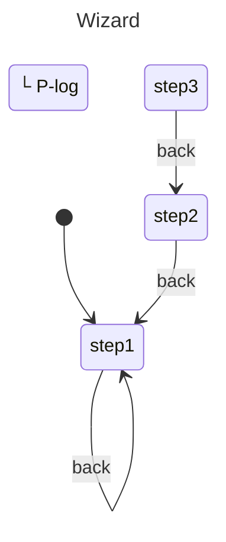

# Multi-Step Wizard

Managing multi-step form workflows.

## Problem

Track wizard steps and navigation between them.

## Solution

```javascript
import { machine, state, transition, initial, init, context, invoke, entry, nested } from "x-robot";

// Individual step machines
const step1 = machine("Step1", init(initial("pending")),
  state("pending", transition("next", "completed")),
  state("completed")
);

const step2 = machine("Step2", init(initial("pending")),
  state("pending", transition("next", "completed")),
  state("completed")
);

const step3 = machine("Step3", init(initial("pending")),
  state("pending", transition("next", "completed")),
  state("completed")
);

function onComplete(ctx) {
  console.log("Form submitted:", ctx.data);
}

// Main wizard
const wizardMachine = machine(
  "Wizard",
  init(initial("step1"), context({ data: {} })),
  state("step1", nested(step1, "next"), transition("back", "step1")),
  state("step2", nested(step2, "next"), transition("back", "step1")),
  state("step3", nested(step3, "next"), transition("back", "step2")),
  state("complete", 
    entry(onComplete)
  )
);

// Usage
invoke(wizardMachine, "step1.next"); // Step 1 complete
invoke(wizardMachine, "step2.next"); // Step 2 complete
invoke(wizardMachine, "step3.next"); // Wizard complete
```

## Diagram



## With Validation

```javascript
function validateStep(step, data) {
  switch (step) {
    case 1: return data.name && data.email;
    case 2: return data.address && data.city;
    case 3: return data.payment;
    default: return true;
  }
}

function validateStep2(ctx) {
  ctx.errors.step2 = validateStep(2, ctx.data) ? null : "Invalid";
}

const wizardMachine = machine(
  "Wizard",
  init(initial("step1"), context({ data: {}, errors: {} })),
  state("step1", 
    nested(step1, "next"),
    transition("back", "step1")
  ),
  state("step2", 
    nested(step2, "next"),
    transition("next", "validating"),
    transition("back", "step1")
  ),
  state("validating",
    entry(validateStep2, "step2", "step2")
  ),
  // ... continue
);
```

## With Progress

```javascript
function getProgress() {
  const step = parseInt(wizardMachine.current.replace("step", ""));
  return (step / 3) * 100;
}

console.log(getProgress()); // 33.33, 66.67, 100
```

## Save/Restore Progress

```javascript
import { snapshot, start } from "x-robot";

// Save
const savedState = snapshot(wizardMachine);
localStorage.setItem("wizard", JSON.stringify(savedState));

// Restore
const saved = JSON.parse(localStorage.getItem("wizard"));
start(wizardMachine, saved);
```

## Variations

### Linear Only

```javascript
// No back navigation
state("step1", nested(step1, "step2")),
state("step2", nested(step2, "step3")),
state("step3", nested(step3, "complete"))
```

### Skippable Steps

```javascript
state("step1", 
  nested(step1, "next"),
  transition("skip", "step2")  // Allow skipping
),
```

## Next Steps

- [Form Validation](./form-validation.md) — Input validation
- [Nested Machines Guide](../guides/nested-machines.md) — Deep dive
