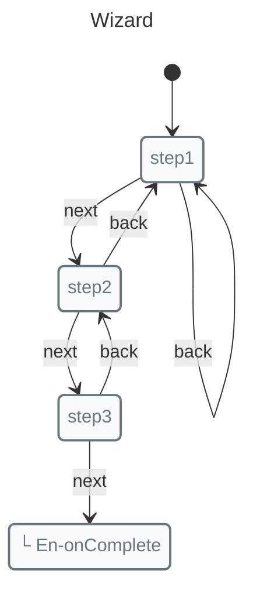
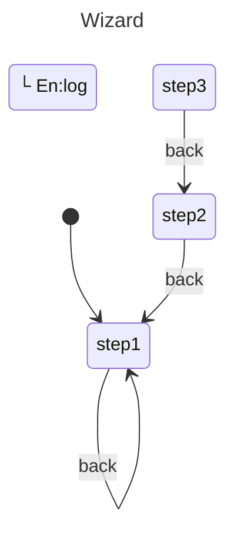
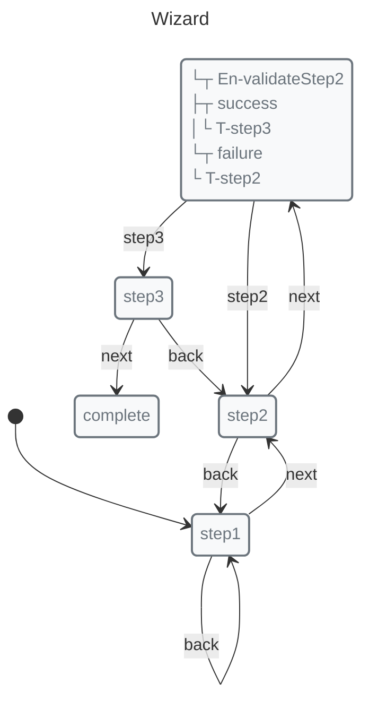

# Multi-Step Wizard

Managing multi-step form workflows.

## Problem

Track wizard steps and navigation between them.

## Solution


```mermaid
---
title: Wizard
---

stateDiagram-v2

classDef danger fill:#f8d7da,stroke:#721c24,stroke-width:2px,text-align:left,color:#721c24
classDef warning fill:#fff3cd,stroke:#856404,stroke-width:2px,text-align:left,color:#856404
classDef success fill:#d4edda,stroke:#155724,stroke-width:2px,text-align:left,color:#155724
classDef primary fill:#cce5ff,stroke:#004085,stroke-width:2px,text-align:left,color:#004085
classDef info fill:#d1ecf1,stroke:#0c5460,stroke-width:2px,text-align:left,color:#0c5460
classDef def fill:#f8f9fa,stroke:#6c757d,stroke-width:2px,text-align:left,color:#6c757d

state step1
state step2
state step3
state complete
class step1 def
class step2 def
class step3 def
class complete def

complete: └ En-onComplete

[*] --> step1
step1 --> step2: next
step1 --> step1: back
step2 --> step3: next
step2 --> step1: back
step3 --> complete: next
step3 --> step2: back
```

```javascript
import { machine, state, transition, initial, init, context, invoke, entry } from "x-robot";

function onComplete(ctx) {
  console.log("Form submitted:", ctx.data);
}

// Main wizard
const wizardMachine = machine(
  "Wizard",
  init(initial("step1"), context({ data: {}, step: 1 })),
  state("step1", transition("next", "step2"), transition("back", "step1")),
  state("step2", transition("next", "step3"), transition("back", "step1")),
  state("step3", transition("next", "complete"), transition("back", "step2")),
  state("complete", 
    entry(onComplete)
  )
);

// Usage
invoke(wizardMachine, "next"); // Step 1 -> Step 2
invoke(wizardMachine, "next"); // Step 2 -> Step 3
invoke(wizardMachine, "next"); // Step 3 -> complete
```

## Diagram


```mermaid
---
title: Wizard
---

stateDiagram-v2

classDef danger fill:#f8d7da,stroke:#721c24,stroke-width:2px,text-align:left,color:#721c24
classDef warning fill:#fff3cd,stroke:#856404,stroke-width:2px,text-align:left,color:#856404
classDef success fill:#d4edda,stroke:#155724,stroke-width:2px,text-align:left,color:#155724
classDef primary fill:#cce5ff,stroke:#004085,stroke-width:2px,text-align:left,color:#004085
classDef info fill:#d1ecf1,stroke:#0c5460,stroke-width:2px,text-align:left,color:#0c5460
classDef def fill:#f8f9fa,stroke:#6c757d,stroke-width:2px,text-align:left,color:#6c757d

state step1
state step2
state step3
state complete

complete: └ En:log

[*] --> step1
step1 --> step1: back
step2 --> step1: back
step3 --> step2: back
```

## With Validation


```mermaid
---
title: Wizard
---

stateDiagram-v2

classDef danger fill:#f8d7da,stroke:#721c24,stroke-width:2px,text-align:left,color:#721c24
classDef warning fill:#fff3cd,stroke:#856404,stroke-width:2px,text-align:left,color:#856404
classDef success fill:#d4edda,stroke:#155724,stroke-width:2px,text-align:left,color:#155724
classDef primary fill:#cce5ff,stroke:#004085,stroke-width:2px,text-align:left,color:#004085
classDef info fill:#d1ecf1,stroke:#0c5460,stroke-width:2px,text-align:left,color:#0c5460
classDef def fill:#f8f9fa,stroke:#6c757d,stroke-width:2px,text-align:left,color:#6c757d

state step1
state step2
state validating
state step3
state complete
class step1 def
class step2 def
class validating def
class step3 def
class complete def

validating: └┬ En-validateStep2<br> ├┬ success<br> │└ T-step3<br> └┬ failure<br>  └ T-step2

[*] --> step1
step1 --> step2: next
step1 --> step1: back
step2 --> validating: next
step2 --> step1: back
validating --> step3: step3
validating --> step2: step2
step3 --> complete: next
step3 --> step2: back
```

```javascript
function validateStep(step, data) {
  switch (step) {
    case 1: return data.name && data.email;
    case 2: return data.address && data.city;
    case 3: return data.payment;
    default: return true;
  }
}

function validateStep2(ctx) {
  const isValid = validateStep(2, ctx.data);
  ctx.errors.step2 = isValid ? null : "Invalid";
  if (!isValid) {
    throw new Error("Step 2 is invalid");
  }
}

const wizardMachine = machine(
  "Wizard",
  init(initial("step1"), context({ data: {}, errors: {} })),
  state("step1", transition("next", "step2"), transition("back", "step1")),
  state("step2", 
    transition("next", "validating"),
    transition("back", "step1")
  ),
  state("validating",
    entry(validateStep2, "step3", "step2")
  ),
  state("step3", transition("next", "complete"), transition("back", "step2")),
  state("complete")
);
```

## With Progress

```javascript
function getProgress() {
  const step = parseInt(wizardMachine.current.replace("step", ""));
  return (step / 3) * 100;
}

console.log(getProgress()); // 33.33, 66.67, 100
```

## Save/Restore Progress

```javascript
import { snapshot, start } from "x-robot";

// Save
const savedState = snapshot(wizardMachine);
localStorage.setItem("wizard", JSON.stringify(savedState));

// Restore
const saved = JSON.parse(localStorage.getItem("wizard"));
start(wizardMachine, saved);
```

## Variations

### Linear Only

```javascript
// No back navigation
state("step1", transition("next", "step2")),
state("step2", transition("next", "step3")),
state("step3", transition("next", "complete"))
```

### Skippable Steps

```javascript
state("step1", 
  transition("next", "step2"),
  transition("skip", "step2")  // Allow skipping
),
```

## Next Steps

*   [Form Validation](./form-validation.md) — Input validation
*   [Nested Machines Guide](../guides/nested-machines.md) — Deep dive
