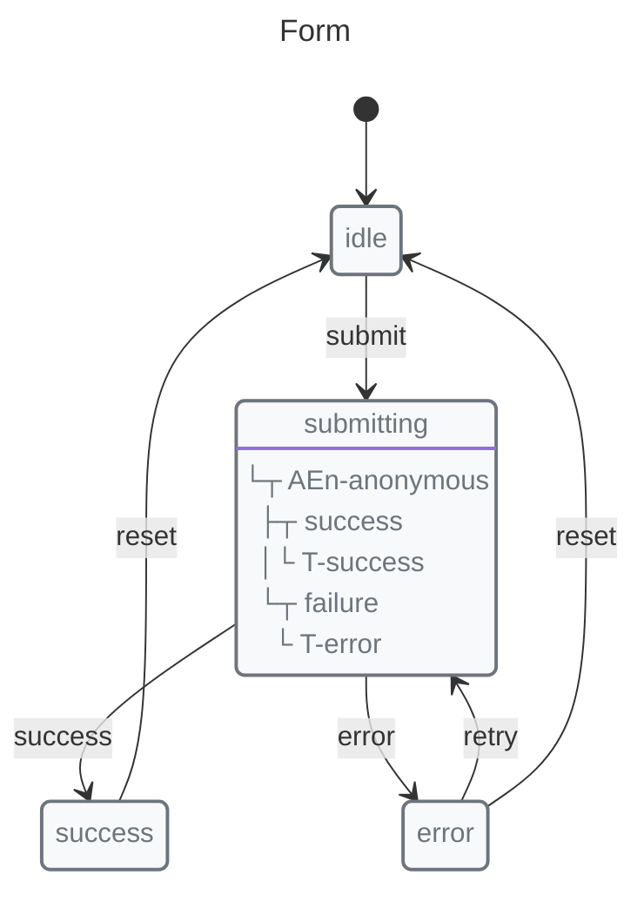

# Why Finite State Machines?

X-Robot reduces invalid states, simplifies async workflows, and generates living documentation from the same machine definitions teams ship.

```javascript
import { machine, state, transition, entry, guard } from "x-robot";
```

## The Problem with Booleans

Most developers manage UI state with booleans. It starts simply:

```javascript
let isLoading = false;
let isSuccess = false;
let isError = false;
let isSubmitting = false;
let isValidated = false;
let hasError = false;
```

Then the complexity grows. You need to track more states:

```javascript
const formState = {
  isEmpty: true,
  isFocused: false,
  isValid: false,
  isValidating: false,
  isSubmitting: false,
  isSubmitted: false,
  isSuccess: false,
  isError: false,
  errorMessage: null
};
```

This approach has fundamental problems:

1.  **Invalid states are possible** — You can have `isLoading = true` and `isSuccess = true` simultaneously
2.  **Transitions are unclear** — How do you go from "submitting" to "error"?
3.  **Testing is difficult** — Every boolean combination is a potential state
4.  **Logic spreads** — Validation, submission, and error handling get mixed across components

## The Solution: State Machines

A finite state machine (FSM) defines all valid states and the transitions between them:



<!-- x-robot:fragment -->


<!-- x-robot:fragment -->


```javascript
import { context, entry, init, initial, machine, state, transition } from "x-robot";

async function submitForm(values) {
  return { id: "submission-1", ...values };
}

const formMachine = machine(
  "Form",
  init(initial("idle"), context({ values: { email: "ada@example.com" }, data: null })),
  state("idle", transition("submit", "submitting")),
  state(
    "submitting",
    entry(
      async (ctx) => {
        ctx.data = await submitForm(ctx.values);
      },
      "success",
      "error"
    )
  ),
  state("success", transition("reset", "idle")),
  state("error", transition("retry", "submitting"), transition("reset", "idle"))
);
```

Benefits:

*   **Only valid states exist** — The machine enforces valid transitions
*   **Transitions are explicit** — Every path is defined
*   **Self-documenting** — The machine definition shows all possible states
*   **Testable** — Each state and transition can be tested independently

## Why X-Robot?

X-Robot focuses on a compact machine API, native async guards, frozen state by default, validation, and generated documentation. For direct comparisons, read [XState vs X-Robot](./comparison/xstate.md), [Robot3 vs X-Robot](./comparison/robot3.md), and [Redux vs X-Robot](./comparison/redux.md).

### 1. Pulse Makes Async Simple

Traditional approaches require multiple functions:

<!-- x-robot:fragment -->

```javascript
// Redux: action + reducer
async function submitForm(values) {
  return { type: "SUBMIT", payload: values };
}
function formReducer(state, action) {
  if (action.type === "SUBMIT_SUCCESS") {
    return { ...state, data: action.payload };
  }
}
```

X-Robot combines action and state update in one function:

<!-- x-robot:fragment -->

```javascript
// X-Robot: single pulse
state(
  "submitting",
  entry(
    async (ctx) => {
      ctx.data = await submitForm(ctx.values);
    },
    "success",
    "error"
  )
);
```

### 2. Frozen State by Default

X-Robot clones context before each pulse, preventing accidental mutations:

<!-- x-robot:fragment -->

```javascript
// In frozen mode (default), this is safe:
state(
  "updating",
  entry((ctx) => {
    ctx.counter++; // modifies cloned context
    throw new Error("Oops");
  })
);
// Original state is unchanged
```

### 3. Native Async Guards

No workarounds for async validation:

<!-- x-robot:fragment -->

```javascript
transition("submit", "validating", guard(async (ctx) => {
  const isValid = await validateEmail(ctx.email);
  return isValid;
})),
```

### 4. Small Bundle, High Performance

*   Core: 16.55KB minified
*   With modules: 79.93KB (`documentate`, `validate`)
*   Performance: 1.1-15.4x faster than XState
*   `documentate()` adds generated visual documentation by concept:
    *   Mermaid: Markdown-friendly source diagrams and previews
    *   PlantUML: richer source diagrams and preferred visual styling
    *   SVG formats: explicit `svg-*` exports for sharing, embedding, and vector assets
    *   PNG formats: explicit `png-*` exports for raster docs, tickets, and slides

### 5. Built-in Tools

*   `documentate()` — Code generation, SCXML, and visual documentation via `x-robot/documentate`:
    *   Mermaid: Markdown-friendly state, sequence, and focused structural source diagrams
    *   PlantUML: richer state, sequence, and focused structural source diagrams
    *   SVG formats: explicit `svg-*` exports for sharing, embedding, and vector assets
    *   PNG formats: explicit `png-*` exports for raster docs, tickets, and slides
*   `validate()` — Machine structure validation via `x-robot/validate`
*   History tracking — Built-in state history

## When to Use State Machines

State machines are ideal for:

*   **Form workflows** — Validation, submission, success/error states
*   **API calls** — Loading, success, error handling
*   **UI interactions** — Modals, wizards, animations
*   **Game state** — Player states, level transitions
*   **Business logic** — Order processing, approval flows
*   **Communication protocols** — Connection states, message handling

## Best Fit

State machines add the most value when a flow has named states, meaningful transitions, and async or validation rules. Keep simpler local state for:

*   Simple toggle states (on/off)
*   Unrelated pieces of UI state
*   Very small applications with minimal state

## Next Steps

*   [Getting Started](./guides/getting-started.md) — Create your first machine
*   [Concepts](./concepts/pulse.md) — Understand the Pulse concept
*   [Public API and Stability](./guides/public-api.md) — Choose stable imports and optional modules
*   [API Reference](./api/) — Explore all functions
